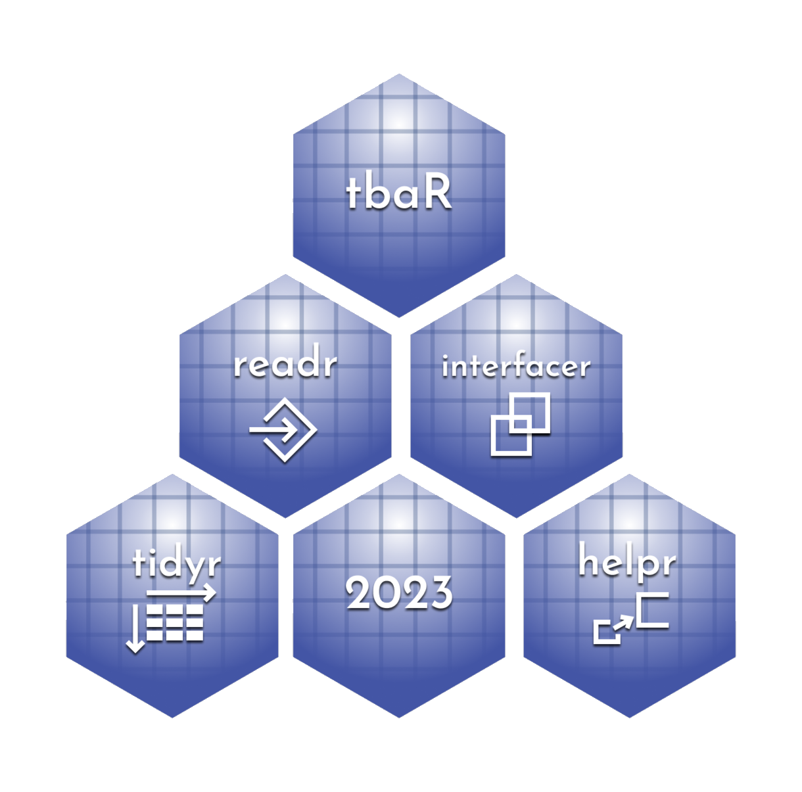

    

# scoutR

scoutR is an R library to facilitate usage of data from the TBA and Statbotics API for FRC scouts, strategists, and data-driven observers. The objective is to provide functions that allow a newcomer to R to write one line of code and retrieve exactly the right dataframe in a tidy format rather than as a JSON that needs massaging to be useful.

## Setup - New User Checklist

- [ ] Install R and RStudio on your machine. You can find them both on Posit's website here: https://posit.co/download/rstudio-desktop/. scoutR assumes that you have R 4.3.0 or later.
- [ ] Open [`demo.qmd`](https://github.com/GKrotkov/scoutR/blob/master/demo.qmd) using RStudio; I recommend setting RStudio to be your default for opening both .r, .rmd, and .qmd files. The demo will walk you through some use cases of scoutR and show you the functions that it exports.

## Roadmap to ScoutR

The below R files define functions that are the core engine of ScoutR

| Name | Description | Input | Output | Public Facing?
| ----- | ----- | ----- | ----- | -----
| `scoutR` | Analysis functions for at-event usage. | Event codes or match data | Tidy dataframes | Yes
| `tba_interfaceR` | Provide a direct interface between the user and the TBA API | TBA-legal keys | Tidy dataframes | Yes
| `helpR` | "Under the hood" helper functions that make other functions easy to use.  | Varies, but mostly dataframes of match objects | Varies | Yes
| `tba_readR` | Read data from the TBA API, helper library for `tba_interfaceR` | TBA-legal keys| JSON | No
| `tba_tidyR` | Reformat JSON data from TBA to Tidy format, helper library for `interfaceR` | JSON | Tidy dataframes | No
| `statbotics_readR` | Read JSON data from Statbotics to Tidy format | Statbotics endpoints | Tidy data frames | Yes

## Why do I care about Tidy data? What even is it?

Tidy data has 3 features.

1.  Each variable forms a column.
2.  Each observation forms a row.
3.  Each type of observational unit forms a separate table.

This is a pretty simple set of rules for data to follow, but keeping strictly to it enables powerful data manipulation libraries like the `tidyverse`. Once we have tidy data, visualization and analysis become streamlined. We can rely on R's inbuilt functions as well as R's robust open source developer community to implement functions to do most of anything we want to do with the data. Luckily for us, scoutR makes getting tidy data straightforward.

# Dependencies

`scoutR` manages dependencies with the `renv` package. This means we can resolve package issues by references the renv lockfile.
