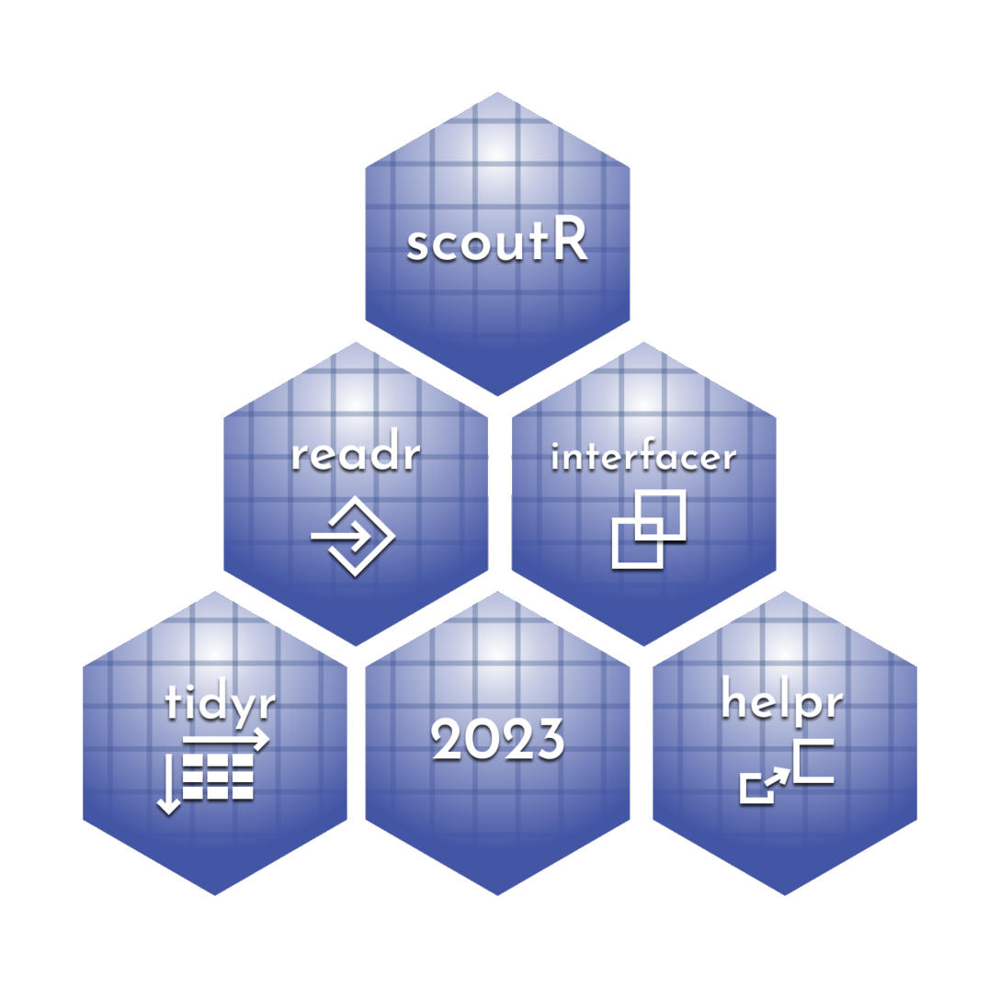

# scoutR

scoutR is an R library to facilitate usage of data from the TBA and Statbotics API for FRC scouts, strategists, and data-driven observers. The objective is to provide functions that allow a newcomer to R to write one line of code and retrieve exactly the right dataframe in a tidy format rather than as a JSON that needs massaging to be useful.

## Setup

Install R and RStudio on your machine. You can find them both on Posit's website here: https://posit.co/download/rstudio-desktop/. tbaR assumes that you have R 4.3.0 or later.

Now download this repository locally and store in a convenient location on your machine. I suggest a separate directory that is only for tbaR for the most convenience.

Next, open `demo.rmd` using RStudio; I recommend setting RStudio to be your default for opening both .r files and .rmd files. The demo will walk you through some use cases of tbaR and especially useful functions from `tba_interfaceR` and `tba_helpR`. It will also instruct you on installing tbaR's dependencies and generating documentation files to reference in the help pages as you work with tbaR.

## Roadmap to tbaR

tbaR has 4 major files: `tba_readR`, `tba_tidyR`, `tba_interfaceR`, and `tba_helpR`. Their usage is summarized below. There are exceptions in individual functions but the documentation for each function will call that out.

| Name | Description | Input | Output | Public Facing?
| ----- | ----- | ----- | ----- | -----
| `tba_scoutR` | Analysis functions for at-event usage. | Event codes or match data | Tidy dataframes | Yes
| `tba_interfaceR` | Provide a direct interface between the user and the TBA API | TBA-legal keys | Tidy dataframes | Yes
| `tba_helpR` | Helper functions that do not directly interact with the TBA API | Varies, but mostly dataframes of match objects | Varies | Yes
| `tba_readR` | Read data from the TBA API, helper library for `interfaceR` | TBA-legal keys| JSON | No
| `tba_tidyR` | Reformat JSON data from TBA to Tidy format, helper library for `interfaceR` | JSON | Tidy dataframes | No

I recommend that new users to R only use `tba_interfaceR` and `tba_scoutR` - these are the only functions you should need (and the ones I go to come competition time.) If you want to get into the guts of tbaR, `tba_helpR` `tba_readR` and `tba_tidyR` may be more useful to you.

## Why do I care about Tidy data? What even is it?

Tidy data has 3 features.

1.  Each variable forms a column.
2.  Each observation forms a row.
3.  Each type of observational unit forms a separate table.

This is a pretty simple set of rules for data to follow, but keeping strictly to it enables powerful data manipulation libraries like the `tidyverse`. Once we have tidy data, visualization and analysis become streamlined. We can rely on R's inbuilt functions as well as R's robust open source developer community to implement functions to do most of anything we want to do with the data. Luckily for us, tbaR makes getting tidy data straightforward.
