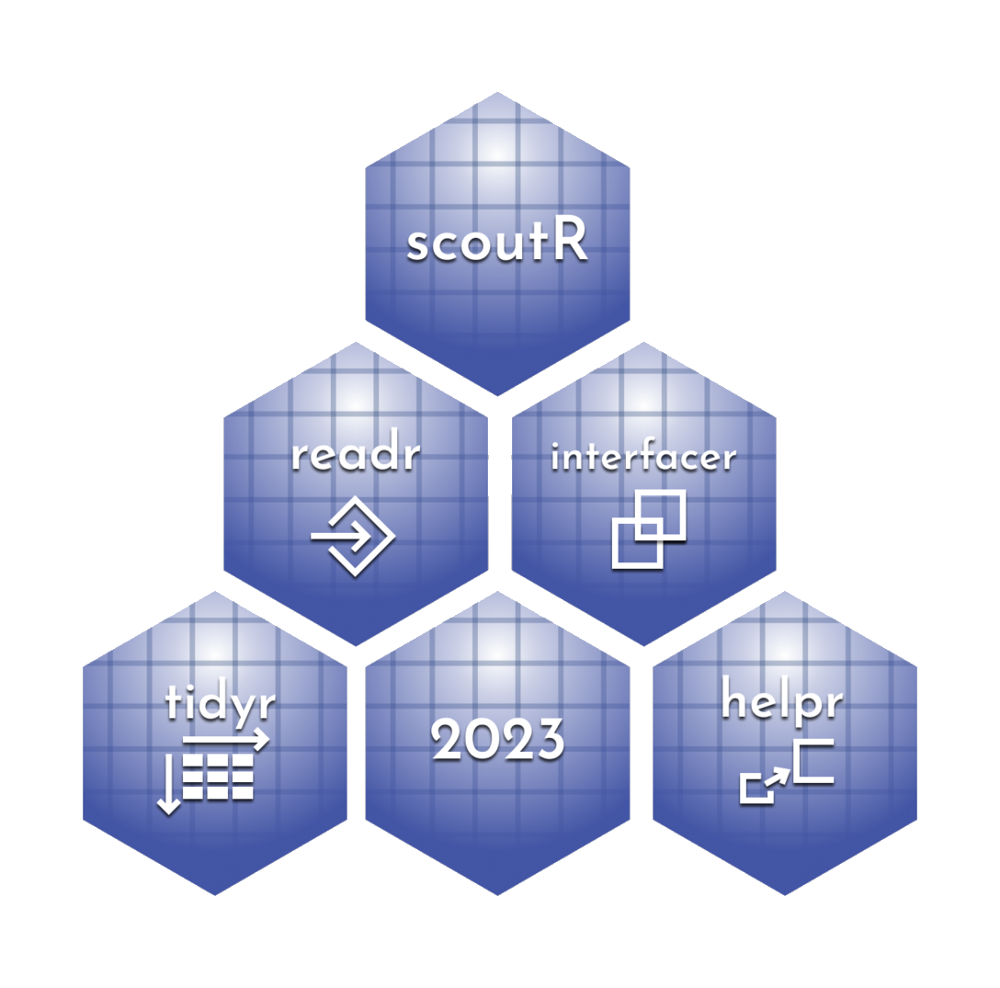

# Package Summary for LLM Ingestion
Generated: 2026-09-20 13:09:28.427891


---

# Standard Package Files


## DESCRIPTION

```
Type: Package
Package: scoutR
Title: FRC Scouting Aide for R Users
Version: 1.0
Author: Gabriel Krotkov
Maintainer: Gabriel Krotkov <gabriel.gk.mail@gmail.com>
Description: Scouting package to make TBA & Statbotics API data more
    accessible for FRC data science students.
License: MIT
URL: https://github.com/GKrotkov/scoutR,
    https://gkrotkov.github.io/scoutR/
BugReports: https://github.com/GKrotkov/tbaR/issues
Imports: 
    boot,
    data.table,
    doParallel,
    dplyr,
    foreach,
    httr2,
    jsonlite,
    MASS,
    parallel,
    pracma,
    purrr,
    readr,
    rvest,
    stringr,
    tibble,
    tidyr,
    withr
Suggests: 
    knitr,
    rmarkdown,
    testthat (>= 3.0.0)
Config/testthat/edition: 3
Encoding: UTF-8
LazyData: true
Config/roxygen2/version: 8.0.0
```


## NAMESPACE

```
# Generated by roxygen2: do not edit by hand

export(TBA_BASE)
export(YEAR)
export(combine_tbls)
export(district_events)
export(district_rankings)
export(district_teams)
export(districts)
export(event)
export(event_alliances)
export(event_awards)
export(event_coprs)
export(event_district_points)
export(event_insights)
export(event_matches)
export(event_matchups)
export(event_opr_progression)
export(event_oprs)
export(event_rankings)
export(event_sb)
export(event_tangibles)
export(event_teams)
export(events)
export(events_sb)
export(fit_event_lr)
export(fit_event_pridge)
export(fit_lineup_lm)
export(fit_pridge)
export(initialize_scoutR)
export(lineup_design_matrix)
export(match_sb)
export(matches_sb)
export(prescout)
export(pridge_lambda_cv)
export(prior_ridge)
export(qual_schedule)
export(team)
export(team_awards)
export(team_events)
export(team_events_sb)
export(team_matches)
export(team_matches_sb)
export(team_participation_years)
export(team_sb)
export(team_years_sb)
export(teams)
export(teams_sb)
export(week_seed_finish_table)
export(year_opr_swings)
export(year_sb)
export(years_sb)
import(dplyr)
import(httr2)
import(readr)
import(tibble)
import(tidyr)
importFrom(data.table,transpose)
importFrom(doParallel,registerDoParallel)
importFrom(foreach,"%dopar%")
importFrom(foreach,foreach)
importFrom(httr2,req_perform)
importFrom(httr2,req_url_path_append)
importFrom(httr2,req_url_query)
importFrom(httr2,request)
importFrom(httr2,resp_body_json)
importFrom(jsonlite,fromJSON)
importFrom(parallel,detectCores)
importFrom(parallel,makeCluster)
importFrom(parallel,stopCluster)
importFrom(pracma,Lcm)
importFrom(purrr,flatten_chr)
importFrom(purrr,is_empty)
importFrom(purrr,reduce)
importFrom(rvest,html_text)
importFrom(stringr,str_detect)
importFrom(stringr,str_extract)
importFrom(stringr,str_length)
importFrom(stringr,str_sub)
importFrom(withr,with_dir)
```


## README.md

```
<p align="center">
    
</p>

# scoutR

scoutR is an R package that makes [TheBlueAlliance](thebluealliance.com) (TBA) and [Statbotics](statbotics.io) data easier for R users to access. The objective is to provide functions that allow a newcomer to R to write one line of code and retrieve exactly the right dataframe in a tidy format rather than as a JSON that needs massaging to be useful. scoutR also provides a number of quality-of-life utility functions for FRC data.

## Setup - New User Checklist

- [ ] Install R and RStudio on your machine. You can find them both on Posit's website here: https://posit.co/download/rstudio-desktop/. scoutR assumes that you have R 4.3.0 or later.
- [ ] Install pak by running `install.packages("pak")` in the R console
- [ ] Install scoutR by running `pak::pak("gkrotkov/scoutR")` in the R console.
- [ ] Introduce yourself to scoutR by running `scoutR::initialize_scoutR(auth_key)`, with your TBA auth key. You can get a TBA auth key at [this link](https://www.thebluealliance.com/account).
- [ ] To use scoutR functions in your R instance, call `library(scoutR)`. This loads the functions from scoutR into your environment.

Now `scoutR` is installed on your version of R! Check out [intro to scoutR](https://gkrotkov.github.io/scoutR/articles/intro.html) for a walkthrough.

# Function naming convention ("how do I guess what functions exist?")
scoutR interface functions generally follow the naming convention that the first word is the input value and the second word is the return value. For example `event_teams()` takes an event key (ex. "2026chcmp") and returns team IDs, and `team_awards()` takes a team ID and returns awards. 

The scoutR interface also exposes single-word functions that mirror the TBA API. For example `events()` takes a year, and `event()` takes an event ID.

## Why do I care about Tidy data? What even is it?

Tidy data has 3 features.

1.  Each variable forms a column.
2.  Each observation forms a row.
3.  Each type of observational unit forms a separate table.

This is a pretty simple set of rules for data to follow, but following it enables powerful data manipulation libraries like the `tidyverse`. Tidy data streamlines visualization and analysis - it lets students skip annoying API interactions and get right to data science questions.

# For collaborators

## Roadmap to ScoutR

The below R files define functions that are the core engine of scoutR. R files like `utils`, `data`, and `dependencies` just make the proverbial trains run on time.

| Name | Description | Input | Output | User Facing?
| ----- | ----- | ----- | ----- | -----
| `scoutR` | Analysis functions for at-event usage. | Event codes or match data | Tidy dataframes | :white_check_mark:
| `tba_interfaceR` | Provide a direct interface between the user and the TBA API | TBA-legal keys | Tidy dataframes | :white_check_mark:
| `helpR` | "Under the hood" helper functions that make other functions easy to use.  | Varies, but mostly dataframes of match objects | Varies | :x:
| `tba_readR` | Read data from the TBA API, helper library for `tba_interfaceR` | TBA-legal keys| JSON | :x:
| `tba_tidyR` | Reformat JSON data from TBA to Tidy format, helper library for `interfaceR` | JSON | Tidy dataframes | :x:
| `statbotics_readR` | Read JSON data from Statbotics to Tidy format | Statbotics endpoints | Tidy data frames | :white_check_mark:

## Dependencies

`scoutR` manages dependencies with the `renv` package. This means we can resolve package issues by references the renv lockfile.
```


---

# R Source Files (R/)


## data.R

```
# data documentation file

#' District Qualification Data
#'
#' A list of qualification data from every district played between 2009 and
#' 2024. Every item in the list is a dataframe, and each dataframe has at least
#' the columns "red1", "red2", "red3", "blue1", "blue2", "blue3", "red_score",
#' and "blue_score". Generated by scripts/get_district_quals.R
#' @source thebluealliance.com
"dquals24"

#' Stepwise-Optimized OPR Weights
#'
#' Linear Regression weights optimized stepwise as outlined by Girls of Steel
#' in "Clutch Matches are in the Middle"
#'
#' @source "Clutch Matches are in the Middle, by Girls of Steel"
"w_stepwise"

#' All Team Awards
#'
#' List of all team official award histories as of the 2024 season
#' @source thebluealliance.com
"awards24"

#' Team Attributes Hexafecta
#'
#' DF noting whether each team has achieved the Team Attributes Hexafecta
#' as of 2024.
#' @source thebluealliance.com
"ta_hexafecta24"

#' Teams by Year
#'
#' Indicates each team-year competed (as of 2024)
"teams_yearly"

#' OPR Swing data (2005 - 2025)
#'
#' "mean_diff" represents the mean change in standardized OPR coefficients
#' (mean across all teams at the event) after the corresponding match
#' "ppt" (plays per team) is the number of match plays the event has had,
#' divided by the number of teams at the event. So for example after 2025mdsev
#' ran match 13, there had been (13 * 6 = ) 78 "plays", across 28 teams at the
#' event, for about 2.79 ppt.
#' @source thebluealliance.com
"opr_swings"
```


## dependencies.R

```
######################
#### Dependencies ####
######################

# Package-wide
#' @import dplyr
#' @import tidyr
#' @import readr
#' @import tibble
#' @import httr2

# Selective function
#' @importFrom pracma Lcm
#' @importFrom httr2 request req_url_path_append req_url_query req_perform resp_body_json
#' @importFrom withr with_dir
#' @importFrom rvest html_text
#' @importFrom stringr str_detect str_sub str_extract str_length
#' @importFrom purrr is_empty flatten_chr reduce
#' @importFrom jsonlite fromJSON
#' @importFrom data.table transpose

# Parallel Processing
#' @importFrom parallel detectCores makeCluster stopCluster
#' @importFrom doParallel registerDoParallel
#' @importFrom foreach foreach %dopar%

NULL
```


## helpR.r

```
################
#### helpeR ####
################

# helpeR implements helper functions that are not necessarily core to the
# funtionality of scoutR, but are useful for users to have access to. These are
# utility functions, more useful under the hood than for decisionmaking.

#' Initialize scoutR
#'
#' Function to store the auth key for scoutR in the user's HOME directory
#' @export
initialize_scoutR <- function(auth_key){
    home <- Sys.getenv("HOME")
    if (is.null(auth_key)){
        warning("No auth key supplied. We assume ~/.scoutR_auth.txt exists.")
    }
    else{
        with_dir(home,{
            # write the auth key text file
            write_file(auth_key, file = ".scoutR_auth.txt")
        })
    }
    message("Auth key written successfully!")
}

#########################
#### Linear Modeling ####
#########################

#' Normalize Weights
#'
#' Takes a vector of real, non-negative weights and converts them to an integer
#' form while maintaining the ratios between all elements.
#' @param w vector of weights
#' @param len_out positive integer, desired output length of the normed weights
#' @return vector of scaled weights, guaranteed to be integer
#' @details Iteratively gets the LCM of all the denominators, so we are
#' guaranteed to get integer results after multiplying by that LCM. And, because
#' it is the *least* common multiple, these will be the smallest possible
#' integer weights.
normalize_weights <- function(w, len_out = NA) {
    # round the digits to 4 places to avoid number representation problems
    # (when the fractionalized numbers get too large, we hit 2's complement)
    w <- round(w, digits = 4)
    stopifnot("weights must be nonnegative" = {all(w >= 0)})
    # apply MASS fractional approximation
    fractions <- sapply(w, function(x) {as.character(MASS::fractions(x))})

    fractional <- matrix(sapply(fractions, function(f) {
        parts <- unlist(strsplit(f, "/"))
        # If there's no denominator, it's 1
        if (length(parts) == 1) {
            return(c(as.numeric(parts), 1))
        } else {
            return(as.numeric(parts))
        }
    }), nrow = 2)

    rownames(fractional) <- c("numerator", "denominator")

    denominators <- fractional["denominator", ]
    lcm_den <- denominators[1]
    for (d in denominators[-1]) {
        lcm_den <- pracma::Lcm(lcm_den, d)
    }

    # use round to guarantee integer results
    result <- round(w * lcm_den)

    if (!is.na(len_out)){
        result <- rep_each_len(result, len_out)
    }

    return(result)
}

#' Weight Rows
#'
#' Weights the rows of the input dataframe by cutting the dataframe into equal
#' length bins and multiple-counting the rows for appropriate weight
#' @param df input dataframe to be weighted
#' @param w numeric vector of weights applied to `df`, assumed integers
#' @details Weights are applied in uniform length bins (so if weights is
#' length-2, there will be two bins with 50% of the data each, and if weights
#' is length-5, there will be five bins with 20% of the data each). The
#' weighting respects order.
weight_rows <- function(df, w){
    w <- normalize_weights(w)
    stopifnot("weights must all be integers after normalization" =
                  all(w == floor(w)))
    # apply weighting by multiply-sampling the weighted rows
    cuts <- cut(1:nrow(df), length(w))
    result <- data.frame()
    for (i in seq_along(w)){
        bin <- df[cuts == levels(cuts)[i], ]
        result <- rbind(result, bin[rep(seq_len(nrow(bin)), w[i]), ])
    }
    return(result)
}

#' Leave-One-Out Cross Validation
#'
#' Computes the leave-one-out cross validation error of a regression fit object
#' @param fit a fitted output of `lm` or `glm` or similar
#' @return numeric estimate of leave-one-out CV risk
#' @details Uses a "shortcut" formula for LOOCV. For details, see formula 5.2
#' in ISLR by James, Witten, Hastie, and Tibshirani (v2), pg 202
LOOCV <- function(fit){
    mean(((fit$model$response - predict(fit))/(1 - boot::glm.diag(fit)$h))^2)
}


##########################
#### TBA Data Helpers ####
##########################

#' ID to Int
#'
#' Coerce a string in team formatting to an int
#' @param id TBA-legal team formatted string (i.e. "frc3504")
#' @param prefix string prefix for id (in overwhelming majority of cases "frc")
id2int <- function(id, prefix = "frc"){
    # if the user accidentally input a numeric, just return it
    if (is.numeric(id)) return(id)
    return(as.numeric(substr(id, nchar(prefix) + 1, nchar(id))))
}

#' ID Robot Fields
#'
#' Helper function that returns the column names of matches that include "robot"
#' in them. Useful to identify fields you may want to include as input to
#' get_multifield_df().
#' @param matches dataframe of match objects
#' @param simplify (bool) if TRUE, we will make some assumptions about the
#' naming schema to cut away alliance color and the robot number so that we can
#' make the output a little less ugly.
id_robot_fields <- function(matches, simplify = TRUE){
    idx <- grep("robot[1-3]", colnames(matches), ignore.case = TRUE)
    result <- colnames(matches)[idx]
    if (simplify){
        result <- gsub("red|blue", "", result, ignore.case = TRUE)
        result <- gsub("_", "", result)
        result <- gsub("robot", "", result, ignore.case = TRUE)
        result <- gsub("\\d", "", result)
        result <- unique(result)
    }
    return(result)
}

#' Get Team Stations
#'
#' Returns a df containing the indices of a team's matches and the alliance
#' station for that team in that match.
#' @param matches dataframe of matches with alliances broken out
#' @param key team key
#' @return data frame with match indices and alliance station
get_team_stations <- function(matches, key){
    key <- tf(key)
    stations <- matches[, c(paste0("blue", 1:3), paste0("red", 1:3))]
    idx <- which(stations == key, arr.ind = TRUE)
    ridx <- idx[, "row"]
    cidx <- idx[, "col"]
    # convert the column indexes into alliance station formats
    team_stations <- dplyr::case_when(
        cidx == 1 ~ "blue1",
        cidx == 2 ~ "blue2",
        cidx == 3 ~ "blue3",
        cidx == 4 ~ "red1",
        cidx == 5 ~ "red2",
        cidx == 6 ~ "red3",
        .default = NA
    )
    return(data.frame(match = ridx, station = team_stations))
}

#' ID Unplayed Matches
#'
#' This function takes a dataframe of TBA match objects and identifies matches
#' that have not been played.
#' @details We identify a match as unplayed if both red and blue alliances have
#' a score of -1.
#' @param matches a dataframe of TBA match objects
id_unplayed <- function(matches){
    return((matches$red_score == -1) & (matches$blue_score == -1))
}

#' Trim Unplayed Matches
#'
#' This function takes a dataframe of TBA match objects and trims away any
#' unplayed matches.
#' @details We identify a match as unplayed if both the red and blue alliance
#' score is -1.
#' @param matches dataframe of match objects
trim_unplayed <- function(matches){
    return(matches[!id_unplayed(matches), ])
}

#' Schema for (color)_(field)Robot(station_num)
#'
#' This schema was the default between 2018 and 2023 (at least.)
#' cfs references color/field/station, the order of the terms
#' @param color alliance color, either "red" or "blue"
#' @param station_num number of the driver station
#' @param field name of the relevant field
schema_cfs <- function(color, station_num, field){
    return(paste0(color, "_", field, "Robot", station_num))
}

#' Schema for (color)_robot(station_num)(Field)
#'
#' This schema was the default in 2016 and 2017.
#' csf references color/station/field, the order of the terms
#' @param color alliance color, either "red" or "blue"
#' @param station_num number of the driver station
#' @param field name of the relevant field
schema_csf <- function(color, station_num, field){
    # for correct camelCase, field must have a capital first letter
    return(paste0(color, "_", "robot", station_num, cap_first(field)))
}

#' Generic Robot Field Getter
#'
#' generic solution for getting fields from tba that use "(color)_nameRobot#"
#' as a naming style. Assumes field does not have the leading underscore.
#' schema optional parameter allows the user to define their own schema if the
#' "(color)_nameRobot#" style is inapplicable
#' @param matches dataframe of match rows
#' @param field variable name of interest in the (color)_(field)Robot(#) format
#' @param team_id team id of interest
#' @param unlist (boolean) unlist the result? Vast majority of time TRUE, FALSE
#'  if the content has complicated content not fit for a vector.
#' @param schema (function) function that takes alliance color, driver station
#'  number, and the name of the relevant field and returns the column name of
#'  the variable of interest. **Supply this parameter without parentheses**.
#'  Also note that schema_csf exists for years 2016 and 2017.
#' @examples
#' mil23 <- event_matches("2023mil")
#' get_robot_field(mil23, "mobility", 6672)
#' get_robot_field(mil23, "endGameChargeStation", 2539)
#' mar16 <- event_matches("2016mrcmp")
#' get_robot_field(mar16, "auto", 1712, schema = schema_csf)
get_robot_field <- function(
    matches, field, team_id, schema = schema_cfs, unlist = T
){
    stations <- get_team_stations(matches, team_id)
    # assumption: station number is the last character of the string
    station_num <- substr_right(stations$station, 1)
    color <- substr_right_inv(stations$station, nchar(stations$station) - 1)
    cidx <- schema(color, station_num, field)
    idx <- data.frame(ridx = stations$match, cidx = cidx)
    result <- apply_indexer(matches, idx)
    if (unlist) result <- unlist(result)
    return(result)
}

#' Get Field Dataframe (Robot-level)
#'
#' Returns a dataframe with the results for every robot in matches for the field
#' specified in field.
#' @param matches dataframe of match rows
#' @param field name of field of interest
#' @param schema function defining schema for column names
#' @param unlist (boolean) unlist the result? Vast majority of time TRUE, FALSE
#'  if the content has complicated content not fit for a vector.
#' @examples
#' mil23 <- event_matches("2023mil")
#' get_robot_field_df(mil23, "autoChargeStation")
#' mar17 <- event_matches("2017mrcmp")
#' get_robot_field_df(mar17, "auto", schema = schema_csf)
get_robot_field_df <- function(
    matches, field, schema = schema_cfs, unlist = T
){
    ids <- unique(c(matches$blue1, matches$blue2, matches$blue3,
                    matches$red1, matches$red2, matches$red3))
    df <- data.frame(id = ids)
    for (i in 1:length(ids)){
        result <- get_robot_field(matches, field, ids[i],
                                  schema = schema, unlist = unlist)
        tbl <- table(result)
        df[df$id == ids[i], names(tbl)] <- tbl
    }

    df[is.na(df)] <- 0 # set all NA values to 0
    return(df)
}

#' Count Team Matches
#'
#' Counts the number of times a team appears in a matches dataframe
#' @param matches dataframe assumed to have "blue1", "blue2", "blue3", "red1",
#' "red2", and "red3" columns.
#' @return dataframe with team ids and the count of matches appeared in
count_team_matches <- function(matches){
    result <- data.frame(table(unlist(c(
        matches %>%
            dplyr::select(blue1, blue2, blue3, red1, red2, red3)
    ))))
    colnames(result) <- c("id", "count")
    return(result)
}

#' Get Dataframe for multiple fields
#'
#' Applies the get_robot_field_df function to all fields provided and returns a
#' dataframe with all the resulting data
#' @param matches dataframe with matches on the rows
#' @param fields vector of name of the fields you want pulled out. If NULL,
#' scoutR will guess with id_robot_fields()
#' @param schema function defining schema for column names
#' @param unlist (boolean) unlist the result? Vast majority of time TRUE, FALSE
#'  if the content of a given field has complicated content not fit for a vector
#' @param merge if TRUE, simplifying the resulting list of dataframes to a
#' single dataframe using Reduce
#' @details This assumes that all the fields considered are categorical - it
#' will treat numeric variables as categorical.
#' @examples
#' mil23 <- event_matches("2023mil")
#' fields <- id_robot_fields(mil23)
#' get_multifield_df(mil23, fields)
#' fma17 <- event_matches("2017mrcmp")
#' fields <- c("auto")
#' get_multifield_df(fma17, fields, schema = schema_csf)
get_multifield_df <- function(
    matches, fields = NULL, schema = schema_cfs, unlist = TRUE, merge = TRUE
){
    if (is.null(fields)){
        fields <- id_robot_fields(matches)
    }
    statics <- list(matches = matches, schema = schema, unlist = unlist)
    result <- mapply(get_robot_field_df, field = fields,
                     MoreArgs = statics, SIMPLIFY = FALSE)
    result$n_matches <- count_team_matches(matches)
    if (merge){
        # note down the titles and the dataframes they come from
        titles <- lapply(lapply(result, colnames), function(v) v[-1])
        sources <- sapply(titles, length)
        sources <- rep(names(sources), sources)
        titles <- flatten_chr(titles)
        # call Reduce to do the actual merging
        result <- Reduce(function(x, y) merge(x, y, by = "id"), result)
        # rename columns to make result more interpretable
        colnames(result) <- c("id", paste(sources, titles, sep = "_"))
    }
    return(result)
}

#' Double Elimination Alliance Finish
#'
#' Returns a character vector representing the finish (placement) of the
#' alliances from a double elimination bracket.
#' @param status alliance "status" object as returned in a column of the output
#' of event_alliances(). A list, usually of length 8.
#' @details
#' case_when uses a "step-down" resolution; so we rely on the first condition
#' being false to make later conditions correctly specified.
de_alliance_finish <- function(status){
    finish <- dplyr::case_when(
        status$status == "won" ~ "Winner",
        status$double_elim_round == "Finals" &
            status$status == "eliminated" ~ "Finalist",
        status$double_elim_round == "Round 5"&
            status$status == "eliminated" ~ "3rd",
        status$double_elim_round == "Round 4"&
            status$status == "eliminated" ~ "4th",
        status$double_elim_round == "Round 3"&
            status$status == "eliminated" ~ "5th/6th",
        status$double_elim_round == "Round 2"&
            status$status == "eliminated" ~ "7th/8th",
        .default = "Still Competing"
    )
    return(finish)
}

#' Best of 3 Bracket Alliance Finish
#'
#' Returns a character vector representing the finish of the alliances from a
#' single elimation, best of three bracket.
#' @param status alliance "status" object as return in the column of the output
#' of scoutR::event_alliances(). A list, usually of length 8.
#' @details
#' case_when uses a "step-down" resolution; so we rely on the first condition
#' being false to make later conditions correctly specified.
bo3_alliance_finish <- function(status){
    finish <- dplyr::case_when(
        status$status == "won" ~ "Winner",
        status$level == "f" &
            status$status == "eliminated" ~ "Finalist",
        status$level == "sf" &
            status$status == "eliminated" ~ "Semifinalist",
        status$level == "qf" &
            status$status == "eliminated" ~ "Quarterfinalist",
        .default = "Still Competing"
    )
    return(finish)
}

#' Alliance Finish
#'
#' Switching fxn to use appropriate "alliance_finish" status (double elim or
#' bo3) based on the internal structure of the input status object
#' @param status status object as output in a column of event_alliances()
alliance_finish <- function(status){
    if ("double_elim_round" %in% names(status)){
        return(de_alliance_finish(status))
    }
    return(bo3_alliance_finish(status))
}

#' Season Tangibles
#'
#' Given a vector of team numbers, this function returns a df with all the
#' robot-level results of those teams in the given official season
#' @param tms (numeric) vector of team numbers
#' @param yr (int) integer year number of interest
#' @param fields optional, robot fields you want to retrieve. If NULL, uses
#' `id_robot_fields()` to get individual robot-level fields automatically.
#' @param manual_teams (int) additional teams to manually add to the team list
#' @noRd
#' @details
#' Checks for match duplication, which will stop execution if TRUE.
#' @examples
#' tms <- event_teams("2024paca", keys = TRUE)
#' tms <- id2int(tms)
#' tangibles <- season_tangibles(tms)
season_tangibles <- function(tms, yr, fields = NULL, manual_teams = NULL){
    stopifnot("yr should be length 1" = {length(yr) == 1})
    # only consider official matches to avoid data irregularities
    matches <- lapply(tms, team_matches, year = yr, official = TRUE)
    # filter out teams with no matches played:
    matches <- matches[sapply(matches, nrow) > 0]
    # join by every column, because we don't want duplicated vars in the output
    matches <- matches %>%
        purrr::reduce(full_join, by = colnames(matches[[1]]))
    # check for duplicated matches
    stopifnot(!any(duplicated(matches)))

    if (is.null(fields)){
        fields <- id_robot_fields(matches)
    }

    history <- get_multifield_df(matches, fields)

    # filter history
    history$id <- id2int(history$id)
    history <- history[history$id %in% tms, ]
    history <- history[order(history$id), ]
    rownames(history) <- history$id
    return(history)
}

#' Prescout Statbotics
#'
#' Retrieves team record and EPA from statbotics
#' @param tms (numeric) vector of teams
#' @param yr (int) length-1 integer for the year of interest
#' @param breakdown (bool) If FALSE, result includes only the overall EPA value.
#' If TRUE, the result includes all component EPA values.
#' @noRd
prescout_sb <- function(tms, yr, breakdown = FALSE){
    get_data <- function(tm, yr = NULL, breakdown = FALSE){
        sb_data <- team_sb(tm, yr = yr)
        record <- data.frame(sb_data$record)
        record$count <- NULL

        if (breakdown){
            epas <- data.frame(sb_data$epa$breakdown)
            colnames(epas) <- paste0(colnames(epas), "_epa")
            record <- dplyr::bind_cols(record, epas)
        } else {
            record$epa <- sb_data$epa$total_points$mean
        }
        return(record)
    }

    result <- lapply(tms, get_data, yr = yr, breakdown = breakdown)
    result <- Reduce(rbind, result)
    result$id <- tms
    return(result)
}

#' Team-Event OPRs
#'
#' Retrieve linear regression coefficients of interest (OPRs) for a particular team in a particular event
#' @param event_id event key (i.e. "2022txirv")
#' @param team_id team key (i.e. "frc1712")
#' @param breakdown (bool) Get all LR coefficients for all response variables? If FALSE, only returns overall OPR.
#' @noRd
team_event_oprs <- function(event_id, team_id, breakdown = TRUE){
    team_id <- tf(team_id)
    if (!breakdown){
        result <- event_oprs(event_id)[, c("team", "opr")] |>
            dplyr::rename(score = opr)
    } else {
        result <- tryCatch(
            event_coprs(event_id),
            error = function(e){
                warning("event_coprs() fails for this event")
                return(data.frame())
            }
        )
    }
    # return only the row for the relevant team; id2int both sides for safety
    team_id <- id2int(team_id)
    result$team <- id2int(result$team)
    return(result[result$team == team_id, setdiff(colnames(result), "team")])
}

#' Individual Team Max (c)OPRs
#'
#' @param team_id team number
#' @param yr year
#' @param breakdown (bool) Get all LR coefficients for all response variables? If FALSE, only returns overall OPR.
#' @noRd
team_max_oprs <- function(team_id, yr, breakdown = TRUE){
    # get only official events to cut down on malformed inputs (i.e. offseasons)
    event_history <- team_events(team_id, year = yr, official = TRUE)

    event_keys <- event_history |>
        # filter out events w/o quals; bc cOPRs will be malformed
        # needs both conditions bc one non-NA row, will coerce NAs to NULL
        dplyr::filter(is.na(division_keys) | division_keys == "NULL") |>
        dplyr::pull(key)
    last_week <- max(event_history$week, na.rm = TRUE) + 1 # +1 bc TBA 0-indexes

    # take the max in each category, rather than picking a single best event
    oprs <- lapply(event_keys, team_event_oprs, team_id, breakdown)
    oprs <- dplyr::bind_rows(oprs)
    if (ncol(oprs) > 0) colnames(oprs) <- paste0(colnames(oprs), "_opr_max")
    result <- matrix(c(apply(oprs, 2, max, na.rm = TRUE),
                       last_week, id2int(team_id)), nrow = 1)
    colnames(result) <- c(colnames(oprs), "last week seen", "id")
    return(as.data.frame(result))
}

#' Max OPRs
#'
#' @param tms (numeric) vector of team ids
#' @param yr (numeric) year
#' @param ... additional arguments passed to team_max_oprs()
max_oprs <- function(tms, yr, ...){
    result <- lapply(tms, team_max_oprs, yr = yr, ...)
    result <- bind_rows(result)
    return(result)
}
```


## prior_ridge.R

```
# Code for computing and evaluating a prior ridge regression model
# Derivation: https://www.overleaf.com/read/jpskmxtpvsvk#dbeb3c

#' Prior Ridge
#'
#' Given a data matrix, response vector, regularization parameter, and vector
#' of priors, compute a prior ridge model
#' @param X (matrix) columns are 1-hot encoded teams, each row an alliance-match
#' @param y (vector) response - typically alliance scores
#' @param lambda regularization parameter
#' @param beta_0 vector of priors to regularize towards
#' @export
prior_ridge <- function(X, y, lambda, beta_0) {
    stopifnot("prior_ridge design matrix must be a matrix" = {is.matrix(X)})
    stopifnot("lambda must be a single value, or equal to ncol(X)" =
                  {length(lambda) %in% c(1, ncol(X))})
    stopifnot("coefficients in beta_0 must match ncol(X)" =
                  {length(beta_0) == ncol(X)})
    p <- ncol(X)
    lambda <- diag(lambda, p)
    solve(crossprod(X) + lambda, crossprod(X, y) + lambda %*% beta_0)[, 1]
}

#' Prior Ridge leave-one-out cross validation
#'
#' Compute prior ridge leave-one-out cross validation error for a specific
#' data matrix, response vector, regularization, and priors vector
#' @param X (matrix) columns are 1-hot encoded teams, each row an alliance-match
#' @param y (vector) response - typically alliance scores
#' @param lambda regularization parameter
#' @param beta_0 vector of priors to regularize towards
pridge_loocv <- function(X, y, lambda, beta_0, mse = TRUE){
    errors <- rep(NA, length(y))
    for (i in seq_along(y)){
        X_train <- X[-i, ]
        y_train <- y[-i]
        X_test <- X[i, ]
        y_test <- y[i]
        # train on the training data
        coefs <- prior_ridge(X_train, y_train, lambda, beta_0)
        # make predictions using test data and compute error
        pred <- X_test %*% coefs
        # use drop() to ensure the error is a vector, not a matrix
        errors[i] <- drop(pred - y_test)
    }
    if(mse) return(mean(errors ^ 2))
    return(errors)
}

#' Prior Ridge Lambda Cross Validation
#'
#' Runs leave-one-out cross validation across a grid of lambda and returns the
#' MSEs across the whole grid. This uses the 'foreach' package for parallel
#' execution.
#'
#' @importFrom foreach %dopar%
#'
#' @param design (matrix, or coercable to matrix) 1-hot encoded team lineups,
#'   matches on the rows, teams on the columns
#' @param response (vector) response vector corresponding to `design`;
#'   typically alliance scores
#' @param priors (vector) length equal to ncol(design) representing a best
#'   guess at the coefficient without match data. Typically pre-event EPA.
#' @param grid (vector) all lambda values (regularization parameter) to consider
#' @param plot_mses (boolean) if TRUE, output a plot showing the CV results
#' @param n_cores (int) the number of cores to parallelize over; or NULL to use
#'   the max minus 1.
#'
#' @export
pridge_lambda_cv <- function(
        design, response, priors, grid, plot_mses = TRUE, n_cores = NULL
){
    design <- as.matrix(design)

    # Leave one core free by default
    if (is.null(n_cores)) n_cores <- max(1, parallel::detectCores() - 1)

    if (n_cores == 1) { # if n_cores is 1, nonparallel execution avoids overhead
        mses <- sapply(grid, function(lambda){
            pridge_loocv(X = design, y = response,
                         lambda = lambda, beta_0 = priors)
        })
    }
    else { # parallelized path
        cl <- parallel::makeCluster(n_cores)
        doParallel::registerDoParallel(cl)

        mses <- tryCatch({
            foreach::foreach(
                lambda = grid, .combine = 'c', .packages = 'scoutR'
            ) %dopar% {
                pridge_loocv(X = design, y = response,
                             lambda = lambda, beta_0 = priors)
            }
        }, finally = {
            # Always stop the cluster to free up resources
            parallel::stopCluster(cl)
        })
    }

    names(mses) <- grid

    if (plot_mses){
        min_ind <- which.min(mses)
        plot(x = grid, y = mses, xlab = "Lambda", ylab = "LOOCV MSE",
             main = "Prior Ridge Lambda Cross Validation",
             sub = paste("LOOCV MSE-min lambda:", round(grid[min_ind], 3)))
        abline(v = grid[min_ind], col = "red", lty = 2)
    }

    return(mses)
}

#' Fit Prior Ridge
#'
#' Given a data.frame of matches, fit the pRidge model
#' @param matches (data.frame) dataframe of matches; assumed to have `red1`,
#' `red2`, `red3`, `blue1`, etc. as team entries, and 2 columns representing
#' the response named "(red/blue)_(responseName)"
#' @param priors (numeric) vector of priors to regularize towards, named with
#' tba-legal team identifiers (i.e. "frc449")
#' @param response_name (character) name of the response vectors as they appear
#' in `matches`
#' @param grid (numeric) Grid of lambda values to consider for regularization
#' @param n_cores the number of cores on your machine to reserve for
#' calculation. If NULL, will default to the max - 1.
#' @param digits (integer) number of digits to round the result to
#' @details
#' Selects lambda via LOOCV. Trims the priors to discard teams that don't
#' appear in `matches`.
#' @export
#' @examples
#' event_key <- "2026mdsev"
#' matches <- event_matches(event_key, match_type = "qual")
#' sb_data <- team_events_sb(event = event_key)
#' epas <- sapply(sb_data, function(te){te$epa$stats$start})
#' names(epas) <- sapply(sb_data, function(te){te$team})
#' mdsev_pridge <- fit_pridge(matches, epas)
#'
fit_pridge <- function(
        matches, priors, response_name = "score",
        grid = exp(seq(log(0.01), log(20), length.out = 100)),
        n_cores = NULL, digits = 2
){
    design <- as.matrix(lineup_design_matrix(matches))

    # extract the response vector from matches
    response <- c(unlist(matches[, paste0("blue_", response_name)]),
                  unlist(matches[, paste0("red_", response_name)]))

    # match priors order to the design matrix; also implicitly discards
    # teams in `priors` that are not in `design`
    names(priors) <- tf(names(priors))
    priors <- priors[match(colnames(design), names(priors))]

    mses <- pridge_lambda_cv(design, response, priors, grid,
                             plot_mses = FALSE, n_cores = n_cores)
    lambda_opt <- grid[which.min(mses)]
    result <- prior_ridge(design, response, lambda_opt, priors)
    return(round(result, digits = digits))
}

#' Fit Event Prior Ridge
#'
#' Given an event key, selects an optimal lambda using LOOCV and fits the prior
#' ridge model using pre-event EPA from statbotics as the prior.
#' @param event_key (char) TBA-legal event key (ex. "2025mdsev")
#' @param response_name name of the desired response vector (typically "score")
#' @param grid (vector) all possible lambda values to consider. Defaults to
#' starting at just above zero to reduce matrix singularity in fits (guarantees
#' that X^tX + (lambda)I is positive definite.)
#' @param n_cores (int) number of cores to parallelize over. If NULL, will select (max - 1) cores
#' @details
#' Relies on statbotics API to establish priors
#'
#' @export
#' @examples
#' fit_event_pridge("2025mdsev")
#' fit_event_pridge("2023new", n_cores = 3)
#' fit_event_pridge("2026mdsev", response_name = "totalAutoPoints")
fit_event_pridge <- function(
        event_key, response_name = "score",
        grid = exp(seq(log(0.01), log(20), length.out = 100)), n_cores = NULL
){
    matches <- event_matches(event_key, match_type = "qual")

    sb_data <- team_events_sb(event = event_key)
    epas <- sapply(sb_data, function(te){te$epa$stats$start})
    names(epas) <- sapply(sb_data, function(te){te$team})

    return(fit_pridge(matches, epas, response_name = response_name))
}
```


## scoutR.R

```
################
#### ScoutR ####
################

#######################
#### Event Utility ####
#######################

#' Event Schedule
#'
#' Returns a dataframe with the event's qualification match schedule
#' @param event_code TBA-legal event key
#' @param int_output convert TBA keys (e.g. "frc1712") to int ("1712")?
#' @export
qual_schedule <- function(event_code, int_output = TRUE){
    matches <- event_matches(
        event_code, match_type = "qual", breakdown = FALSE, unplayed = TRUE
    )
    if (is.null(matches)) return(NULL)

    matches <- matches %>%
        dplyr::select(match_number, red1, red2, red3, blue1, blue2, blue3)

    if (int_output){
        matches <- matches %>%
            dplyr::mutate(dplyr::across(
                c(red1, red2, red3, blue1, blue2, blue3), id2int
            ))
    }

    return(matches)
}

#' Event Matchups
#'
#' Returns a list containing all a team's partners and opponents for a
#' particular event.
#' @param event_code TBA-legal event code (ex. "2025chcmp")
#' @param team_id team of interest as int or TBA id (ex. "frc449", 449)
#' @export
event_matchups <- function(event_code, team_id){
    if (is.character(team_id)) team_id <- id2int(team_id)
    schedule <- qual_schedule(event_code, int_output = TRUE)
    filtered <- schedule %>%
        filter(team_id == red1 | team_id == red2 | team_id == red3 |
                   team_id == blue1 | team_id == blue2 | team_id == blue3)
    # logical vector: is the team of interest on the blue alliance?
    on_blue <- team_id == filtered$blue1 |
        team_id == filtered$blue2 |
        team_id == filtered$blue3
    red <- c(filtered$red1, filtered$red2, filtered$red3)
    blue <- c(filtered$blue1, filtered$blue2, filtered$blue3)
    idx <- rep(on_blue, 3)
    partners <- sort(unique(c(red[!idx], blue[idx])))
    opponents <- sort(unique(c(red[idx], blue[!idx])))
    return(list(partners = partners, opponents = opponents))
}

# ScoutR provides an array of useful, event-ready analysis functions for
# data-driven decisionmaking at FRC events.

#' Prescout
#'
#' Given an event code, return a df with prescouting data
#' @param event_code TBA-legal event code (ex. "2024paca")
#' @param breakdown (bool) Compute OPR and EPA for all possible response
#' variables? If FALSE, will only return topline values.
#' @param manual_teams (int) additional teams to manually add to the team list
#' @details
#' Checks for match duplication, which will stop execution if TRUE.
#' @export
#' @examples
#' gpr24 <- prescout("2024paca")
#' newton25 <- prescout("2025newton", manual_teams = c(1712, 6672, 3504))
prescout <- function(event_code, breakdown = TRUE, manual_teams = NULL){
    team_data <- event_teams(event_code)
    # add manual teams - suppressing warnings for the 0x0 tibble case
    tms <- union(suppressWarnings(team_data$team_number), manual_teams)
    # for manual additions, add to team_data
    for (i in seq_along(manual_teams)){
        no_nulls <- Filter(Negate(is.null), team(manual_teams[i]))
        team_data <- team_data |>
            # bind_rows fills missing columns with NA
            dplyr::bind_rows(as.data.frame(no_nulls))
    }
    stopifnot("At least one team needed to prescout()" = {nrow(team_data) > 0})
    team_data <- team_data |>
        dplyr::select(team_number, nickname, city, state_prov, country) |>
        dplyr::rename(id = team_number, name = nickname)
    yr <- as.numeric(substr(event_code, 1, 4))
    tangibles <- season_tangibles(tms, yr)
    sb <- prescout_sb(tms, yr, breakdown = breakdown)
    oprs <- max_oprs(tms, yr, breakdown = breakdown)
    result <- purrr::reduce(list(team_data, tangibles, sb, oprs),
                            merge, by = "id", all = TRUE)
    return(result)
}

#' Event Tangibles
#'
#' Pulls the "tangible" results for a given event from TBA. Identifies
#' "tangible" fields by the standard "robot" naming schema that TBA and the
#' FIRST API tends to use to describe any robot-specific fields.
#' @param event_key TBA-legal event key (i.e. "2025vagle")
#' @param schema function defining schema for column names. schema_cfs() has
#' been the standard for 2018 - 2025 (and likely beyond)
#' @param qual_only (logical) include only qual matches? If FALSE, will include
#' both qualification and playoff matches.
#' @param pct Convert all data columns to a percentage rather than a count?
#' @param digits if non-NULL, rounds all numeric columns to the number of digits
#' supplied.
#' @examples
#' event_tangibles("2025vagle")
#' event_tangibles("2025vagle", qual_only = FALSE)
#' event_tangibles("2017mrcmp", schema = schema_csf)
#' @export
event_tangibles <- function(
    event_key, schema = schema_cfs, qual_only = T, pct = T, digits = 2
){
    type <- ifelse(qual_only, "qual", "all")
    matches_df <- event_matches(event_key, match_type = type)
    result <- get_multifield_df(matches_df, schema = schema)
    if (pct){
        # start at 2 to exclude ids, end before last col to exclude match count
        tangible_cidx <- 2:(ncol(result) - 1)
        tangibles <- result[, tangible_cidx]
        tangibles <- tangibles / result$n_matches_count
        tangibles <- round(tangibles, digits = 2)
        result[, tangible_cidx] <- tangibles
        colnames(result)[tangible_cidx] <-
            paste(colnames(result)[tangible_cidx], "pct", sep = "_")
        colnames(result) <- tolower(colnames(result))
    }
    if (!is.null(digits)){
        result <- round_numerics(result, digits = digits)
    }
    return(result)
}

##################
#### Analysis ####
##################

#' Event Finish Seed
#'
#' Given an event, retrieves the seed(s) of alliances with a particular playoffs
#' finish, defaulting to "Winner"
#' @param key TBA-legal event key (ex. "2025vagle")
#' @param size (int) Check event size; return NA if not the input integer.
#' Ignored if NULL.
#' @examples
#' event_finish_seed("2025vagle")
#'
event_finish_seed <- function(key, finish = "Winner", size = NULL){
    alliances <- event_alliances(key)
    # special case for null results (ex. 2023tuis3)
    if (is.null(alliances) || nrow(alliances) == 0) return(NA)
    if (!is.null(size) && nrow(alliances) != size) return(NA)
    result <- which(alliances$finish == finish)
    # special case for failed unpacking (ex. 2025ausc)
    if (length(result) == 0) return(NA)
    return(result)
}

#' Event Finish Table by Seed and Week
#'
#' Given a competition week and year, returns a table showing the distribution
#' of event seed for a particular finish (default "Winner")
#' @param wk Single integer between 1 and 6 representing the week of competition
#' @param year Year of interest, defaults to current year.
#' @param size (int) If NULL, include all events. Otherwise, only include
#' events with the specified number of alliances.
#' @export
#' @examples
#' week_seed_finish_table(1)
#' week_seed_finish_table(4, 2023)
week_seed_finish_table <- function(wk, year = YEAR,
                                   finish = "Winner", size = NULL){
    stopifnot("Week should be a single integer between 1 and 6" = {
        length(wk) == 1 && 0 < wk && wk <= 6
    })
    wk <- wk - 1 # TBA uses 0-indexing for week numbering
    keys <- events(year) %>%
        dplyr::filter(week == wk) %>%
        dplyr::select(key)
    keys <- unlist(keys)
    return(table(sapply(keys, event_finish_seed,
                        finish = finish, size = size)))
}

#######################################################
#### Linear Modeling (Calculated Contribution/OPR) ####
#######################################################

#' Lineup Design Matrix
#'
#' Computes the lineup design matrix (indicator variables one-hot encoding each
#' robot's presence in a match). When used to fit a linear regression through
#' the intercept with scores as the response, the resulting coefficients
#' are equal to OPR. We use the nomenclature "lineups" to reflect NBA "lineup
#' data" which is related to the development of OPR/Calculated Contribution.
#' @param matches Dataframe of matches like output by event_matches
#' @details Assumes match order is irrelevant. Casts the final output to a
#' data.frame because the `lm` function expects a data.frame. Returns blue
#' alliances as a block, and then red alliances. We call this function the
#' "design matrix" because it only includes the indicator variables, and not
#' any of the responses.
#' @export
#' @examples
#' matches <- event_matches("2023mil", match_type = "qual")
#' matches <- matches[order(matches$match_number), ]
#' design <- lineup_design_matrix(matches)
#' design$score <- c(matches$blue_score, matches$red_score)
#' fit <- lm(score ~ 0 + ., data = design)
#' summary(fit) # retrieves OPRs
lineup_design_matrix <- function(matches){
    lineups <- data.frame(
        robot1 = c(matches$blue1, matches$red1),
        robot2 = c(matches$blue2, matches$red2),
        robot3 = c(matches$blue3, matches$red3)
    )
    # Sort the columns numerically
    teams <- unique(unlist(lineups))
    teams <- teams[order(as.numeric(gsub("^frc", "", teams)))]
    design <- matrix(ncol = length(teams), nrow = nrow(lineups))
    design <- t(apply(lineups, 1, function(row) as.numeric(teams %in% row)))
    colnames(design) <- teams
    return(data.frame(design))
}

#' Fit Lineup Linear Model
#'
#' Computes the lineup design matrix for a given dataframe `lineups`, and then
#' fits a linear model using the given `responses`.
#' @param lineups A dataframe of lineups assumed to have the columns `blue1`,
#' `blue2`, `blue3`, `red1`, `red2`, and `red3`. This can be like a dataframe
#' of matches as output by `event_matches`.
#' @param responses A list of two vectors, `red` and `blue`. Each must be a
#' vector of the same length as the number of rows in `lineups`, representing
#' the response value to fit a linear model to.
#' @param w Weights for WLS fit. Weights will be extended with `rep_len` to have
#' length corresponding to the rows of `lineups`.
#' @details Key assumption - the order of `lineups` and the `responses` vector
#' must line up exactly. Otherwise, the fit will be meaningless. Fits a
#' regression through the origin - fixing the intercept coefficient to be 0.
#' Regression should always be through the origin both for model validity (we
#' want the matrix to have full rank) and because, unlike with basketball
#' (R)APM, there is no home team advantage to account for.
#' @export
#' @examples
#' gpr <- event_matches("2024paca", match_type = "qual")
#' opr <- fit_lineup_lm(gpr, list(red = gpr$red_score, blue = gpr$blue_score))
fit_lineup_lm <- function(lineups, responses, w = NULL){
    stopifnot("`responses` must be of length 2" = {length(responses) == 2})
    stopifnot("`responses` must have `red` and `blue` vectors" =
                  "red" %in% names(responses) & "blue" %in% names(responses))
    stopifnot("`responses` vectors must be of the same length as `lineups`" =
                  all(sapply(responses, length) == nrow(lineups)))
    stopifnot("Lineups dataframe input cannot have a column named `response`"
              = {!("response" %in% colnames(lineups))})
    if (is.null(w)){
        w <- rep(1, nrow(lineups))
    }
    # lm() weights parameter doesn't need integer weights so we can use
    # rep_len() instead of normalize_weights
    w <- rep_each_len(w, len_out = nrow(lineups))
    # double the length of weights to mirror blue/red alliances
    w <- c(w, w)
    design <- lineup_design_matrix(lineups)
    # the design matrix function does blue first, then red, so we mirror that
    design$response <- c(responses$blue, responses$red)
    return(lm(response ~ 0 + ., data = design, weights = w))
}

#' Fit Event Linear Regression
#'
#' Performs a linear regression through the origin for a given event. With
#' default settings, this will compute OPR; cOPRs can be retrieved through
#' changing the `response` field.
#' @param event_code TBA-legal event code (e.g. "2024paca")
#' @param match_type One of "qual", "playoff", or "all"
#' @param response The response variable of interest for the linear regression.
#' To compute regular OPR, pick "score". Component OPRs can be computed by
#' supplying a string with a different response.
#' @param w Numeric vector indicating the weights to apply to each row
#' @param flip_response_alliance  (bool) if TRUE, uses the blue alliance
#' response for the red alliance design matrix and vice versa. This can be
#' useful for calculating foul contributions to the other alliance or defensive
#' metrics.
#' @return Fitted lm object; to retrieve coefficients call coefficients(fit)
#' @details Assumes that the event matches dataframe follows the convention
#' "(red/blue)_(response)" where (response) is the type of score we are
#' interested in computing an approximation contribution for.
#' @export
#' @examples
#' fit_event_lr("2024paca")
#' fit_event_lr("2023mil", response = "teleopGamePieceCount")
#' fit_event_lr("2024new", match_type = "all")
#' fit_event_lr("2024paca", response = "foulPoints", flip_response_alliance = T)
fit_event_lr <- function(
    event_code, match_type = "qual", response = "score", w = NULL,
    flip_response_alliance = FALSE
){
    matches <- event_matches(event_code, match_type = match_type)
    matches <- matches[order(matches$match_number), ]

    responses <- list(
        red = matches[, paste0("red_", response)][[1]],
        blue = matches[, paste0("blue_", response)][[1]]
    )

    if (flip_response_alliance){
        tmp <- responses
        responses$red <- tmp$blue
        responses$blue <- tmp$red
        rm(tmp)
    }

    return(fit_lineup_lm(matches, responses, w = w))
}

#' Event OPR Progression
#'
#' Returns a dataframe tracking the progression of OPR over the course of an
#' event. The rows scale with the number of matches played, and the columns are
#' the team IDs, with additional columns for tracking the match number and
#' plays per team.
#' @param event_code TBA-legal event code
#' @param response_name (chr) string for the column name suffix of the response
#' variable. For raw OPR, this is "score" (accessing "red_score" and
#' blue_score").
#' @param standardize (bool) if TRUE, standardize event scores
#' @param w optional WLS weighting for linear fits
#' @details Spans the number of matches for which OPR is well-defined. Assumes
#' that column names are formatted like: "(red/blue)_()"
#' @export
#' @examples
#' result <- event_opr_progression("2024paca")
#' result <- event_opr_progression("2024paca", response = "autoTotalNotePoints")
event_opr_progression <- function(
    event_code, response_name = "score", standardize = FALSE, w = NULL
){
    red_resp <- paste0("red_", response_name) # red response
    blue_resp <- paste0("blue_", response_name) # blue response
    matches <- event_matches(event_code, match_type = "qual")
    if (is.null(matches)) return(NULL) # handle null case
    if (standardize){ # handle response standardization
        scores <- c(matches[[red_resp]], matches[[blue_resp]])
        matches[[red_resp]] <- (matches[[red_resp]] - mean(scores)) / sd(scores)
        matches[[blue_resp]] <- (matches[[blue_resp]] - mean(scores)) / sd(scores)
    }
    n_teams <- length(unique(c(matches$red1, matches$red2, matches$red3,
                               matches$blue1, matches$blue2, matches$blue3)))
    # the lowest number of matches for a valid fit is half the number of teams,
    # because there are two alliances in each match.
    lo <- (floor(n_teams / 2) + 1)
    # the highest number of matches is all the matches
    hi <- nrow(matches)
    # rows are the progression, cols are teams
    result <- matrix(NA, nrow = length(lo:hi), ncol = n_teams)

    # handle high # of teams, low # of matches cases, ex. 2007ga
    if (hi <= lo) return(NULL)

    # loop through valid subsets, fit a linear regression, and store coeffs
    for (i in lo:hi){
        matches_subset <- matches[1:i, ]
        # double bracket syntax allows dynamic construction of column names
        fit <- fit_lineup_lm(
            matches_subset,
            list(red = matches_subset[[red_resp]],
                 blue = matches_subset[[blue_resp]]),
            w = w
        )
        result[i - lo + 1, ] <- coefficients(fit)
    }

    colnames(result) <- names(coefficients(fit))
    result <- data.frame(result)
    result$match_num <- lo:hi
    # matches per team
    result$ppt <- (result$match_num * 6) / n_teams
    return(result)
}

#' OPR Swings as events progress
#'
#' Compute a dataframe summarizing the perturbation of OPR coefficients as
#' matches progress over all matches that year.
#' @param year (int) year of interest
#' @details
#' "mean_diff" in the output data.frame represents the mean change in
#' standardized OPR coefficients (mean across all competing teams) after the
#' corresponding match.
#' @export
year_opr_swings <- function(year){
    event_keys <- events(year, official = TRUE) |>
        dplyr::filter(event_type %in% c(0, 1)) |>
        dplyr::pull(key)

    result <- data.frame()
    for (i in seq_along(event_keys)){
        progression <- event_opr_progression(event_keys[i], standardize = TRUE)
        if(is.null(progression)) next()
        if(nrow(progression) < 3) next() # exclude extreme low-qual (ex. 2010is)
        mean_diff <- progression |>
            dplyr::select(-c(match_num, ppt)) |>
            sapply(diff) |>
            rowMeans(na.rm = TRUE)

        result <- rbind(result, data.frame(
            # abs() bc we care about the magnitude, not the direction
            mean_diff = abs(mean_diff),
            # -1 accounts for the diff() trim
            match_num = progression$match_num[-1],
            ppt = progression$ppt[-1],
            event = event_keys[i],
            year = year
        ))
    }
    return(result)
}


#############
#### WLS ####
#############

#' Dual Line Weight Approximation
#'
#' Given the variance in a number of bins, approximate an appropriate WLS
#' weighting by two lines.
#' @param bin_vars A vector of the variance in each bin
#' @return vector of weights
dual_line_weight_approximation <- function(bin_vars){
    idx <- 1:(floor(length(bin_vars) / 2))
    first_half_fit <- lm(bin_vars[idx] ~ idx)
    idx <- (ceiling(length(bin_vars) / 2)):length(bin_vars)
    second_half_fit <- lm(bin_vars[idx] ~ idx)
    first_half <- rep(coefficients(first_half_fit)[1],
                      floor(length(bin_vars) / 2))
    first_half <- first_half +
        (coefficients(first_half_fit)[2] * (1:length(first_half) - 1))
    second_half <- rep(
        coefficients(second_half_fit)[1] +
            (coefficients(second_half_fit)[2] *
                 ((floor(length(bin_vars) / 2) + 1))),
        ceiling(length(bin_vars) / 2))
    second_half <- second_half +
        (coefficients(second_half_fit)[2] * (1:length(second_half) - 1))
    result <- 1 / c(first_half, second_half)
    names(result) <- NULL
    return(result)
}
```


## statbotics_readR.R

```
STATBOTICS_BASE <- httr2::request("https://api.statbotics.io/v3")
ITR_BASE <- httr2::request("https://api-statbotics.popcornpenguins.com/v3/")

#' Internal: perform a Statbotics request, falling back to ITR_BASE on a 500
#'
#' Builds a request against STATBOTICS_BASE using the given path segments
#' and (optional) query parameters, performs it, and returns the parsed
#' JSON body. If STATBOTICS_BASE returns an HTTP 500+, the same request is
#' retried against ITR_BASE instead.
#' @param path (chr) vector of path segments to append, in order
#' @param query (list) optional named list of query parameters
#' @noRd
sb_perform <- function(path, query = NULL){
    build <- function(base){
        req <- do.call(httr2::req_url_path_append, c(list(base), as.list(path)))
        if (!is.null(query) && length(query) > 0) {
            req <- do.call(httr2::req_url_query, c(list(req), query))
        }
        req
    }

    resp <- tryCatch(
        build(STATBOTICS_BASE) |> httr2::req_perform(),
        httr2_http = function(cnd) {
            stopifnot("HTTR error not 500 or higher" = cnd$status >= 500)
            build(ITR_BASE) |> httr2::req_perform()
        }
    )
    httr2::resp_body_json(resp)
}

#' Team (Statbotics)
#'
#' Returns a list representing a team's statbotics results
#' @param tm (int/chr) team number
#' @param yr (int) year of interest
#' @param event (chr) event key of interest (ex. "2023mil")
#' @param match (chr) match key of interest (ex. "2024new_qm110")
#' @examples
#' dawgma <- team_sb(1712)
#' blair_at_severn <- team_sb(449, event = "2025mdsev")
#' @export
team_sb <- function(tm, yr = NULL, event = NULL, match = NULL){
    stopifnot("tm should be of length 1" = {length(tm) == 1})
    # putting "event" first gives it preference, if multiple optionals are given
    if (!is.null(event)) {
        path <- c("team_event", tm, event)
    } else if (!is.null(yr)) {
        stopifnot("yr should be of length 1" = {length(yr) == 1})
        path <- c("team_year", tm, yr)
    } else if (!is.null(match)){
        stopifnot("match should be of length 1" = {length(match) == 1})
        path <- c("team_match", tm, match)
    } else {
        path <- c("team", tm)
    }
    sb_perform(path)
}

#' Event (Statbotics)
#'
#' Returns a list representing statbotics info for a given event
#' @param key event key (e.g. "2025mdpas")
#' @examples
#' pasadena <- event_sb("2025mdpas")
#' @export
event_sb <- function(key){
    stopifnot("key should have length 1" = {length(key) == 1})
    sb_perform(c("event", key))
}

#' Match (Statbotics)
#'
#' Returns a list representing statbotics info for a particular match
#' @param key match key (e.g. "2023milf1m3")
#' @export
match_sb <- function(key){
    stopifnot("key should have length 1" = {length(key) == 1})
    sb_perform(c("match", key))
}

#' Year (Statbotics)
#'
#' Returns a list representing statbotics info for a given year
#' @param yr year of interest, as a single-length int
#' @export
year_sb <- function(yr){
    stopifnot("yr should have length 1" = {length(yr) == 1})
    sb_perform(c("year", yr))
}

#' Teams (Statbotics)
#'
#' Returns a batch of team (or team-year, or team-event, or team-match) objects
#' conforming to the provided parameters.
#' @param ... Optional parameters passed to v3/{teams} endpoint
#' @param yr (optional) year of interest
#' @param event (optional) event of interest
#' @param match (optional) match of interest
#' @export
teams_sb <- function (..., yr = NULL, event = NULL, match = NULL) {
    if (!is.null(yr)) {
        path <- "team_years"
        query <- c(list(year = yr), list(...))
    }
    else if (!is.null(event)) {
        path <- "team_events"
        query <- c(list(event = event), list(...))
    }
    else if (!is.null(match)) {
        path <- "team_matches"
        query <- c(list(match = match), list(...))
    }
    else {
        path <- "teams"
        query <- list(...)
    }
    sb_perform(path, query = query)
}

#' Years (Statbotics)
#'
#' Returns a batch of statbotics event objects conforming to the given parameters
#' @param ... Parameters to be passed to the statbotics /v3/{years}/ endpoint
#' @export
years_sb <- function(...){
    sb_perform("years", query = list(...))
}

#' Events (Statbotics)
#'
#' Returns a batch of statbotics event objects conforming to the given parameters
#' @param ... Parameters passed to the statbotics /v3/{events} endpoint
#' @export
events_sb <- function(...){
    sb_perform("events", query = list(...))
}

#' Matches (Statbotics)
#'
#' Returns a batch of statbotics match objects conforming to the given parameters
#' @param ... Parameters passed to the statbotics /v3/{matches} endpoint
#' @export
matches_sb <- function(...){
    sb_perform("matches", query = list(...))
}

#' Team-Years (Statbotics)
#'
#' Returns a batch of statbotics team-year objects based on the given parameters.
#' @param ... Parameters passed to the statbotics /v3/team_years endpoint
#' @examples
#' team_years_sb(year = 2025, district = "chs")
#' team_years_sb(team = 449)
#' @export
team_years_sb <- function(...){
    sb_perform("team_years", query = list(...))
}

#' Team-Events (Statbotics)
#'
#' Returns a batch of statbotics team-event objects based on the given parameters.
#' @param ... Parameters passed to the statbotics /v3/team_events endpoint
#' @examples
#' team_events_sb(team = 4821, year = 2025)
#' team_events_sb(event = "2025mdsev")
#' @export
team_events_sb <- function(...){
    sb_perform("team_events", query = list(...))
}

#' Team-Matches (Statbotics)
#'
#' Returns a batch of statbotics team-match objects based on the given parameters.
#' @param ... Parameters passed to the statbotics /v3/team_matches endpoint
#' @examples
#' team_matches_sb(team = 449, year = 2025)
#' @export
team_matches_sb <- function(...){
    sb_perform("team_matches", query = list(...))
}
```


## tba_interfaceR.r

```
####################
#### interfaceR ####
####################

# tba_interfaceR implements functions that return tidy-style data, wrapping fxns
# from tba_readR -> tba_tidyR. scoutR uses valuable namespace like "event"
# and "team_matches" to make the most elegant coding solution available. In
# general, the naming convention is intended to reference the TBA API calls
# relevant to the query to make the experience as seamless as possible between
# scoutR and the TBA API. Advanced R users are encouraged to use the functions
# available in tba_readR and tba_tidyR to get more low level control.

# in general "keys" will override many other optional parameters in this file

###################
#### Constants ####
###################

warns <- function(){
    list(simkey = "both simple and keys are TRUE",
         year_event = "both year and event supplied, defaulting to year",
         mtype = "match_type not a valid entry type, defaulting to 'all'")
}

##############
#### Team ####
##############

#' Team
#'
#' Read a team object from the TBA API
#' @param key TBA legal team key
#' @param simple (bool) simplify object?
#' @author Gabriel Krotkov
#' @return Team object in list format
#' @export
team <- function(key, simple = FALSE){
    return(read_team(key, simple))
}

# returns team list pagninated by team # in 500s: (0, 500), [500, 1000), ...
# note that page_num uses zero indexing
# year - (numeric) year of competition
#' Read Teams
#'
#' Get team list paginated by team # in 500s.
#' @param page_num index of desired page
#' @param year year of interest. If FALSE, gets all years
#' @param simple (bool) simplify return objects?
#' @param keys (bool) return keys only?
#' @return tidy tibble of teams
#' @export
#' @examples
#' teams(0)
#' teams(4)
#' teams(1, year = 2016)
#' teams(0, simple = TRUE)
#' teams(3, keys = TRUE)
teams <- function(page_num, year = FALSE, simple = FALSE, keys = FALSE){
    if (simple & keys) warning(warns()$simkey)

    data <- read_teams(page_num, year, simple, keys)
    if (keys) return(unlist(data))
    return(tidy_teams(data))
}

#' Team Matches
#'
#' @param key TBA legal team key
#' @param year year of interest
#' @param event TBA event key of interest
#' @param official (bool) get only official matches?
#' @param simple (bool) simplify match objects?
#' @param keys (bool) get only keys?
#' @param alliances (bool) break out alliance column in match objects?
#' @param breakdown (bool) break out score breakdown column?
#' @param unplayed (boolean) include matches with scores of -1 (indicating that the match has not been played?)
#' @return tidy tibble of team matches, or vector if keys = TRUE
#' @author Gabriel Krotkov
#' @export
#' @examples
#' team_matches(1712, keys = TRUE)
#' team_matches(1712, year = 2016)
#' team_matches(1712, event = "2015paphi")
#' team_matches(1712, official = TRUE, alliances = FALSE, breakdown = FALSE)
team_matches <- function(
    key, year = NA, event = NA, official = FALSE, simple = FALSE, keys = FALSE,
    alliances = TRUE, breakdown = TRUE, unplayed = FALSE
){
    if (simple & keys) warning(warns()$simkey)
    if (!is.na(year) & !is.na(event)) warning(warns()$year_event)

    data <- read_team_matches(key, year, event, official, simple, keys)

    if (keys) return(unlist(data)) # if user expects keys, list is unnecessary

    data <- tidy_matches(
        data, alliances = alliances, breakdown = breakdown, unplayed = unplayed
    )

    return(data)
}

#' Team Events
#'
#' Read events for a certain team
#' @author Gabriel Krotkov
#' @param key TBA legal team key. Can be in int or string format.
#' @param year year of interest
#' @param official (bool) get only official events?
#' @param simple (bool) simplify event objects?
#' @param keys (bool) return keys only?
#' @return tidy tibble of event objects, or vector if keys = TRUE
#' @export
#' @examples
#' team_events(1712, year = 2017)
#' team_events("1712", year = 2018, official = TRUE)
#' team_events("frc1712", keys = TRUE)
team_events <- function(
    key, year = NA, official = FALSE, simple = FALSE, keys = FALSE
){
    if (simple & keys) warning(warns()$simkey)

    data <- read_team_events(key, year, official, simple, keys)

    if (keys) return(unlist(data))

    data <- tidy_events(data)

    return(data)
}

# returns a tidy dataframe of the awards a team has won
# year/event - (boolean/NA) get awards of a specific year or event?
# recipients - (boolean) unpack the recipients list in the awards object?
#' Team Awards
#'
#' Gets team award history
#' @author Gabriel Krotkov
#' @param key TBA legal team key
#' @param year year of interest
#' @param event event of interest
#' @param recipients (bool) break out recipients column?
#' @return tidy tibble of award history
#' @export
#' @examples
#' team_awards("1712", year = 2016)
#' team_awards("frc1712", year = 2010, recipients = TRUE)
#' team_awards(1712, event = "2017pawch")
team_awards <- function(key, year = NULL, event = NULL, recipients = FALSE){
    if (!is.null(year) & !is.null(event)) warning(warns()$year_event)

    data <- read_team_awards(key, year, event)

    data <- tidy_awards(data, recipients)

    return(data)
}

#' Team Participation Years
#'
#' Returns a list of all years where the given team participated in at least
#' one event. Because this function is so simple, I won't clutter the namespace
#' by making a tba_readR and tba_tidyR version.
#' @param n team number (either as number or string)
#' @return vector of years
#' @export
#' @examples
#' team_participation_years(1712)
#' team_participation_years("3504")
#'
team_participation_years <- function(n){
    request <- paste("team", tf(n), "years_participated", sep = "/")
    return(unlist(get_content(request, base = TBA_BASE)))
}

###############
#### Event ####
###############

#' Get Event Object
#'
#' Reads event object from TBA API
#' @author Gabriel Krotkov
#' @param key TBA legal event key
#' @param simple (bool) simplify event objects?
#' @return tidy tibble of one row with an event object
#' @export
#' @examples
#' event("2022txirv")
#' event("2016pahat", simple = TRUE)
event <- function(key, simple = FALSE){
    return(tidy_event(read_event(key, simple = FALSE)))
}

#' Events
#'
#' Reads a group of event objects from TBA API
#' @author Gabriel Krotkov
#' @param year year of interest
#' @param official (bool) get only official events?
#' @param simple (bool) simplify event objects?
#' @param keys (bool) get keys only?
#' @return tidy tibble of event objects, or vector if keys = TRUE
#' @export
#' @examples
#' events(2019)
#' events(2010, official = TRUE)
#' events(2012, simple = TRUE)
#' events(2015, keys = TRUE)
events <- function(year, official = FALSE, simple = FALSE, keys = FALSE){
    if (simple & keys) warning(warns()$simkeys)
    # keys needs to short-circuit official because the official check requires
    # information from the whole events object
    if (keys & official){
        df <- events(year, official = TRUE, simple = simple, keys = FALSE)
        return(df$key)
    }
    data <- read_year_events(year, simple, keys)

    if (keys) return(data)

    data <- tidy_events(data, official = official)
    return(data)
}

# return a tidy dataframe of the matches at an event
# alliances/breakdown - (boolean) break out columns of the list?
# match_type - ("all", "qual", or "playoff") what type of matches to get?
# simple/keys - (boolean) as usual
#' Event Matches
#'
#' Reads matches of a given event
#' @author Gabriel Krotkov
#' @param event_key TBA legal event key
#' @param alliances (bool) break down alliances column?
#' @param breakdown (bool) break down score_breakdown column?
#' @param match_type one of "all", "qual", or "playoff"
#' @param unplayed (boolean) include matches with scores of -1 (indicating that the match has not been played?)
#' @param sort (boolean) if TRUE, will sort the resulting match object by match number.
#' @param simple (bool) simplify match object?
#' @param keys (bool) get keys only?
#' @return Tibble of matches from the given event.
#' @export
#' @examples
#' event_matches("2015paphi", match_type = "playoff")
#' event_matches("2014mrcmp", match_type = "qual", keys = TRUE)
event_matches <- function(
    event_key, alliances = TRUE, breakdown = TRUE,
    match_type = c("all", "quals", "playoff"),
    unplayed = FALSE, sort = TRUE, simple = FALSE, keys = FALSE
){
    match_type = match.arg(match_type)
    if (simple & keys) warning(warns()$simkeys)

    if(match_type == "quals"){
        data <- read_event_qual_matches(event_key, simple, keys)
    } else if (match_type == "playoff"){
        data <- read_event_playoff_matches(event_key, simple, keys)
    } else{
        data <- read_event_matches(event_key, simple, keys)
    }

    if (keys) return(unlist(data))

    if (is.null(data) | length(data) == 0){ # case where no matches are posted
        warning("event_matches() call with no posted schedule; returning NULL")
        return(NULL)
    }

    data <- tidy_matches(
        data, alliances = alliances, breakdown = breakdown, unplayed = unplayed,
        sort = sort
    )

    return(data)
}

#' Event Alliances
#'
#' Read event alliances
#' @author Gabriel Krotkov
#' @param key TBA legal event key
#' @param unpack_picks (logical) break out alliance column?
#' @param attach_finish (logical)
#' @return Tidy tibble of event alliances
#' @export
#' @examples
#' event_alliances("2016hop", unpack_picks = TRUE)
#' event_alliances("2015paphi")
#' event_alliances("2014mrcmp", unpack_picks = FALSE)
event_alliances <- function(key, unpack_picks = TRUE, attach_finish = TRUE){
    data <- read_event_alliances(key)
    # short-circuit eval to safely check null case
    if (is.null(data) || length(data) == 0) return(NULL)
    data <- tidy_alliances(data, unpack_picks)
    # check for null status, otherwise we'll crash when attempting to access it
    if (attach_finish && !is.null(data$status)){
        data$finish <- sapply(data$status, alliance_finish)
    }
    return(data)
}

#' Event Insights
#'
#' Read event insights
#' @param key event key
#' @param insight_as_col (bool) Will we treat the "phase" of insights
#' (qual/playoff) as the column variable? If TRUE, will return a dataframe
#' with the variables "field", "qual", "playoff", (and any other phases.) If
#' FALSE, will have each field in its own column and a row for each phase.
#' @details We assume that sublists have the same number and names for fields.
#' That is, quals and playoffs will have the same length of list, and have
#' the same fields filled out in both lists, in the same order.
#' @export
event_insights <- function(key, insight_as_col = FALSE){
    response <- read_event_insights(key)
    if (is.null(response)) return(NULL)
    data <- tidy_insights(response, insight_as_col)
    if(insight_as_col){
        data$event <- key
        data <- data %>%
            select(event, everything())
    } else{
        data$id <- paste(key, data$phase, sep = "_")
        data$key <- key
        data <- data %>%
            select(id, key, phase, everything())
    }
    return(data)
}

#' Event OPRs
#'
#' Read event OPRs
#' @author Gabriel Krotkov
#' @param key TBA legal event key
#' @return tidy tibble of event OPRs with columns: opr, dpr, ccwm, team
#' @export
#' @examples
#' event_oprs("2015paphi")
event_oprs <- function(key){
    data <- read_event_oprs(key)
    data <- tidy_oprs(data)
    return(data)
}

#' Get Event cOPRs
#'
#' Wrapper function for read_event_coprs and tidy_event_coprs
#' @param key (string) event key
#' @param digits number of digits to round the result to
#' @details
#' TBA exports cOPRs for events as early as 2023. If you want cOPRs for earlier
#' events, you can compute them with `fit_event_lr` and a wise response choice
#'
#' @export
event_coprs <- function(key, digits = 2){
    raw <- read_event_coprs(key)
    result <- tidy_coprs(raw)
    result <- round_numerics(result, digits = digits)
    return(result)
}

#' Event Rankings
#'
#' Read event rankings
#' @author Gabriel Krotkov
#' @param key TBA legal event key
#' @param trim (bool) remove data unrelated to game analysis?
#' @return tidy tibble of event rankings
#' @export
#' @examples
#' event_rankings("2016hop")
event_rankings <- function(key, trim = TRUE){
    data <- read_event_rankings(key)
    data <- tidy_rankings(data, trim)
    return(data)
}

#' Event District Points
#'
#' Reads event district points
#' @author Gabriel Krotkov
#' @param key TBA legal event key
#' @param tiebreakers (bool) unpack tiebreakers?
#' @return tidy tibble of district points?
#' @export
#' @examples
#' event_district_points("2016mrcmp", tiebreakers = TRUE)
#' event_district_points("2015padre")
event_district_points <- function(key, tiebreakers = FALSE){
    data <- read_event_district_points(key)
    data <- tidy_district_points(data, tiebreakers)
    return(data)
}

#' Event Teams
#'
#' Reads teams at a given event
#' @author Gabriel Krotkov
#' @param key TBA legal event key
#' @param statuses (bool) unpack event statuses?
#' @param simple (bool) simplify teams objects?
#' @param keys (bool) get keys only?
#' @export
#' @examples
#' event_teams("2015padre", keys = TRUE)
event_teams <- function(key, statuses = FALSE, simple = FALSE, keys = FALSE){
    data <- read_event_teams(key, statuses, simple, keys)
    if (keys) return(data)
    data <- tidy_teams(data)
    return(data)
}

#' Event Awards
#'
#' Reads event awards
#' @author Gabriel Krotkov
#' @param key TBA legal event key
#' @param recipients (bool) unpack recipients column?
#' @return tidy tibble of event awards
#' @export
#' @examples
#' event_awards("2015padre")
#' event_awards("2010ein", recipients = TRUE)
event_awards <- function(key, recipients = FALSE){
    data <- read_event_awards(key)

    data <- tidy_awards(data, recipients)

    return(data)
}

##################
#### District ####
##################

#' Districts
#'
#' Reads districts in a given year
#' @author Gabriel Krotkov
#' @param year (int) year of interest
#' @return tidy tibble of districts in the given year
#' @export
#' @examples
#' districts(2012)
#' districts(2023)
districts <- function(year = YEAR){
    data <- read_districts(year)
    return(tidy_districts(data))
}

#' District Events
#'
#' Reads events in a given district
#' @param district_key TBA legal district key (remember year as prefix)
#' @param simple (bool) simplify event objects?
#' @param keys (bool) return keys only?
#' @return tidy tibble of district events, or vector if keys = TRUE
#' @export
#' @examples
#' district_events("2016mar")
#' district_events("2018fma", keys = TRUE)
district_events <- function(district_key, simple = FALSE, keys = FALSE){
    if (simple & keys) warning(warns()$simkey)

    data <- read_district_events(district_key, simple, keys)

    if (keys) return(unlist(data))

    data <- tidy_events(data)

    return(data)
}

#' District Teams
#'
#' Gets teams in a given district-year
#' @author Gabriel Krotkov
#' @param district_key TBA legal district key
#' @param simple (bool) simplify team objects?
#' @param keys (bool) get keys only?
#' @return Tidy tibble of teams objects in a given district (or vector if keys)
#' @export
#' @examples
#' district_teams("2022fit", keys = TRUE)
#' district_teams("2014mar", simple = TRUE)
#' district_teams("2016mar")
district_teams <- function(district_key, simple = FALSE, keys = FALSE){
    if (simple & keys) warning(warns()$simkey)

    data <- read_district_teams(district_key, simple, keys)

    if (keys) return(unlist(data))

    data <- tidy_teams(data)

    return(data)

}

#' District Rankings
#'
#' Reads district rankings
#' @author Gabriel Krotkov
#' @param district_key (character) TBA legal district key
#' @param detail (character) How far should we break down the event
#' district point scores?
#' @return tidy tibble of event rankings
#' @details
#' "none" - return the JSON data embedded as a list in a column
#' "separate" - separate out the individual events, but no further
#' "breakdown" - separate the individual events, and also break down their
#' points results.
#'
#' @export
#' @examples
#' district_rankings("2016mar", detail = "breakdown")
#' district_rankings("2022fit")
district_rankings <- function(
    district_key, detail = c("none", "separate", "breakdown")
){
    detail <- match.arg(detail)
    data <- read_district_rankings(district_key)
    return(tidy_district_rankings(data, detail = detail))
}
```


## tba_readR.r

```
###################
#### TBA readR ####
###################

# This R script wraps the TBA and Statbotics APIs to return well-formatted JSON
# data as a list. If it does not exist as an API call, or close to it, it
# shouldn't be a part of the readR.

# Functions interfacing with the Statbotics api will end in "_statbotics";
# because the TBA API has generally broader functionality than the statbotics
# API (so we're giving the nomenclature "right of way" to TBA)

#' @export
TBA_BASE <- "https://www.thebluealliance.com/api/v3"

# returns the current year
#' @export
YEAR <- format(Sys.time(), "%Y")

###################
#### Behaviors ####
###################

# keys = TRUE will override simple = TRUE
# both simple and keys will always default to FALSE

######################
#### Base Helpers ####
######################

#' tba_key
#'
#' Function to retrieve the user's TBA key. First, looks for the auth key
#' as an environment variable, and if that fails it will retrieve it from
#' the user's HOME directory in the hidden auth text file.
#' @details
#' We check the environment variables first so the function doesn't attempt to
#' access the file system in a constrained environment (like GitHub Actions)
#' and crash.
#' @noRd
tba_key <- function(){
    # covers the Github Actions environment case, where we can't access HOME
    if (!Sys.getenv("TBA_AUTH") %in% c("", "NA")) return(Sys.getenv("TBA_AUTH"))

    # for human users, look for the auth key in ~/.scoutR_auth.txt
    path <- file.path(Sys.getenv("HOME"), ".scoutR_auth.txt")
    if(file.exists(path)){
        return(readr::read_file(path))
    } else{
        stop("tba_key not in either environment vars or ~/.scoutR_auth.txt")
    }
}

numbers_only <- function(x) !grepl("\\D", x)

#' Team Formatting
#'
#' Coerces team identifiers into TBA-legal format
#' @param n Team identifier as numeric or string
#' @author Gabriel Krotkov
#' @return TBA-legal identifier
#' @examples
#' tf(1712)
#' tf("frc1712")
#' tf("1712")
#' tf(c(614, "frc449", "1712"))
tf <- function(n) {
    na_mask <- is.na(n)
    if (any(na_mask)) warning("NA input as a team id")

    numeric_mask <- !na_mask & (is.numeric(n) | numbers_only(n))

    result <- ifelse(numeric_mask, paste0("frc", n), as.character(n))
    result[na_mask] <- NA
    return(result)
}

#' Get Content
#'
#' Executes an API request given an endpoint and an API base
#' @param req request string endpoint
#' @param base API base string (for example, TBA or Statbotics API root)
#' @author Gabriel Krotkov
#' @return JSON list of result string
#' @examples
#' get_content("team/frc1712/awards")
#' get_content("team/3504", base = STATBOTICS_BASE)
get_content <- function(req, params = list(), base = TBA_BASE){
    stopifnot("Authentication key uninitialized.
              To resolve, run: initialize_scoutR('your_tba_auth_key')." =
                  !is.na(tba_key()))

    params <- append(params, list(`X-TBA-Auth-Key` = tba_key()))

    result <- tryCatch(
        request(base) |>
            req_url_path_append(req) |>
            req_url_query(!!!params) |>
            # uses lambda one-line-function syntax to always return false
            req_error(is_error = \(resp) FALSE) |>
            req_perform() |>
            resp_body_json(),
        error = function(e) NULL  # network-level failures return NULL
    )

    return(result)
}

#' Simkeys
#'
#' Attaches simple or keys to the end of a request string
#' @param req Request string
#' @param simple Boolean - attach simple?
#' @param keys Boolean - attach keys?
#' @author Gabriel Krotkov
#' @return Modified request string
#' @details Note that keys = TRUE overrides simple = TRUE
#' @examples
#' simkeys("", TRUE, FALSE)
#' simkeys("", FALSE, TRUE)
#' simkeys("", TRUE, TRUE)
simkeys <- function(req, simple = FALSE, keys = FALSE){
    if (simple && keys){
        warning("both simple and keys = TRUE")
    }
    if (keys){
        req <- paste(req, "keys", sep = "/")
    } else if (simple){
        req <- paste(req, "simple", sep = "/")
    }
    return(req)
}

####################
#### Match Fxns ####
####################

# Functions for manipulating match objects
#' Identify qualification match
#'
#' Returns a boolean given a match object representing whether the match was
#' a qualification match.
#' @param match TBA Match object
#' @author Gabriel Krotkov
#' @return boolean
#' @examples
#' paphi <- read_event_matches("2016paphi")
#' is_qual_match(paphi[[1]])
#' is_qual_match(paphi[[56]])
is_qual_match <- function(match){
    return (str_detect(match$key, "_qm"))
}

#' Retrieve score breakdown object
#'
#' Returns a score breakdown object given a match object
#' @param match TBA match object
#' @author Gabriel Krotkov
#' @return Score breakdown object (list)
#' @examples
#' paphi <- read_event_matches("2016paphi")
#' breakdown(paphi[[1]])
breakdown <- function(match){
    return(match$score_breakdown)
}

# returns TRUE if the score breakdown is available, FALSE otherwise
#' Score Posted Identified
#'
#' Returns a boolean of whether the score is posted given a match object
#' @param match TBA match object
#' @author Gabriel Krotkov
#' @return boolean, TRUE if the score is posted, FALSE otherwise
#' @examples
#' match <- read_event_matches("2016paphi")[[1]]
#' is_score_posted(match)
is_score_posted <- function(match){
    return(!is.null(match$score_breakdown))
}

# assumes matches is a list of matches, returns a list without matches that
# are unplayed/unscored
#' Remove Unscored Matches
#'
#' Returns a list of match objects without any matches without the score posted.
#' @param matches List of TBA match objects
#' @author Gabriel Krotkov
#' @return List of TBA match objects without unposted matches
#' @examples
#' matches <- read_event_matches("2022azfl")
#' remove_unscored_matches(matches)
remove_unscored_matches <- function(matches){
    return(matches[unlist(lapply(matches, is_score_posted))])
}

# takes a list of match objects and returns a vector of match keys
#' Extract match keys
#'
#' Returns a vector of match keys given a list of TBA match objects
#' @param matches List of TBA match objects
#' @author Gabriel Krotkov
#' @return Vector of match keys
#' @examples
#' event_key <- "2016paphi"
#' match_keys(read_event_matches(event_key))
match_keys <- function(matches){
    getter <- function(match){return(match$key)}
    return(sapply(matches, getter))
}

#' Read Official Matchkeys
#'
#' Returns a list of all official match keys
#' @param year (int) year of interest
#' @param trim_parents (bool) remove events with divisions below them?
#' @author Gabriel Krotkov
#' @return List of all official match keys, or NULL
#' @examples
#' read_official_match_keys(year = 2022)
read_official_match_keys <- function(year = YEAR, trim_parents = TRUE){
    event_keys <- read_official_events(year = year, trim_parents = trim_parents,
                                       keys = TRUE)

    # loop through and append matches from each event
    matches <- list()
    for (i in 1:length(event_keys)){
        matches <- c(matches, read_event_matches(event_keys[i], keys = TRUE))
    }
    return(unlist(matches))
}

####################
#### Event Fxns ####
####################

#' Identify an official event
#'
#' Returns a boolean describing whether an event is offical, using TBA's event
#' type code.
#' @param event TBA Event object
#' @author Gabriel Krotkov
#' @return (bool) Is the input event official?
#' @examples
#' is_event_official(read_event("2016parr"))
#' is_event_official(read_event("2016pahat"))
is_event_official <- function(event){
    # code 99 is offseason, code 100 is preseason (week0)
    return(!event$event_type %in% c(99, 100))
}

#' Identify an event key as official
#'
#' Returns a boolean describing whether a given event key is official
#' @param key TBA event key
#' @author Gabriel Krotkov
#' @return (bool) Is the event official?
#' @examples
#' is_event_key_official(read_event("2016parr"))
#' is_event_key_official(read_event("2016paphi"))
is_event_key_official <- function(key){
    evnt <- read_event(key, simple = TRUE)
    return(!evnt$event_type %in% c(99, 100))
}

#' Read an event object from a key
#'
#' Returns an event object given the key
#' @param key TBA legal event key
#' @param simple (bool) return simple version?
#' @author Gabriel Krotkov
#' @return TBA Event Object
#' @examples
#' read_event("2016paphi")
#' read_event("2016mrcmp", simple = TRUE)
read_event <- function(key, simple = FALSE){
    request <- paste("event", key, sep = "/")
    request <- simkeys(request, simple = simple, keys = FALSE)
    return(get_content(request))
}

#' Read event alliances from key
#'
#' Returns an event alliances object given an event key
#' @param key TBA legal event key
#' @author Gabriel Krotkov
#' @return TBA Alliances object
#' @examples
#' read_event_alliances("2015paphi")
read_event_alliances <- function(key){
    request <- paste("event", key, "alliances", sep = "/")
    return(get_content(request))
}

#' Read Event Insights from key
#'
#' Returns event insights given event key
#' @param key TBA legal event key
#' @author Gabriel Krotkov
#' @return TBA Insights object
#' @examples
#' read_event_insights("2018pawch")
read_event_insights <- function(key){
    request <- paste("event", key, "insights", sep = "/")
    return(get_content(request))
}

# returns event OPRs given event key
#' Read Event OPRs
#'
#' Returns event oprs given event key
#' @param key TBA legal event key
#' @author Gabriel Krotkov
#' @return TBA OPRs object
#' @examples
#' read_event_oprs("2018mrcmp")
read_event_oprs <- function(key){
    request <- paste("event", key, "oprs", sep = "/")
    return(get_content(request))
}

#' Read Event cOPRs
#' @param key (chr) event key (e.g. "2025vagle")
read_event_coprs <- function(key){
    request <- paste("event", key, "coprs", sep = "/")
    return(get_content(request))
}

#' Read Event Predictions
#'
#' Returns event predictions given event key
#' @param key TBA legal event key
#' @author Gabriel Krotkov
#' @return TBA Predictions object
#' @examples
#' read_event_predictions("2018mrcmp")
read_event_predictions <- function(key){
    request <- paste("event", key, "predictions", sep = "/")
    return(get_content(request))
}

#' Read Event Rankings
#'
#' Returns event rankings given event key
#' @param key TBA legal event key
#' @author Gabriel Krotkov
#' @return TBA rankings object
#' @examples
#' read_event_rankings("2015paphi")
read_event_rankings <- function(key){
    request <- paste("event", key, "rankings", sep = "/")
    return(get_content(request))
}

#' Read Event District Points
#'
#' Returns event district points given event key
#' @param key TBA legal event key
#' @author Gabriel Krotkov
#' @return TBA district points event object
#' @examples
#' read_event_district_points("2016mrcmp")
read_event_district_points <- function(key){
    request <- paste("event", key, "district_points", sep = "/")
    return(get_content(request))
}

#' Read Event Awards
#'
#' Returns event awards given event key
#' @param key TBA legal event key
#' @author Gabriel Krotkov
#' @return TBA Awards object
#' @examples
#' read_event_awards("2017pawch")
read_event_awards <- function(key){
    request <- paste("event", key, "awards", sep = "/")
    return(get_content(request))
}

#' Read Event Teams
#'
#' Returns event teams given event key. Either key or simple overrides statuses
#' @param key TBA legal event key
#' @param statuses (boolean) get team statuses?
#' @param simple (boolean) return simple format?
#' @param keys (boolean) return keys only?
#' @author Gabriel Krotkov
#' @return List of team objects from the given event
#' @examples
#' read_event_teams("2016hop")
#' read_event_teams("2016hop", statuses = TRUE)
#' read_event_teams("2016hop", simple = TRUE)
#' read_event_teams("2016hop", keys = TRUE)
read_event_teams <- function(
    event_key, statuses = FALSE, simple = FALSE, keys = FALSE
){
    request <- paste("event", event_key, "teams", sep = "/")
    request <- simkeys(request, simple = simple, keys = keys)
    if (!simple & !keys & statuses){
        request <- paste(request, "statuses", sep = "/")
    }
    result <- get_content(request)
    if (keys) result <- unlist(result)
    return(result)
}

#' Read Year Events
#'
#' Returns all events for a given year. Keys overrides simple.
#' @param year (int) year of interest
#' @param simple (bool) simple format return value?
#' @param keys (bool) return keys only?
#' @author Gabriel Krotkov
#' @return List of event objects in the given year
#' @examples
#' read_year_events(year = 2014)
#' read_year_events(year = 2015, simple = TRUE)
#' read_year_events(year = 2016, keys = TRUE)
#' read_year_events(year = 2017, simple = TRUE, keys = TRUE)
read_year_events <- function(year = YEAR, simple = FALSE, keys = FALSE){
    request <- paste("events", year, sep = "/")
    request <- simkeys(request, simple = simple, keys = keys)
    result <- get_content(request)
    if (keys) result <- unlist(result)
    return(result)
}

#' Read Events
#'
#' Returns a list of all events in the given year, or all events in all years.
#' @param year (int or NA) year of interest or NA for all years
#' @param official (bool) restrict to only official events?
#' @param trim_parents (bool) remove events with divisions under them?
#' @param simple (bool) simple format return?
#' @param keys (bool) return keys only?
#' @author Gabriel Krotkov
#' @return List of year events
#' @examples
#' read_events(year = 2016, official = TRUE, trim_parents = TRUE)
read_events <- function(
    year = NA, official = FALSE, trim_parents = FALSE, simple = FALSE,
    keys = FALSE
){
    if (is.na(year)){ # year = NA implies we want all events
        result <- list()
        earliest <- 1992
        for (i in earliest:YEAR){
            yr_events <- read_year_events(i, simple, keys)
            if (official){
                # filter out unofficial events
                yr_events <- yr_events[unlist(lapply(yr_events,
                                                     is_event_official))]
            }
            result <- append(result, yr_events)
        }
        return(result)
    }

    # if official is false, we can simply return
    if (!official) return(read_year_events(year, simple, keys))

    # if official is true, we use read_official_events
    return(read_official_events(year, trim_parents, simple, keys))
}

#' Read Event Matches
#'
#' Given an event key returns a list of all matches at the event
#' @param event_key (string) TBA legal event key
#' @param simple (bool) simple format response?
#' @param keys (bool) return only keys?
#' @author Gabriel Krotkov
#' @return Returns list of matches
#' @examples
#' read_event_matches("2016mrcmp")
#' read_event_matches("2014mrcmp", keys = TRUE)
read_event_matches <- function(event_key, simple = FALSE, keys = FALSE){
    request <- simkeys(paste("event", event_key, "matches", sep = "/"),
                       simple = simple, keys = keys)
    result <- get_content(request)
    if (keys) result <- unlist(result)
    return(result)
}

# return qualification matches of an event given the event key
#' Read Event Qualification Matches
#'
#' Given an event key, returns the event's qualification matches
#' @param event_key TBA legal event key
#' @param simple (bool) simple format response?
#' @param keys (bool) restrict response to only keys?
#' @author Gabriel Krotkov
#' @return List of qualification matches
#' @examples
#' read_event_qual_matches("2016hop", simple = TRUE)
read_event_qual_matches <- function(event_key, simple = FALSE, keys = FALSE){
    # if the user asked only for keys, this is all we need
    if (keys){
        keys <- unlist(event_matches(event_key, keys = TRUE))
        qual_keys <- keys[grep("_qm", keys)]
        return(qual_keys)
    }
    # otherwise, get all the matches and sort through the keys
    matches <- read_event_matches(event_key, simple = simple, keys = keys)

    # handling the null case
    if (is_empty(matches)){
        return(list())
    }

    idx <- sapply(matches, is_qual_match)
    return(matches[idx])
}

#' Read Event Playoff Matches
#'
#' Reads an event's playoff matches given the event key
#' @param event_key TBA legal event key
#' @param simple return simple format match objects?
#' @param key return keys only?
#' @author Gabriel Krotkov
#' @return List of TBA Match objects, or vector of keys if keys = TRUE
#' @examples
#' read_event_playoff_matches("2018pawch")
read_event_playoff_matches <- function(
    event_key, simple = FALSE, keys = FALSE
){
    # if the user asked only for keys, this is all we need
    if (keys){
        keys <- unlist(read_event_matches(event_key, keys = TRUE))
        playoff_keys <- keys[grep("_qm", keys, invert = TRUE)]
        return(playoff_keys)
    }
    # otherwise, get all the matches and sort through the keys
    matches <- read_event_matches(event_key, simple = simple, keys = keys)

    # handling the null case
    if (is_empty(matches)){
        return(list())
    }

    idx <- sapply(matches, is_qual_match)
    return(matches[!idx])
}

#' Read Official Events
#'
#' Reads official events from the TBA API.
#' @param year year of interest
#' @param trim_parents remove events with divisions below them?
#' @param simple return simple event objects?
#' @param keys return vector of keys?
#' @author Gabriel Krotkov
#' @return TBA event objects list, or vector if keys = TRUE
#' @examples
#' read_official_events(year = 2016, trim_parents = TRUE, keys = TRUE)
read_official_events <- function(
    year = YEAR, trim_parents = TRUE, simple = FALSE, keys = FALSE
){
    # we need to start with the full event objects to filter for official events
    events <- read_year_events(year = year)

    # remove unofficial events by examining "event_type_string"
    events <- as.data.frame(do.call(rbind, events))
    events <- events[events$event_type_string != "Offseason", ]
    events <- events[events$event_type_string != "Preseason", ]

    if(trim_parents){
        # remove events with divisions below them (we keep the divisions themselves)
        events <- events[events$division_keys == "list()", ]
    }

    event_keys <- unlist(events$event_code)
    event_keys <- paste(year, event_keys, sep = "")

    if (keys) return(event_keys)
    else if (simple){
        simple_event_factors <- c("city", "country", "district", "end_date",
                                  "event_code", "event_type", "key", "name",
                                  "start_date", "state_prov", "year")

        return(events[, simple_event_factors])
    }

    return(events)
}

###################
#### Team Fxns ####
###################

#' Read Team
#'
#' Reads team object from numeric input
#' @param n team number
#' @param simple - (boolean) FALSE if you want all available information
#' @author Gabriel Krotkov
#' @return Team object
#' @examples
#' read_team(1712)
#' read_team(708)
#' read_team(6672)
read_team <- function(n, simple = FALSE){
    request <- paste("team", tf(n), sep = "/")

    request <- simkeys(request, simple = simple, keys = FALSE)

    return(get_content(request))
}

#' Read Teams
#'
#' Returns a list of team objects paginated in 500s (uses 0 indexing)
#' @param page_num Page index of interest
#' @param year year of interest, or FALSE for all years
#' @param simple return simple team objects?
#' @param keys return keys only?
#' @author Gabriel Krotkov
#' @return Returns a list of team objects, or vector of keys
#' @examples
#' read_teams(1)
#' read_teams(3, keys = TRUE)
read_teams <- function(page_num, year = FALSE, simple = FALSE, keys = FALSE){
    request <- paste("teams", page_num, sep = "/")
    if (year) request <- paste("teams", year, page_num, sep = "/")

    request <- simkeys(request, simple = simple, keys = keys)
    result <- get_content(request)
    if (keys) result <- unlist(result)

    return(result)
}

#' Read Team Events
#'
#' Returns a team's event given the team number
#' @param n (numeric) team number
#' @param year (numeric/character) year of interest
#' @return list of event objects
#' @author Gabriel Krotkov
#' @examples
#' read_team_events(1712, year = 2018, simple = TRUE)
#' read_team_events(1712, keys = TRUE)
read_team_events <- function(
    n, year = NA, official = FALSE, simple = FALSE, keys = FALSE
){
    request <- paste("team", tf(n), "events", sep = "/")

    if (!is.na(year)){
        request <- paste(request, as.character(year), sep = "/")
    }

    # we use keys = FALSE since we will extract keys later if necessary
    # this saves many API calls when keys = TRUE
    request <- simkeys(request, simple, keys = FALSE)
    result <- get_content(request)
    if (official){
        result <- result[unlist(lapply(result, is_event_official))]
    }
    if (keys){
        result <- sapply(result, function(elem){return(elem$key)})
    }

    return(result)
}

#' Read Official Team Matches
#'
#' Returns a team's official matches
#' @param team (numeric/character)
#' @param year (numeric) year of interest
#' @param event (character) event key
#' @param simple (bool) return simple objects?
#' @param keys (bool) return keys only?
#' @author Gabriel Krotkov
#' @return List of official matches by the team of interest
#' @examples
#' read_team_official_matches(1712, 2015, NA, TRUE, TRUE)
read_team_official_matches <- function(team, year, event, simple, keys){
    if (!is.na(event)){
        warning("both event and official supplied TRUE, prioritizing event")
        return(read_team_matches(team, year, event, FALSE, simple, keys))
    } else if (!is.na(year)){
        event_keys <- unlist(read_team_events(team, year = year, keys = TRUE))
    } else { # event and year are both NA
        event_keys <- unlist(read_team_events(team, keys = TRUE))
    }
    matches <- list()
    for (i in 1:length(event_keys)){
        if (!is_event_key_official(event_keys[i])) next()
        tmp <- read_team_matches(team, event = event_keys[i], keys = keys)
        matches <- c(matches, tmp)
    }
    if (keys) matches <- unlist(matches)
    return(matches)
}

#
# note that year overrides event if both are filled.
#' Read Team Matches
#'
#' Returns all the team's matches
#' @param team (numeric/character) team key or number
#' @param year (numeric) year of interest, or NA if all
#' @param event (character) TBA event key
#' @param official (bool) restrict to official events?
#' @param simple (bool) present simple data objects?
#' @param keys (bool) return keys only?
#' @author Gabriel Krotkov
#' @return list of match objects with the given team
#' @examples
#' read_team_matches(1712, year = 2016, keys = TRUE)
read_team_matches <- function(
    team, year = NA, event = NA, official = FALSE, simple = FALSE, keys = FALSE
){
    if (official) return(read_team_official_matches(team, year, event,
                                                    simple, keys))
    if (!is.na(year)){
        request <- paste("team", tf(team), "matches", as.character(year),
                         sep = "/")
    } else if (!is.na(event)){
        request <- paste("team", tf(team), "event", as.character(event),
                         "matches", sep = "/")
    } else { # implies (is.na(year) && is.na(event))
        event_keys <- unlist(read_team_events(team, keys = TRUE))
        # we can recurse since we now have event keys
        matches <- list()
        for (i in 1:length(event_keys)){
            tmp <- read_team_matches(team, event = event_keys[i], keys = keys)
            matches <- c(matches, tmp)
        }
        return(matches)
    }

    request <- simkeys(request, simple = simple, keys = keys)
    result <- get_content(request)
    if (keys) result <- unlist(result)
    return(result)
}

# returns the awards that a team won, opt parameters for year and event
# note that year overrides event if both are filled.
# team - team key (can be #### or "frc####")
#' Read Team Awards
#'
#' Reads the awards that the given team has won
#' @param team (numeric/character) team of interest
#' @param year (numeric/character) year of interest
#' @param event (character) TBA legal event key
#' @author Gabriel Krotkov
#' @return List of award objects
#' @examples
#' read_team_awards(1712, year = 2018)
read_team_awards <- function(team, year = NULL, event = NULL){
    request <- paste("team", tf(team), "awards", sep = "/")
    if (!is.null(year)){
        request <- paste(request, as.character(year), sep = "/")
    } else if (!is.null(event)){
        request <- paste("team", tf(team), "event", event, "awards", sep = "/")
    }
    return(get_content(request))
}

#######################
#### District Fxns ####
#######################

#' Read Districts
#'
#' Reads the districts in FIRST for the given year
#' @param year (numeric/character)
#' @author Gabriel Krotkov
#' @return List of district objects
#' @examples
#' read_districts(2022)
read_districts <- function(year = YEAR){
    request <- paste("districts", as.character(year), sep = "/")
    return(get_content(request))
}

#' Read District Events
#'
#' Returns a list of district events given district key
#' @param district_key (character) TBA identifier of district in a year
#' @param simple (bool) simplify event objects?
#' @return list of district event objects
#' @author Gabriel Krotkov
#' @examples
#' read_district_events("2022fit")
read_district_events <- function(district_key, simple = FALSE, keys = FALSE){
    request <- paste("district", district_key, "events", sep = "/")
    request <- simkeys(request, simple = simple, keys = keys)
    return(get_content(request))
}

#' Read District Teams
#'
#' Get a list of all teams in a district
#' @param district_key (character) TBA key for district
#' @param simple (bool) simplify team objects?
#' @return list of district teams
#' @author Gabriel Krotkov
#' @examples
#' read_district_teams("2022fit")
#' read_district_teams("2016mar")
read_district_teams <- function(district_key, simple = FALSE, keys = FALSE){
    request <- paste("district", district_key, "teams", sep = "/")
    request <- simkeys(request, simple = simple, keys = keys)
    result <- get_content(request)
    if (keys) result <- unlist(result)
    return(result)
}

#' Read District Rankings
#'
#' Gets the rankings of an input district
#' @param district_key (character) district identifier
#' @author Gabriel Krotkov
#' @return list of district rankings objects
#' @examples
#' read_district_rankings("2016mar")
read_district_rankings <- function(district_key){
    request <- paste("district", district_key, "rankings", sep = "/")
    return(get_content(request))
}

####################
#### Zebra Fxns ####
####################

#' Zebra reader
#' Reads Zebra match data
#'
#' @param match_key TBA match key
#' @author Dr. Holt Oliver
#' @return Zebra match for the input match key, or NULL
#' @examples
#' read_match_zebra("2022txcmp2_qf4m3")
read_match_zebra <- function(match_key){
    request <- paste("match", match_key, "zebra_motionworks", sep = "/")
    return(get_content(request))
}

```


## tba_tidyR.r

```
###############
#### tidyR ####
###############

# Behavior notes:
# If an object of TBA keys only is fed into a tidy function it may take a long
# time to execute since it will attempt to rename each level of the factor and
# print out each renaming. It will also result in a somewhat silly result.

# Occasionally tidy_rankings will return a dataframe with unused tiebreaker
# columns. This accurately reflects additional null tiebreakers supplied from
# the API, but I supply an optional parameter that trims off NA or 0 columns.

#################
#### Helpers ####
#################

name_teams_list <- function(team_list, color){
    if (!(color %in% c("blue", "red"))){
        return(as.character(1:length(team_list)))
    }
    names(team_list) <- paste(color, 1:length(team_list), sep = "")
    return(team_list)
}

# helper for adding name attributes to a list so unnest_wider can be used
name_sublist <- function(elem, label = ""){
    # return empty list to speed up future unnest calls that need names
    if(is.null(elem)) return(list())
    N <- length(elem)
    names(elem) <- paste(label, 1:N, sep = "")
    return(elem)
}

# adapted from stackOverflow at:
# https://stackoverflow.com/questions/2643939/remove-columns-from-dataframe-where-all-values-are-na
drop_na_cols <- function(df){
    not_na_col <- function(x) !all(is.na(x))
    return(Filter(not_na_col, df))
}

# adapted from stackOverflow as above
drop_zero_cols <- function(df){
    not_zero_col <- function(x) !all(x == 0)
    return(Filter(not_zero_col, df))
}

####################
#### Match Fxns ####
####################

#' Unnest Alliances
#'
#' Unpacks the columns "blue" and "red" and renames new columns with colors.
#' Dedicated helper for unpack_alliances, a user shouldn't be calling this.
#' @param matches list of match objects
#' @author Gabriel Krotkov
#' @return match objects with the alliance field broken up into alliance members
unnest_alliances <- function(matches){
    # remember the number of columns and the column we're unpacking
    ncol0 <- ncol(matches)
    cid <- which(colnames(matches) == "blue")
    matches <- matches %>%
        unnest_wider(blue)
    # rename using our remembered indices
    idx <- cid:(cid + ncol(matches) - ncol0)
    colnames(matches)[idx] <- paste("blue", colnames(matches)[idx], sep = "_")
    # unpack team keys
    matches$blue_team_keys <- lapply(matches$blue_team_keys,
                                     name_teams_list, "blue")
    matches <- matches %>%
        unnest_wider(blue_team_keys)

    # remember the number of columns and the column we're unpacking
    ncol0 <- ncol(matches)
    cid <- which(colnames(matches) == "red")
    matches <- matches %>%
        unnest_wider(red)
    # rename using our remembered indices
    idx <- cid:(cid + ncol(matches) - ncol0)
    colnames(matches)[idx] <- paste("red", colnames(matches)[idx], sep = "_")
    matches$red_team_keys <- lapply(matches$red_team_keys,
                                    name_teams_list, "red")
    matches <- matches %>%
        unnest_wider(red_team_keys)

    return(matches)
}

#' Unpack Alliances
#'
#' Takes a tibble of matches and breaks down the "alliance" column. This is
#' primarily as a helper for tidy_matches
#' @author Gabriel Krotkov
#' @param matches tibble of matches
#' @return tibble of matches with alliance compositions broken down
unpack_alliances <- function(matches){
    if (!("alliances" %in% colnames(matches))){
        warning("unpack_alliances() called with no `alliance` column")
        return(matches)
    }
    matches <- matches %>%
        unnest_wider(alliances)

    matches <- unnest_alliances(matches)
    return(matches)
}

#' Unpack Breakdown
#'
#' Breaks the "score_breakdown" field into many columns
#' @author Gabriel Krotkov
#' @param matches Tibble of TBA match objects (unnested)
#' @return Tibble of matches with additional columns for the score breakdown.
unpack_breakdown <- function(matches){
    if (!("score_breakdown" %in% colnames(matches))){
        warning("unpack_breakdown() called with no `score_breakdown` column")
        return(matches)
    }
    # unpack score_breakdown into red and blue
    matches <- matches %>%
        unnest_wider("score_breakdown")

    # unpack the top level of "blue"
    ncol0 <- ncol(matches)
    cid <- which(colnames(matches) == "blue")
    matches <- matches %>%
        unnest_wider("blue")
    idx <- cid:(cid + ncol(matches) - ncol0)
    colnames(matches)[idx] <- paste("blue", colnames(matches)[idx], sep = "_")

    # reset variables and repeat the process for red
    ncol0 <- ncol(matches)
    cid <- which(colnames(matches) == "red")
    matches <- matches %>%
        unnest_wider("red")
    idx <- cid:(cid + ncol(matches) - ncol0)
    colnames(matches)[idx] <- paste("red", colnames(matches)[idx], sep = "_")

    return(matches)
}

#' Tidy Matches
#'
#' Takes a list of match objects from TBA's API and returns them as a
#' tidy tibble.
#' @param raw list of match objects from TBA API as read by tba_readR
#' @param alliances (boolean) unpack the alliances?
#' @param breakdown (boolean) unpack the score breakdown?
#' @param unplayed (boolean) include matches with scores of -1 (indicating that the match has not been played?)
#' @param sort (boolean) if TRUE, will sort the output matches by competition level and match number.
#' @author Gabriel Krotkov
#' @return tidy tibble of matches
#' @examples
#' tidy_matches(read_event_matches("2016mrcmp"), alliances = TRUE,
#'     breakdown = TRUE)
tidy_matches <- function(
    raw, alliances = FALSE, breakdown = FALSE, unplayed = FALSE, sort = TRUE
){
    event <- tibble(matches = raw)

    # if there are no matches, we can return the empty tibble
    if (nrow(event) == 0) return(event)

    event <- event %>%
        unnest_wider(matches)

    # handling case of call on nulls or when score_breakdown does not exist
    if (breakdown && (!("score_breakdown" %in% colnames(event)) ||
                     all(is.na(event$score_breakdown)))){
        warning("tidy_matches called with breakdown = TRUE on null case \n
                Recalling tidy_matches with breakdown = FALSE")
        return(tidy_matches(raw, alliances = alliances, breakdown = FALSE))
    }

    if (alliances) event <- unpack_alliances(event)
    if (breakdown) event <- unpack_breakdown(event)

    if(!unplayed){
        event <- trim_unplayed(event)
    }

    # sort by competition level and match number
    if(sort & all(c("match_number", "comp_level") %in% colnames(event))){
        event <- event %>%
            mutate(comp_level = factor(comp_level,
                                       levels = c("qm", "qf", "sf", "f"))) %>%
            arrange(comp_level, match_number)
    }
    return(event)
}

####################
#### Event Fxns ####
####################

#' Tidy Event
#'
#' Makes a single event object into a tidy tibble. Designed to be easily
#' rbindable, since a tibble for a single event in tidy format is a rare use
#' case.
#' @param raw TBA API event object
#' @author Gabriel Krotkov
#' @return tidy tibble row of an event object
#' @examples
#' tidy_event(read_event("2017pawch"))
tidy_event <- function(raw){
    data <- tibble(event = raw)
    data <- as.data.frame(t(data))
    colnames(data) <- names(raw)
    return(data)
}

#' Tidy Events
#'
#' Returns a tidy tibble of event objects given a list of TBA event objects
#' @param raw list of TBA event objects
#' @param official return only official events?
#' @author Gabriel Krotkov
#' @return Tidy tibble of events
#' @examples
#' tidy_events(read_district_events("2016mar"))
tidy_events <- function(raw, official = FALSE){
    data <- tibble(event = raw)
    data <- unnest_wider(data, event)
    # 99 and 100 are offseason and preseason events, respectively
    if (official){
        data <- data[!(data$event_type %in% c(99, 100)), ]
    }
    return(data)
}

#' Tidy Alliances
#'
#' Returns a tidy tibble of the alliances at an event given alliances object
#' @param raw list of alliances objects as from read_event_alliances
#' @param unpack_picks (bool) split up picks list into columns?
#' @author Gabriel Krotkov
#' @return tidy tibble of alliances
#' @examples
#' tidy_alliances(read_event_alliances("2019mrcmp"), unpack_picks = TRUE)
tidy_alliances <- function(raw, unpack_picks = FALSE){
    data <- tibble(alliance = raw)
    alliances <- unnest_wider(data, alliance)
    alliances$picks <- lapply(alliances$picks, name_sublist, label = "robot")
    alliances <- unnest_wider(alliances, picks)
    # relabel the unpacked picks to make sense
    idx <- grep("robot", colnames(alliances))
    colnames(alliances)[idx[1]] <- "captain"
    idx <- idx[-1]
    pick_names <- paste("pick", 1:length(idx), sep = " ")
    colnames(alliances)[idx] <- pick_names
    return(alliances)
}

#' Transpose Insights
#'
#' Helper function for tidy_insights, handles the transpose case.
#' @param data long dataframe of insights
#' @importFrom data.table transpose
transpose_insights <- function(data){
    phase <- data$phase
    data$phase <- NULL
    data <- split(data, phase)
    data <- lapply(data, data.table::transpose)
    data <- lapply(data, function(subl){
        colnames(subl) <- subl[1, ]
        subl <- subl[-1, ]
    })
    data <- bind_rows(data)
    data$phase <- unique(phase)
    data <- data %>%
        select(phase, everything())
    return(data)
}

#' Tidy Insights
#'
#' Function to handle JSON input of insight data, returning a tidy dataframe.
#' @param raw Sublist of insight data, usually either quals or playoffs
#' @param insight_as_col (bool) Do we want to transpose the data? If TRUE,
tidy_insights <- function(raw, insight_as_col = FALSE){
    lists <- unlist(raw[sapply(raw, is.list)])
    data <- tibble(field = names(lists), value = lists)
    # extend nonlist values to the dataframe
    tmp <- unlist(raw[!sapply(raw, is.list)])
    data <- rbind(data, tibble(field = names(tmp), value = tmp))
    # split naming correctly
    tmp <- unlist(strsplit(data$field, "[.]"))
    data$phase <- tmp[seq(1, nrow(data) * 2, 2)]
    data$field <- tmp[seq(2, nrow(data) * 2, 2)]
    # transpose the dataframe and fix the naming if required
    if (insight_as_col){
        data <- transpose_insights(data)
    }
    return(data)
}

#' Tidy OPRs
#'
#' Returns a tidy tibble of OPRs given raw lists of OPR objects from TBA API
#' @param raw list of OPR objects
#' @author Gabriel Krotkov
#' @return tidy tibble of event OPRs
#' @examples
#' tidy_oprs(read_event_oprs("2018mrcmp"))
tidy_oprs <- function(raw){
    team_names <- names(raw$oprs)
    data <- tibble(opr = as.numeric(raw$oprs), dpr = as.numeric(raw$dprs),
                   ccwm = as.numeric(raw$ccwms))
    data$team <- team_names
    data$team <- as.numeric(substr(data$team, 4, nchar(data$team)))
    return(data)
}

#' Tidy Event cOPRs
#'
#' Turns list of event cOPRs (from read_event_coprs) to a tidy dataframe
#' @param data list of cOPR data
tidy_coprs <- function(data){
    # strategy: unlist() all the elements of data, and then cbind them
    result <- lapply(data, unlist)
    result <- do.call(cbind, result)
    ids <- rownames(result)
    result <- as_tibble(result)
    result$team <- ids
    result <- result |>
        dplyr::relocate(team, everything())
    return(result)
}

#' Tidy Rankings
#'
#' Returns a tidy tibble of rankings given raw lists of event rankings
#' @param raw (list) rankings list object from TBA API
#' @param unpack (bool) unpack the tiebreaker info?
#' @author Gabriel Krotkov
#' @return Tidy tibble of event rankings
#' @examples
#' tidy_rankings(read_event_rankings("2016hop"))
tidy_rankings <- function(raw, trim = TRUE){
    data <- tibble(ranking = raw$rankings)
    data <- unnest_wider(data, ranking)
    if ("record" %in% colnames(data) & !all(is.na(data$record))){
        data <- unnest_wider(data, record)
    }

    # unpack sort order names
    sort_order <- tibble(rank = raw$sort_order_info)
    if (is.null(raw$sort_order_info)){
        labels <- seq(1, length(unlist(data$sort_orders[1])))
        tiebreaker_names <- paste("sort", labels)
    } else {
        sort_order <- unnest_wider(sort_order, rank)
        tiebreaker_names <- sort_order$name
    }

    # use sort_orders to name tiebreakers
    data$sort_orders <- lapply(data$sort_orders, name_sublist, "tiebreaker")
    idx <- which(colnames(data) == "sort_orders")
    data <- unnest_wider(data, sort_orders)
    idx <- idx:(idx + length(tiebreaker_names) - 1)
    colnames(data)[idx] <- tiebreaker_names

    if(trim){
        # remove columns with all 0s or all NAs
        data <- drop_na_cols(data)
        data <- drop_zero_cols(data)
    }

    return(data)
}

###################
#### Team Fxns ####
###################

#' Tidy Teams
#'
#' Takes a list of TBA API team objects and converts to a tidy tibble
#' @param raw TBA API team object list
#' @author Gabriel Krotkov
#' @return tidy tibble of teams
#' @examples
#' tidy_teams(read_event_teams("2022txirv"))
tidy_teams <- function(raw){
    raw <- tibble(team = raw)
    result <- unnest_wider(raw, team)
    return(result)
}

#########################
#### Award Functions ####
#########################

# take nested list with team awards and unnest
# team - (list) nested list with awards information from TBA awards call
# recipients - (boolean) unpack award recipients?
tidy_awards <- function(raw, recipients = FALSE){
    awards <- tibble(awards = raw)
    awards <- unnest_wider(awards, awards)
    if (recipients){
        awards$recipient_list <- lapply(awards$recipient_list,
                                           name_sublist, label = "recipients")
        awards <- unnest_wider(awards, recipient_list)
    }
    return(awards)
}

#######################
#### District Fxns ####
#######################

# takes a raw districts list as output from read_districts
tidy_districts <- function(raw){
    districts <- tibble(districts = raw)
    districts <- unnest_wider(districts, districts)
    return(districts)
}

# takes a raw district rankings like as output from read_district_rankings
#' Tidy District Ranking
#' @param raw JSON list output from tba_readR
#' @param detail (chr) how much detail do we want to break the results down into?
#' @details
#' If "none", will include the event results list in a column in the output
#' If "separate" will separate the events but not break down the points
#' If "breakdown" will break down points earning at each event to the most
#' granular level.
#'
tidy_district_rankings <- function(
        raw, detail = c("none", "separate", "breakdown")
) {
    detail <- match.arg(detail)

    raw <- tibble::tibble(ranks = raw)
    rankings <- tidyr::unnest_wider(raw, ranks) |>
        # rename to make var names simpler later on
        rename(event = event_points)

    if (detail == "none") return(rankings)

    # how many columns did the df used to have?
    mark <- ncol(rankings)
    rankings <- tidyr::unnest_wider(rankings, event, names_sep = "_")

    if (detail == "separate") return(rankings)

    n_events <- ncol(rankings) - mark + 1

    rankings <- rankings |>
        unnest_wider(paste("event", seq_len(n_events), sep = "_"),
                     names_sep = "_")

    return(rankings)
}


tidy_district_points <- function(raw, tiebreakers = FALSE){
    data <- tibble(dp = raw$points)
    data <- unnest_wider(data, dp)
    data$team_keys <- names(raw$points)

    # ASSUMPTION: raw$points and raw$tiebreakers have the same team order
    if (tiebreakers){
        # If we can't find tiebreakers, warn user and return data.
        if (! ("tiebreakers" %in% names(raw))){
            warning("cannot find 'tiebreakers' in raw input list (tba_tidyR)")
            return(data)
        }
        tmp <- tibble(tb = raw$tiebreakers)
        tmp <- unnest_wider(tmp, tb)
        tmp$team_keys <- names(raw$tiebreakers)
        data <- merge(data, tmp, by = "team_keys")
    }

    return(data)
}
```


## tba_validatoR.R

```
###################
#### validatoR ####
###################

# tba_validatoR provides functions to compare your scouted data to
# TheBlueAlliance data.

# tba_cols <- c("blue1", "blue2", "blue3", "red1", "red2", "red3", "match_number",
#               "blue_autoChargeStationRobot1",
#               "blue_autoChargeStationRobot2",
#               "blue_autoChargeStationRobot3",
#               "blue_endGameChargeStationRobot1",
#               "blue_endGameChargeStationRobot2",
#               "blue_endGameChargeStationRobot3",
#               "blue_mobilityRobot1", "blue_mobilityRobot2",
#               "blue_mobilityRobot3", "red_autoChargeStationRobot1",
#               "red_autoChargeStationRobot2",
#               "red_autoChargeStationRobot3",
#               "red_endGameChargeStationRobot1",
#               "red_endGameChargeStationRobot2",
#               "red_endGameChargeStationRobot3",
#               "red_mobilityRobot1", "red_mobilityRobot2",
#               "red_mobilityRobot3", "blue_autoBridgeState",
#               "blue_endGameBridgeState", "red_autoBridgeState",
#               "red_endGameBridgeState")
#
# kraken_cols <- c("matchNum", "teamNum", "mobility",
#                  "autoBalance", "teleopBalance", "scoutName")
# # load and reformat data so the TBA data is kraken-compatible
# load("col_defs.rda")
# load("apollo.rda") # loads tba_data object
# kraken_data <- read.csv("krakendata/kraken_apollo.csv")
#
# kraken_data <- kraken_data %>%
#     select(all_of(kraken_cols))
# tba_data <- tba_data %>%
#     select(all_of(tba_cols))
#
# rm(tba_cols, kraken_cols)
#
# col_stems <- c("", "_mobilityRobot", "_autoChargeStationRobot",
#                "_endGameChargeStationRobot")
# col_names_template <- c("matchNum", "teamNum",
#                         "mobility", "autoBalance", "teleopBalance",
#                         "autoBridgeState", "endgameBridgeState")
#
# # pull out correct columns and rename columns
# tba_blue1 <- tba_data[, c("match_number", paste0("blue", col_stems, "1"),
#                           "blue_autoBridgeState", "blue_endGameBridgeState")]
# colnames(tba_blue1) <- col_names_template
# tba_blue2 <- tba_data[, c("match_number", paste0("blue", col_stems, "2"),
#                           "blue_autoBridgeState", "blue_endGameBridgeState")]
# colnames(tba_blue2) <- col_names_template
# tba_blue3 <- tba_data[, c("match_number", paste0("blue", col_stems, "3"),
#                           "blue_autoBridgeState", "blue_endGameBridgeState")]
# colnames(tba_blue3) <- col_names_template
# tba_red1 <- tba_data[, c("match_number", paste0("red", col_stems, "1"),
#                          "red_autoBridgeState", "red_endGameBridgeState")]
# colnames(tba_red1) <- col_names_template
# tba_red2 <- tba_data[, c("match_number", paste0("red", col_stems, "2"),
#                          "red_autoBridgeState", "red_endGameBridgeState")]
# colnames(tba_red2) <- col_names_template
# tba_red3 <- tba_data[, c("match_number", paste0("red", col_stems, "3"),
#                          "red_autoBridgeState", "red_endGameBridgeState")]
# colnames(tba_red3) <- col_names_template
#
# tba_data <- rbind(tba_blue1, tba_blue2, tba_blue3, tba_red1, tba_red2, tba_red3)
# rm(tba_red1, tba_red2, tba_red3, tba_blue1, tba_blue2, tba_blue3)
# tba_data$teamNum <- as.integer(substr(tba_data$teamNum,
#                                       4, nchar(tba_data$teamNum)))
# tba_data$mobility <- ifelse(tba_data$mobility == "Yes", TRUE, FALSE)
#
# # conform balance data
# tba_data$autoBalance <- ifelse(tba_data$autoBalance == "Docked",
#                                ifelse(tba_data$autoBridgeState == "Level",
#                                       "engage", "dock"), "na")
# tba_data$teleopBalance <- ifelse(tba_data$teleopBalance == "Docked",
#                                  ifelse(tba_data$endgameBridgeState == "Level",
#                                         "engage", "dock"),
#                                  ifelse(tba_data$teleopBalance == "Park",
#                                         "park", "na"))
# tba_data$autoBridgeState <- NULL; tba_data$endgameBridgeState <- NULL
# kraken_data$teleopBalance <- ifelse(kraken_data$teleopBalance == "fail",
#                                     "na", kraken_data$teleopBalance)
#
# # trim TBA data to remove matches beyond what we've scouted
# match_limit <- max(kraken_data$matchNum)
# tba_data <- tba_data[which(tba_data$matchNum <= match_limit), ]
#
# # sort both dataframes
# tba_data <- tba_data[order(tba_data$matchNum, tba_data$teamNum), ]
# kraken_data <- kraken_data[order(kraken_data$matchNum, kraken_data$teamNum), ]
# tba_data$id <- paste(tba_data$matchNum, tba_data$teamNum, sep = "-")
# kraken_data$id <- paste(kraken_data$matchNum, kraken_data$teamNum, sep = "-")
#
# # @TODO update this function to be more generic, check it actually works as-is
# agreement_generic <- function(scouted, validation, scout_name, col_name){
#     scout_df <- scouted[scouted$scoutName == scout_name, ]
#     scout_validation <- validation[which(validation$id %in% scout_df$id), ]
#     scout_df <- validation[which(scout_df$id %in% scout_validation$id), ]
#     colnames(scout_validation) <- paste0(colnames(scout_validation),
#                                          "_validation")
#     scout_combined <- cbind(scout_df, scout_validation)
#     scout_combined$agree <- scout_combined[, col_name] ==
#         scout_combined[, paste(col_name, "validation", sep = "_")]
#     return(sum(scout_combined$agree) / nrow(scout_combined))
# }
```


## utils.R

```
# utils.R

# A function is a util if its functionality is not restricted to the context
# of the TBA or Statbotics API

#' Substring Right
#'
#' Returns the n rightmost characters in s.
#' @param s input string
#' @param n number of characters from the right to include (1 indexed)
substr_right <- function(s, n){
    return(substr(s, nchar(s) - n + 1, nchar(s)))
}

#' Inverted Substring Right
#'
#' Returns string s without the n rightmost characters
#' @param s input string
#' @param n number of characters (1 indexed) to chop off the right.
substr_right_inv <- function(s, n){
    return(substr(s, 1, nchar(s) - 1))
}

#' Capitalize First Character
#'
#' Capitalizes the first character of each of the elements of the input vector
#' @param s input character vector
cap_first <- function(s){
    return(paste(toupper(substr(s, 1, 1)),
                 substr(s, 2, nchar(s)), sep=""))
}

#' Indexer
#'
#' @author Isolde Moyer
#' Helper function to access the matrix diagonal.
indexer <- function(row, col) {
    return(row[col])
}

#' Apply Indexer
#'
#' Applies the indexer function to the dataframe and pulls out the diagonal
#' of the resulting matrix, efficiently getting the requested data from DF.
#' @author Isolde Moyer
#' @details Assumes that the 'df' parameter is coercable to a matrix. Also
#' assumes that idx is a dataframe with columns "ridx" and "cidx" (standing for
#' row index and col index) that index into df.
apply_indexer <- function(df, idx){
    indexed <- apply(as.matrix(df[idx$ridx, ]), 1, indexer, idx$cidx)
    if (is.list(indexed)) indexed <- do.call("cbind", indexed)
    return(diag(indexed))
}

#' Repeat Each for Given Length
#'
#' Extend a vector to have a given (`len_out`) length by repeating elements
#' using the `each` functionality of `rep()`
#' @param v input vector to extend
#' @param len_out the desired final length of the vector
rep_each_len <- function(v, len_out){
    # all elements are multiplied an additional baseline number of times
    baseline <- floor(len_out / length(v))
    # only the first (len_out mod len(v)) elements get an additional 1
    adj <- c(rep(1, len_out %% length(v)),
             rep(0, length(v) - (len_out %% length(v))))
    return(rep(v, times = baseline + adj))
}

#' Combine Tables
#'
#' Combines two tables, numerical vectors of integer counts. Assumes that
#' order() is a meaningful call on the names of the tables.
#' @param tbl1 First table to be combined
#' @param tbl2 Second table to be combined
#' @export
combine_tbls <- function(tbl1, tbl2){
    unq <- unique(c(names(tbl1), names(tbl2)))
    # using 0 bc we will combine with addition
    pads <- rep(0, length(unq) - length(tbl1))
    names(pads) <- setdiff(unq, names(tbl1))
    tbl1 <- c(tbl1, pads)
    tbl1 <- tbl1[order(names(tbl1))]
    # using 0 bc we will combine with addition
    pads <- rep(0, length(unq) - length(tbl2))
    names(pads) <- setdiff(unq, names(tbl2))
    tbl2 <- c(tbl2, pads)
    tbl2 <- tbl2[order(names(tbl2))]
    return(tbl1 + tbl2)
}

#' Round Numerics
#'
#' Rounds all non-integer numeric columns to a specified precision
#' @param df input data.frame
#' @param digits precision to round to
#' @noRd
round_numerics <- function(df, digits = 2){
    numeric_cidx <- which(unlist(lapply(df, is.numeric)))
    df[numeric_cidx] <- lapply(df[numeric_cidx], round, digits = digits)
    return(df)
}

```


---

# Documentation (man/)


## alliance_finish.Rd

```
Alliance Finish

Description:

     Switching fxn to use appropriate "alliance_finish" status (double
     elim or bo3) based on the internal structure of the input status
     object

Usage:

     alliance_finish(status)
     
Arguments:

  status: status object as output in a column of event_alliances()

```


## apply_indexer.Rd

```
Apply Indexer

Description:

     Applies the indexer function to the dataframe and pulls out the
     diagonal of the resulting matrix, efficiently getting the
     requested data from DF.

Usage:

     apply_indexer(df, idx)
     
Details:

     Assumes that the 'df' parameter is coercable to a matrix. Also
     assumes that idx is a dataframe with columns "ridx" and "cidx"
     (standing for row index and col index) that index into df.

Author(s):

     Isolde Moyer

```


## awards24.Rd

```
All Team Awards

Description:

     List of all team official award histories as of the 2024 season

Usage:

     awards24
     
Format:

     An object of class ‘list’ of length 8410.

Source:

     thebluealliance.com

```


## bo3_alliance_finish.Rd

```
Best of 3 Bracket Alliance Finish

Description:

     Returns a character vector representing the finish of the
     alliances from a single elimation, best of three bracket.

Usage:

     bo3_alliance_finish(status)
     
Arguments:

  status: alliance "status" object as return in the column of the
          output of scoutR::event_alliances(). A list, usually of
          length 8.

Details:

     case_when uses a "step-down" resolution; so we rely on the first
     condition being false to make later conditions correctly
     specified.

```


## breakdown.Rd

```
Retrieve score breakdown object

Description:

     Returns a score breakdown object given a match object

Usage:

     breakdown(match)
     
Arguments:

   match: TBA match object

Value:

     Score breakdown object (list)

Author(s):

     Gabriel Krotkov

Examples:

     paphi <- read_event_matches("2016paphi")
     breakdown(paphi[[1]])
     
```


## cap_first.Rd

```
Capitalize First Character

Description:

     Capitalizes the first character of each of the elements of the
     input vector

Usage:

     cap_first(s)
     
Arguments:

       s: input character vector

```


## combine_tbls.Rd

```
Combine Tables

Description:

     Combines two tables, numerical vectors of integer counts. Assumes
     that order() is a meaningful call on the names of the tables.

Usage:

     combine_tbls(tbl1, tbl2)
     
Arguments:

    tbl1: First table to be combined

    tbl2: Second table to be combined

```


## count_team_matches.Rd

```
Count Team Matches

Description:

     Counts the number of times a team appears in a matches dataframe

Usage:

     count_team_matches(matches)
     
Arguments:

 matches: dataframe assumed to have "blue1", "blue2", "blue3", "red1",
          "red2", and "red3" columns.

Value:

     dataframe with team ids and the count of matches appeared in

```


## de_alliance_finish.Rd

```
Double Elimination Alliance Finish

Description:

     Returns a character vector representing the finish (placement) of
     the alliances from a double elimination bracket.

Usage:

     de_alliance_finish(status)
     
Arguments:

  status: alliance "status" object as returned in a column of the
          output of event_alliances(). A list, usually of length 8.

Details:

     case_when uses a "step-down" resolution; so we rely on the first
     condition being false to make later conditions correctly
     specified.

```


## district_events.Rd

```
District Events

Description:

     Reads events in a given district

Usage:

     district_events(district_key, simple = FALSE, keys = FALSE)
     
Arguments:

district_key: TBA legal district key (remember year as prefix)

  simple: (bool) simplify event objects?

    keys: (bool) return keys only?

Value:

     tidy tibble of district events, or vector if keys = TRUE

Examples:

     district_events("2016mar")
     district_events("2018fma", keys = TRUE)
     
```


## district_rankings.Rd

```
District Rankings

Description:

     Reads district rankings

Usage:

     district_rankings(district_key, detail = c("none", "separate", "breakdown"))
     
Arguments:

district_key: (character) TBA legal district key

  detail: (character) How far should we break down the event district
          point scores?

Details:

     "none" - return the JSON data embedded as a list in a column
     "separate" - separate out the individual events, but no further
     "breakdown" - separate the individual events, and also break down
     their points results.

Value:

     tidy tibble of event rankings

Author(s):

     Gabriel Krotkov

Examples:

     district_rankings("2016mar", detail = "breakdown")
     district_rankings("2022fit")
     
```


## district_teams.Rd

```
District Teams

Description:

     Gets teams in a given district-year

Usage:

     district_teams(district_key, simple = FALSE, keys = FALSE)
     
Arguments:

district_key: TBA legal district key

  simple: (bool) simplify team objects?

    keys: (bool) get keys only?

Value:

     Tidy tibble of teams objects in a given district (or vector if
     keys)

Author(s):

     Gabriel Krotkov

Examples:

     district_teams("2022fit", keys = TRUE)
     district_teams("2014mar", simple = TRUE)
     district_teams("2016mar")
     
```


## districts.Rd

```
Districts

Description:

     Reads districts in a given year

Usage:

     districts(year = YEAR)
     
Arguments:

    year: (int) year of interest

Value:

     tidy tibble of districts in the given year

Author(s):

     Gabriel Krotkov

Examples:

     districts(2012)
     districts(2023)
     
```


## dquals24.Rd

```
District Qualification Data

Description:

     A list of qualification data from every district played between
     2009 and 2024. Every item in the list is a dataframe, and each
     dataframe has at least the columns "red1", "red2", "red3",
     "blue1", "blue2", "blue3", "red_score", and "blue_score".
     Generated by scripts/get_district_quals.R

Usage:

     dquals24
     
Format:

     An object of class ‘list’ of length 827.

Source:

     thebluealliance.com

```


## dual_line_weight_approximation.Rd

```
Dual Line Weight Approximation

Description:

     Given the variance in a number of bins, approximate an appropriate
     WLS weighting by two lines.

Usage:

     dual_line_weight_approximation(bin_vars)
     
Arguments:

bin_vars: A vector of the variance in each bin

Value:

     vector of weights

```


## event_alliances.Rd

```
Event Alliances

Description:

     Read event alliances

Usage:

     event_alliances(key, unpack_picks = TRUE, attach_finish = TRUE)
     
Arguments:

     key: TBA legal event key

unpack_picks: (logical) break out alliance column?

attach_finish: (logical)

Value:

     Tidy tibble of event alliances

Author(s):

     Gabriel Krotkov

Examples:

     event_alliances("2016hop", unpack_picks = TRUE)
     event_alliances("2015paphi")
     event_alliances("2014mrcmp", unpack_picks = FALSE)
     
```


## event_awards.Rd

```
Event Awards

Description:

     Reads event awards

Usage:

     event_awards(key, recipients = FALSE)
     
Arguments:

     key: TBA legal event key

recipients: (bool) unpack recipients column?

Value:

     tidy tibble of event awards

Author(s):

     Gabriel Krotkov

Examples:

     event_awards("2015padre")
     event_awards("2010ein", recipients = TRUE)
     
```


## event_coprs.Rd

```
Get Event cOPRs

Description:

     Wrapper function for read_event_coprs and tidy_event_coprs

Usage:

     event_coprs(key, digits = 2)
     
Arguments:

     key: (string) event key

  digits: number of digits to round the result to

Details:

     TBA exports cOPRs for events as early as 2023. If you want cOPRs
     for earlier events, you can compute them with `fit_event_lr` and a
     wise response choice

```


## event_district_points.Rd

```
Event District Points

Description:

     Reads event district points

Usage:

     event_district_points(key, tiebreakers = FALSE)
     
Arguments:

     key: TBA legal event key

tiebreakers: (bool) unpack tiebreakers?

Value:

     tidy tibble of district points?

Author(s):

     Gabriel Krotkov

Examples:

     event_district_points("2016mrcmp", tiebreakers = TRUE)
     event_district_points("2015padre")
     
```


## event_finish_seed.Rd

```
Event Finish Seed

Description:

     Given an event, retrieves the seed(s) of alliances with a
     particular playoffs finish, defaulting to "Winner"

Usage:

     event_finish_seed(key, finish = "Winner", size = NULL)
     
Arguments:

     key: TBA-legal event key (ex. "2025vagle")

    size: (int) Check event size; return NA if not the input integer.
          Ignored if NULL.

Examples:

     event_finish_seed("2025vagle")
     
```


## event_insights.Rd

```
Event Insights

Description:

     Read event insights

Usage:

     event_insights(key, insight_as_col = FALSE)
     
Arguments:

     key: event key

insight_as_col: (bool) Will we treat the "phase" of insights
          (qual/playoff) as the column variable? If TRUE, will return a
          dataframe with the variables "field", "qual", "playoff", (and
          any other phases.) If FALSE, will have each field in its own
          column and a row for each phase.

Details:

     We assume that sublists have the same number and names for fields.
     That is, quals and playoffs will have the same length of list, and
     have the same fields filled out in both lists, in the same order.

```


## event_matches.Rd

```
Event Matches

Description:

     Reads matches of a given event

Usage:

     event_matches(
       event_key,
       alliances = TRUE,
       breakdown = TRUE,
       match_type = c("all", "quals", "playoff"),
       unplayed = FALSE,
       sort = TRUE,
       simple = FALSE,
       keys = FALSE
     )
     
Arguments:

event_key: TBA legal event key

alliances: (bool) break down alliances column?

breakdown: (bool) break down score_breakdown column?

match_type: one of "all", "qual", or "playoff"

unplayed: (boolean) include matches with scores of -1 (indicating that
          the match has not been played?)

    sort: (boolean) if TRUE, will sort the resulting match object by
          match number.

  simple: (bool) simplify match object?

    keys: (bool) get keys only?

Value:

     Tibble of matches from the given event.

Author(s):

     Gabriel Krotkov

Examples:

     event_matches("2015paphi", match_type = "playoff")
     event_matches("2014mrcmp", match_type = "qual", keys = TRUE)
     
```


## event_matchups.Rd

```
Event Matchups

Description:

     Returns a list containing all a team's partners and opponents for
     a particular event.

Usage:

     event_matchups(event_code, team_id)
     
Arguments:

event_code: TBA-legal event code (ex. "2025chcmp")

 team_id: team of interest as int or TBA id (ex. "frc449", 449)

```


## event_opr_progression.Rd

```
Event OPR Progression

Description:

     Returns a dataframe tracking the progression of OPR over the
     course of an event. The rows scale with the number of matches
     played, and the columns are the team IDs, with additional columns
     for tracking the match number and plays per team.

Usage:

     event_opr_progression(
       event_code,
       response_name = "score",
       standardize = FALSE,
       w = NULL
     )
     
Arguments:

event_code: TBA-legal event code

response_name: (chr) string for the column name suffix of the response
          variable. For raw OPR, this is "score" (accessing "red_score"
          and blue_score").

standardize: (bool) if TRUE, standardize event scores

       w: optional WLS weighting for linear fits

Details:

     Spans the number of matches for which OPR is well-defined. Assumes
     that column names are formatted like: "(red/blue)_()"

Examples:

     result <- event_opr_progression("2024paca")
     result <- event_opr_progression("2024paca", response = "autoTotalNotePoints")
     
```


## event_oprs.Rd

```
Event OPRs

Description:

     Read event OPRs

Usage:

     event_oprs(key)
     
Arguments:

     key: TBA legal event key

Value:

     tidy tibble of event OPRs with columns: opr, dpr, ccwm, team

Author(s):

     Gabriel Krotkov

Examples:

     event_oprs("2015paphi")
     
```


## event_rankings.Rd

```
Event Rankings

Description:

     Read event rankings

Usage:

     event_rankings(key, trim = TRUE)
     
Arguments:

     key: TBA legal event key

    trim: (bool) remove data unrelated to game analysis?

Value:

     tidy tibble of event rankings

Author(s):

     Gabriel Krotkov

Examples:

     event_rankings("2016hop")
     
```


## event_sb.Rd

```
Event (Statbotics)

Description:

     Returns a list representing statbotics info for a given event

Usage:

     event_sb(key)
     
Arguments:

     key: event key (e.g. "2025mdpas")

Examples:

     pasadena <- event_sb("2025mdpas")
     
```


## event_tangibles.Rd

```
Event Tangibles

Description:

     Pulls the "tangible" results for a given event from TBA.
     Identifies "tangible" fields by the standard "robot" naming schema
     that TBA and the FIRST API tends to use to describe any
     robot-specific fields.

Usage:

     event_tangibles(
       event_key,
       schema = schema_cfs,
       qual_only = T,
       pct = T,
       digits = 2
     )
     
Arguments:

event_key: TBA-legal event key (i.e. "2025vagle")

  schema: function defining schema for column names. schema_cfs() has
          been the standard for 2018 - 2025 (and likely beyond)

qual_only: (logical) include only qual matches? If FALSE, will include
          both qualification and playoff matches.

     pct: Convert all data columns to a percentage rather than a count?

  digits: if non-NULL, rounds all numeric columns to the number of
          digits supplied.

Examples:

     event_tangibles("2025vagle")
     event_tangibles("2025vagle", qual_only = FALSE)
     event_tangibles("2017mrcmp", schema = schema_csf)
     
```


## event_teams.Rd

```
Event Teams

Description:

     Reads teams at a given event

Usage:

     event_teams(key, statuses = FALSE, simple = FALSE, keys = FALSE)
     
Arguments:

     key: TBA legal event key

statuses: (bool) unpack event statuses?

  simple: (bool) simplify teams objects?

    keys: (bool) get keys only?

Author(s):

     Gabriel Krotkov

Examples:

     event_teams("2015padre", keys = TRUE)
     
```


## event.Rd

```
Get Event Object

Description:

     Reads event object from TBA API

Usage:

     event(key, simple = FALSE)
     
Arguments:

     key: TBA legal event key

  simple: (bool) simplify event objects?

Value:

     tidy tibble of one row with an event object

Author(s):

     Gabriel Krotkov

Examples:

     event("2022txirv")
     event("2016pahat", simple = TRUE)
     
```


## events_sb.Rd

```
Events (Statbotics)

Description:

     Returns a batch of statbotics event objects conforming to the
     given parameters

Usage:

     events_sb(...)
     
Arguments:

     ...: Parameters passed to the statbotics /v3/events endpoint

```


## events.Rd

```
Events

Description:

     Reads a group of event objects from TBA API

Usage:

     events(year, official = FALSE, simple = FALSE, keys = FALSE)
     
Arguments:

    year: year of interest

official: (bool) get only official events?

  simple: (bool) simplify event objects?

    keys: (bool) get keys only?

Value:

     tidy tibble of event objects, or vector if keys = TRUE

Author(s):

     Gabriel Krotkov

Examples:

     events(2019)
     events(2010, official = TRUE)
     events(2012, simple = TRUE)
     events(2015, keys = TRUE)
     
```


## fit_event_lr.Rd

```
Fit Event Linear Regression

Description:

     Performs a linear regression through the origin for a given event.
     With default settings, this will compute OPR; cOPRs can be
     retrieved through changing the `response` field.

Usage:

     fit_event_lr(
       event_code,
       match_type = "qual",
       response = "score",
       w = NULL,
       flip_response_alliance = FALSE
     )
     
Arguments:

event_code: TBA-legal event code (e.g. "2024paca")

match_type: One of "qual", "playoff", or "all"

response: The response variable of interest for the linear regression.
          To compute regular OPR, pick "score". Component OPRs can be
          computed by supplying a string with a different response.

       w: Numeric vector indicating the weights to apply to each row

flip_response_alliance: (bool) if TRUE, uses the blue alliance response
          for the red alliance design matrix and vice versa. This can
          be useful for calculating foul contributions to the other
          alliance or defensive metrics.

Details:

     Assumes that the event matches dataframe follows the convention
     "(red/blue)_(response)" where (response) is the type of score we
     are interested in computing an approximation contribution for.

Value:

     Fitted lm object; to retrieve coefficients call coefficients(fit)

Examples:

     fit_event_lr("2024paca")
     fit_event_lr("2023mil", response = "teleopGamePieceCount")
     fit_event_lr("2024new", match_type = "all")
     fit_event_lr("2024paca", response = "foulPoints", flip_response_alliance = T)
     
```


## fit_event_pridge.Rd

```
Fit Event Prior Ridge

Description:

     Given an event key, selects an optimal lambda using LOOCV and fits
     the prior ridge model using pre-event EPA from statbotics as the
     prior.

Usage:

     fit_event_pridge(
       event_key,
       response_name = "score",
       grid = exp(seq(log(0.01), log(20), length.out = 100)),
       n_cores = NULL
     )
     
Arguments:

event_key: (char) TBA-legal event key (ex. "2025mdsev")

response_name: name of the desired response vector (typically "score")

    grid: (vector) all possible lambda values to consider. Defaults to
          starting at just above zero to reduce matrix singularity in
          fits (guarantees that X^tX + (lambda)I is positive definite.)

 n_cores: (int) number of cores to parallelize over. If NULL, will
          select (max - 1) cores

Details:

     Relies on statbotics API to establish priors

Examples:

     fit_event_pridge("2025mdsev")
     fit_event_pridge("2023new", n_cores = 3)
     fit_event_pridge("2026mdsev", response_name = "totalAutoPoints")
     
```


## fit_lineup_lm.Rd

```
Fit Lineup Linear Model

Description:

     Computes the lineup design matrix for a given dataframe `lineups`,
     and then fits a linear model using the given `responses`.

Usage:

     fit_lineup_lm(lineups, responses, w = NULL)
     
Arguments:

 lineups: A dataframe of lineups assumed to have the columns `blue1`,
          `blue2`, `blue3`, `red1`, `red2`, and `red3`. This can be
          like a dataframe of matches as output by `event_matches`.

responses: A list of two vectors, `red` and `blue`. Each must be a
          vector of the same length as the number of rows in `lineups`,
          representing the response value to fit a linear model to.

       w: Weights for WLS fit. Weights will be extended with `rep_len`
          to have length corresponding to the rows of `lineups`.

Details:

     Key assumption - the order of `lineups` and the `responses` vector
     must line up exactly. Otherwise, the fit will be meaningless. Fits
     a regression through the origin - fixing the intercept coefficient
     to be 0. Regression should always be through the origin both for
     model validity (we want the matrix to have full rank) and because,
     unlike with basketball (R)APM, there is no home team advantage to
     account for.

Examples:

     gpr <- event_matches("2024paca", match_type = "qual")
     opr <- fit_lineup_lm(gpr, list(red = gpr$red_score, blue = gpr$blue_score))
     
```


## fit_pridge.Rd

```
Fit Prior Ridge

Description:

     Given a data.frame of matches, fit the pRidge model

Usage:

     fit_pridge(
       matches,
       priors,
       response_name = "score",
       grid = exp(seq(log(0.01), log(20), length.out = 100)),
       n_cores = NULL,
       digits = 2
     )
     
Arguments:

 matches: (data.frame) dataframe of matches; assumed to have `red1`,
          `red2`, `red3`, `blue1`, etc. as team entries, and 2 columns
          representing the response named "(red/blue)_(responseName)"

  priors: (numeric) vector of priors to regularize towards, named with
          tba-legal team identifiers (i.e. "frc449")

response_name: (character) name of the response vectors as they appear
          in `matches`

    grid: (numeric) Grid of lambda values to consider for
          regularization

 n_cores: the number of cores on your machine to reserve for
          calculation. If NULL, will default to the max - 1.

  digits: (integer) number of digits to round the result to

Details:

     Selects lambda via LOOCV. Trims the priors to discard teams that
     don't appear in `matches`.

Examples:

     event_key <- "2026mdsev"
     matches <- event_matches(event_key, match_type = "qual")
     sb_data <- team_events_sb(event = event_key)
     epas <- sapply(sb_data, function(te){te$epa$stats$start})
     names(epas) <- sapply(sb_data, function(te){te$team})
     mdsev_pridge <- fit_pridge(matches, epas)
     
```


## get_content.Rd

```
Get Content

Description:

     Executes an API request given an endpoint and an API base

Usage:

     get_content(req, params = list(), base = TBA_BASE)
     
Arguments:

     req: request string endpoint

    base: API base string (for example, TBA or Statbotics API root)

Value:

     JSON list of result string

Author(s):

     Gabriel Krotkov

Examples:

     get_content("team/frc1712/awards")
     get_content("team/3504", base = STATBOTICS_BASE)
     
```


## get_multifield_df.Rd

```
Get Dataframe for multiple fields

Description:

     Applies the get_robot_field_df function to all fields provided and
     returns a dataframe with all the resulting data

Usage:

     get_multifield_df(
       matches,
       fields = NULL,
       schema = schema_cfs,
       unlist = TRUE,
       merge = TRUE
     )
     
Arguments:

 matches: dataframe with matches on the rows

  fields: vector of name of the fields you want pulled out. If NULL,
          scoutR will guess with id_robot_fields()

  schema: function defining schema for column names

  unlist: (boolean) unlist the result? Vast majority of time TRUE,
          FALSE if the content of a given field has complicated content
          not fit for a vector

   merge: if TRUE, simplifying the resulting list of dataframes to a
          single dataframe using Reduce

Details:

     This assumes that all the fields considered are categorical - it
     will treat numeric variables as categorical.

Examples:

     mil23 <- event_matches("2023mil")
     fields <- id_robot_fields(mil23)
     get_multifield_df(mil23, fields)
     fma17 <- event_matches("2017mrcmp")
     fields <- c("auto")
     get_multifield_df(fma17, fields, schema = schema_csf)
     
```


## get_robot_field_df.Rd

```
Get Field Dataframe (Robot-level)

Description:

     Returns a dataframe with the results for every robot in matches
     for the field specified in field.

Usage:

     get_robot_field_df(matches, field, schema = schema_cfs, unlist = T)
     
Arguments:

 matches: dataframe of match rows

   field: name of field of interest

  schema: function defining schema for column names

  unlist: (boolean) unlist the result? Vast majority of time TRUE,
          FALSE if the content has complicated content not fit for a
          vector.

Examples:

     mil23 <- event_matches("2023mil")
     get_robot_field_df(mil23, "autoChargeStation")
     mar17 <- event_matches("2017mrcmp")
     get_robot_field_df(mar17, "auto", schema = schema_csf)
     
```


## get_robot_field.Rd

```
Generic Robot Field Getter

Description:

     generic solution for getting fields from tba that use
     "(color)_nameRobot#" as a naming style. Assumes field does not
     have the leading underscore. schema optional parameter allows the
     user to define their own schema if the "(color)_nameRobot#" style
     is inapplicable

Usage:

     get_robot_field(matches, field, team_id, schema = schema_cfs, unlist = T)
     
Arguments:

 matches: dataframe of match rows

   field: variable name of interest in the (color)_(field)Robot(#)
          format

 team_id: team id of interest

  schema: (function) function that takes alliance color, driver station
          number, and the name of the relevant field and returns the
          column name of the variable of interest. **Supply this
          parameter without parentheses**. Also note that schema_csf
          exists for years 2016 and 2017.

  unlist: (boolean) unlist the result? Vast majority of time TRUE,
          FALSE if the content has complicated content not fit for a
          vector.

Examples:

     mil23 <- event_matches("2023mil")
     get_robot_field(mil23, "mobility", 6672)
     get_robot_field(mil23, "endGameChargeStation", 2539)
     mar16 <- event_matches("2016mrcmp")
     get_robot_field(mar16, "auto", 1712, schema = schema_csf)
     
```


## get_team_stations.Rd

```
Get Team Stations

Description:

     Returns a df containing the indices of a team's matches and the
     alliance station for that team in that match.

Usage:

     get_team_stations(matches, key)
     
Arguments:

 matches: dataframe of matches with alliances broken out

     key: team key

Value:

     data frame with match indices and alliance station

```


## id_robot_fields.Rd

```
ID Robot Fields

Description:

     Helper function that returns the column names of matches that
     include "robot" in them. Useful to identify fields you may want to
     include as input to get_multifield_df().

Usage:

     id_robot_fields(matches, simplify = TRUE)
     
Arguments:

 matches: dataframe of match objects

simplify: (bool) if TRUE, we will make some assumptions about the
          naming schema to cut away alliance color and the robot number
          so that we can make the output a little less ugly.

```


## id_unplayed.Rd

```
ID Unplayed Matches

Description:

     This function takes a dataframe of TBA match objects and
     identifies matches that have not been played.

Usage:

     id_unplayed(matches)
     
Arguments:

 matches: a dataframe of TBA match objects

Details:

     We identify a match as unplayed if both red and blue alliances
     have a score of -1.

```


## id2int.Rd

```
ID to Int

Description:

     Coerce a string in team formatting to an int

Usage:

     id2int(id, prefix = "frc")
     
Arguments:

      id: TBA-legal team formatted string (i.e. "frc3504")

  prefix: string prefix for id (in overwhelming majority of cases
          "frc")

```


## indexer.Rd

```
Indexer

Description:

     Indexer

Usage:

     indexer(row, col)
     
Author(s):

     Isolde Moyer Helper function to access the matrix diagonal.

```


## initialize_scoutR.Rd

```
Initialize scoutR

Description:

     Function to store the auth key for scoutR in the user's HOME
     directory

Usage:

     initialize_scoutR(auth_key)
     
```


## is_event_key_official.Rd

```
Identify an event key as official

Description:

     Returns a boolean describing whether a given event key is official

Usage:

     is_event_key_official(key)
     
Arguments:

     key: TBA event key

Value:

     (bool) Is the event official?

Author(s):

     Gabriel Krotkov

Examples:

     is_event_key_official(read_event("2016parr"))
     is_event_key_official(read_event("2016paphi"))
     
```


## is_event_official.Rd

```
Identify an official event

Description:

     Returns a boolean describing whether an event is offical, using
     TBA's event type code.

Usage:

     is_event_official(event)
     
Arguments:

   event: TBA Event object

Value:

     (bool) Is the input event official?

Author(s):

     Gabriel Krotkov

Examples:

     is_event_official(read_event("2016parr"))
     is_event_official(read_event("2016pahat"))
     
```


## is_qual_match.Rd

```
Identify qualification match

Description:

     Returns a boolean given a match object representing whether the
     match was a qualification match.

Usage:

     is_qual_match(match)
     
Arguments:

   match: TBA Match object

Value:

     boolean

Author(s):

     Gabriel Krotkov

Examples:

     paphi <- read_event_matches("2016paphi")
     is_qual_match(paphi[[1]])
     is_qual_match(paphi[[56]])
     
```


## is_score_posted.Rd

```
Score Posted Identified

Description:

     Returns a boolean of whether the score is posted given a match
     object

Usage:

     is_score_posted(match)
     
Arguments:

   match: TBA match object

Value:

     boolean, TRUE if the score is posted, FALSE otherwise

Author(s):

     Gabriel Krotkov

Examples:

     match <- read_event_matches("2016paphi")[[1]]
     is_score_posted(match)
     
```


## lineup_design_matrix.Rd

```
Lineup Design Matrix

Description:

     Computes the lineup design matrix (indicator variables one-hot
     encoding each robot's presence in a match). When used to fit a
     linear regression through the intercept with scores as the
     response, the resulting coefficients are equal to OPR. We use the
     nomenclature "lineups" to reflect NBA "lineup data" which is
     related to the development of OPR/Calculated Contribution.

Usage:

     lineup_design_matrix(matches)
     
Arguments:

 matches: Dataframe of matches like output by event_matches

Details:

     Assumes match order is irrelevant. Casts the final output to a
     data.frame because the `lm` function expects a data.frame. Returns
     blue alliances as a block, and then red alliances. We call this
     function the "design matrix" because it only includes the
     indicator variables, and not any of the responses.

Examples:

     matches <- event_matches("2023mil", match_type = "qual")
     matches <- matches[order(matches$match_number), ]
     design <- lineup_design_matrix(matches)
     design$score <- c(matches$blue_score, matches$red_score)
     fit <- lm(score ~ 0 + ., data = design)
     summary(fit) # retrieves OPRs
     
```


## LOOCV.Rd

```
Leave-One-Out Cross Validation

Description:

     Computes the leave-one-out cross validation error of a regression
     fit object

Usage:

     LOOCV(fit)
     
Arguments:

     fit: a fitted output of `lm` or `glm` or similar

Details:

     Uses a "shortcut" formula for LOOCV. For details, see formula 5.2
     in ISLR by James, Witten, Hastie, and Tibshirani (v2), pg 202

Value:

     numeric estimate of leave-one-out CV risk

```


## match_keys.Rd

```
Extract match keys

Description:

     Returns a vector of match keys given a list of TBA match objects

Usage:

     match_keys(matches)
     
Arguments:

 matches: List of TBA match objects

Value:

     Vector of match keys

Author(s):

     Gabriel Krotkov

Examples:

     event_key <- "2016paphi"
     match_keys(read_event_matches(event_key))
     
```


## match_sb.Rd

```
Match (Statbotics)

Description:

     Returns a list representing statbotics info for a particular match

Usage:

     match_sb(key)
     
Arguments:

     key: match key (e.g. "2023milf1m3")

```


## matches_sb.Rd

```
Matches (Statbotics)

Description:

     Returns a batch of statbotics match objects conforming to the
     given parameters

Usage:

     matches_sb(...)
     
Arguments:

     ...: Parameters passed to the statbotics /v3/matches endpoint

```


## max_oprs.Rd

```
Max OPRs

Description:

     Max OPRs

Usage:

     max_oprs(tms, yr, ...)
     
Arguments:

     tms: (numeric) vector of team ids

      yr: (numeric) year

     ...: additional arguments passed to team_max_oprs()

```


## normalize_weights.Rd

```
Normalize Weights

Description:

     Takes a vector of real, non-negative weights and converts them to
     an integer form while maintaining the ratios between all elements.

Usage:

     normalize_weights(w, len_out = NA)
     
Arguments:

       w: vector of weights

 len_out: positive integer, desired output length of the normed weights

Details:

     Iteratively gets the LCM of all the denominators, so we are
     guaranteed to get integer results after multiplying by that LCM.
     And, because it is the *least* common multiple, these will be the
     smallest possible integer weights.

Value:

     vector of scaled weights, guaranteed to be integer

```


## opr_swings.Rd

```
OPR Swing data (2005 - 2025)

Description:

     "mean_diff" represents the mean change in standardized OPR
     coefficients (mean across all teams at the event) after the
     corresponding match "ppt" (plays per team) is the number of match
     plays the event has had, divided by the number of teams at the
     event. So for example after 2025mdsev ran match 13, there had been
     (13 * 6 = ) 78 "plays", across 28 teams at the event, for about
     2.79 ppt.

Usage:

     opr_swings
     
Format:

     An object of class ‘data.frame’ with 95207 rows and 5 columns.

Source:

     thebluealliance.com

```


## prescout.Rd

```
Prescout

Description:

     Given an event code, return a df with prescouting data

Usage:

     prescout(event_code, breakdown = TRUE, manual_teams = NULL)
     
Arguments:

event_code: TBA-legal event code (ex. "2024paca")

breakdown: (bool) Compute OPR and EPA for all possible response
          variables? If FALSE, will only return topline values.

manual_teams: (int) additional teams to manually add to the team list

Details:

     Checks for match duplication, which will stop execution if TRUE.

Examples:

     gpr24 <- prescout("2024paca")
     newton25 <- prescout("2025newton", manual_teams = c(1712, 6672, 3504))
     
```


## pridge_lambda_cv.Rd

```
Prior Ridge Lambda Cross Validation

Description:

     Runs leave-one-out cross validation across a grid of lambda and
     returns the MSEs across the whole grid. This uses the 'foreach'
     package for parallel execution.

Usage:

     pridge_lambda_cv(
       design,
       response,
       priors,
       grid,
       plot_mses = TRUE,
       n_cores = NULL
     )
     
Arguments:

  design: (matrix, or coercable to matrix) 1-hot encoded team lineups,
          matches on the rows, teams on the columns

response: (vector) response vector corresponding to `design`; typically
          alliance scores

  priors: (vector) length equal to ncol(design) representing a best
          guess at the coefficient without match data. Typically
          pre-event EPA.

    grid: (vector) all lambda values (regularization parameter) to
          consider

plot_mses: (boolean) if TRUE, output a plot showing the CV results

 n_cores: (int) the number of cores to parallelize over; or NULL to use
          the max minus 1.

```


## pridge_loocv.Rd

```
Prior Ridge leave-one-out cross validation

Description:

     Compute prior ridge leave-one-out cross validation error for a
     specific data matrix, response vector, regularization, and priors
     vector

Usage:

     pridge_loocv(X, y, lambda, beta_0, mse = TRUE)
     
Arguments:

       X: (matrix) columns are 1-hot encoded teams, each row an
          alliance-match

       y: (vector) response - typically alliance scores

  lambda: regularization parameter

  beta_0: vector of priors to regularize towards

```


## prior_ridge.Rd

```
Prior Ridge

Description:

     Given a data matrix, response vector, regularization parameter,
     and vector of priors, compute a prior ridge model

Usage:

     prior_ridge(X, y, lambda, beta_0)
     
Arguments:

       X: (matrix) columns are 1-hot encoded teams, each row an
          alliance-match

       y: (vector) response - typically alliance scores

  lambda: regularization parameter

  beta_0: vector of priors to regularize towards

```


## qual_schedule.Rd

```
Event Schedule

Description:

     Returns a dataframe with the event's qualification match schedule

Usage:

     qual_schedule(event_code, int_output = TRUE)
     
Arguments:

event_code: TBA-legal event key

int_output: convert TBA keys (e.g. "frc1712") to int ("1712")?

```


## read_district_events.Rd

```
Read District Events

Description:

     Returns a list of district events given district key

Usage:

     read_district_events(district_key, simple = FALSE, keys = FALSE)
     
Arguments:

district_key: (character) TBA identifier of district in a year

  simple: (bool) simplify event objects?

Value:

     list of district event objects

Author(s):

     Gabriel Krotkov

Examples:

     read_district_events("2022fit")
     
```


## read_district_rankings.Rd

```
Read District Rankings

Description:

     Gets the rankings of an input district

Usage:

     read_district_rankings(district_key)
     
Arguments:

district_key: (character) district identifier

Value:

     list of district rankings objects

Author(s):

     Gabriel Krotkov

Examples:

     read_district_rankings("2016mar")
     
```


## read_district_teams.Rd

```
Read District Teams

Description:

     Get a list of all teams in a district

Usage:

     read_district_teams(district_key, simple = FALSE, keys = FALSE)
     
Arguments:

district_key: (character) TBA key for district

  simple: (bool) simplify team objects?

Value:

     list of district teams

Author(s):

     Gabriel Krotkov

Examples:

     read_district_teams("2022fit")
     read_district_teams("2016mar")
     
```


## read_districts.Rd

```
Read Districts

Description:

     Reads the districts in FIRST for the given year

Usage:

     read_districts(year = YEAR)
     
Arguments:

    year: (numeric/character)

Value:

     List of district objects

Author(s):

     Gabriel Krotkov

Examples:

     read_districts(2022)
     
```


## read_event_alliances.Rd

```
Read event alliances from key

Description:

     Returns an event alliances object given an event key

Usage:

     read_event_alliances(key)
     
Arguments:

     key: TBA legal event key

Value:

     TBA Alliances object

Author(s):

     Gabriel Krotkov

Examples:

     read_event_alliances("2015paphi")
     
```


## read_event_awards.Rd

```
Read Event Awards

Description:

     Returns event awards given event key

Usage:

     read_event_awards(key)
     
Arguments:

     key: TBA legal event key

Value:

     TBA Awards object

Author(s):

     Gabriel Krotkov

Examples:

     read_event_awards("2017pawch")
     
```


## read_event_coprs.Rd

```
Read Event cOPRs

Description:

     Read Event cOPRs

Usage:

     read_event_coprs(key)
     
Arguments:

     key: (chr) event key (e.g. "2025vagle")

```


## read_event_district_points.Rd

```
Read Event District Points

Description:

     Returns event district points given event key

Usage:

     read_event_district_points(key)
     
Arguments:

     key: TBA legal event key

Value:

     TBA district points event object

Author(s):

     Gabriel Krotkov

Examples:

     read_event_district_points("2016mrcmp")
     
```


## read_event_insights.Rd

```
Read Event Insights from key

Description:

     Returns event insights given event key

Usage:

     read_event_insights(key)
     
Arguments:

     key: TBA legal event key

Value:

     TBA Insights object

Author(s):

     Gabriel Krotkov

Examples:

     read_event_insights("2018pawch")
     
```


## read_event_matches.Rd

```
Read Event Matches

Description:

     Given an event key returns a list of all matches at the event

Usage:

     read_event_matches(event_key, simple = FALSE, keys = FALSE)
     
Arguments:

event_key: (string) TBA legal event key

  simple: (bool) simple format response?

    keys: (bool) return only keys?

Value:

     Returns list of matches

Author(s):

     Gabriel Krotkov

Examples:

     read_event_matches("2016mrcmp")
     read_event_matches("2014mrcmp", keys = TRUE)
     
```


## read_event_oprs.Rd

```
Read Event OPRs

Description:

     Returns event oprs given event key

Usage:

     read_event_oprs(key)
     
Arguments:

     key: TBA legal event key

Value:

     TBA OPRs object

Author(s):

     Gabriel Krotkov

Examples:

     read_event_oprs("2018mrcmp")
     
```


## read_event_playoff_matches.Rd

```
Read Event Playoff Matches

Description:

     Reads an event's playoff matches given the event key

Usage:

     read_event_playoff_matches(event_key, simple = FALSE, keys = FALSE)
     
Arguments:

event_key: TBA legal event key

  simple: return simple format match objects?

     key: return keys only?

Value:

     List of TBA Match objects, or vector of keys if keys = TRUE

Author(s):

     Gabriel Krotkov

Examples:

     read_event_playoff_matches("2018pawch")
     
```


## read_event_predictions.Rd

```
Read Event Predictions

Description:

     Returns event predictions given event key

Usage:

     read_event_predictions(key)
     
Arguments:

     key: TBA legal event key

Value:

     TBA Predictions object

Author(s):

     Gabriel Krotkov

Examples:

     read_event_predictions("2018mrcmp")
     
```


## read_event_qual_matches.Rd

```
Read Event Qualification Matches

Description:

     Given an event key, returns the event's qualification matches

Usage:

     read_event_qual_matches(event_key, simple = FALSE, keys = FALSE)
     
Arguments:

event_key: TBA legal event key

  simple: (bool) simple format response?

    keys: (bool) restrict response to only keys?

Value:

     List of qualification matches

Author(s):

     Gabriel Krotkov

Examples:

     read_event_qual_matches("2016hop", simple = TRUE)
     
```


## read_event_rankings.Rd

```
Read Event Rankings

Description:

     Returns event rankings given event key

Usage:

     read_event_rankings(key)
     
Arguments:

     key: TBA legal event key

Value:

     TBA rankings object

Author(s):

     Gabriel Krotkov

Examples:

     read_event_rankings("2015paphi")
     
```


## read_event_teams.Rd

```
Read Event Teams

Description:

     Returns event teams given event key. Either key or simple
     overrides statuses

Usage:

     read_event_teams(event_key, statuses = FALSE, simple = FALSE, keys = FALSE)
     
Arguments:

statuses: (boolean) get team statuses?

  simple: (boolean) return simple format?

    keys: (boolean) return keys only?

     key: TBA legal event key

Value:

     List of team objects from the given event

Author(s):

     Gabriel Krotkov

Examples:

     read_event_teams("2016hop")
     read_event_teams("2016hop", statuses = TRUE)
     read_event_teams("2016hop", simple = TRUE)
     read_event_teams("2016hop", keys = TRUE)
     
```


## read_event.Rd

```
Read an event object from a key

Description:

     Returns an event object given the key

Usage:

     read_event(key, simple = FALSE)
     
Arguments:

     key: TBA legal event key

  simple: (bool) return simple version?

Value:

     TBA Event Object

Author(s):

     Gabriel Krotkov

Examples:

     read_event("2016paphi")
     read_event("2016mrcmp", simple = TRUE)
     
```


## read_events.Rd

```
Read Events

Description:

     Returns a list of all events in the given year, or all events in
     all years.

Usage:

     read_events(
       year = NA,
       official = FALSE,
       trim_parents = FALSE,
       simple = FALSE,
       keys = FALSE
     )
     
Arguments:

    year: (int or NA) year of interest or NA for all years

official: (bool) restrict to only official events?

trim_parents: (bool) remove events with divisions under them?

  simple: (bool) simple format return?

    keys: (bool) return keys only?

Value:

     List of year events

Author(s):

     Gabriel Krotkov

Examples:

     read_events(year = 2016, official = TRUE, trim_parents = TRUE)
     
```


## read_match_zebra.Rd

```
Zebra reader Reads Zebra match data

Description:

     Zebra reader Reads Zebra match data

Usage:

     read_match_zebra(match_key)
     
Arguments:

match_key: TBA match key

Value:

     Zebra match for the input match key, or NULL

Author(s):

     Dr. Holt Oliver

Examples:

     read_match_zebra("2022txcmp2_qf4m3")
     
```


## read_official_events.Rd

```
Read Official Events

Description:

     Reads official events from the TBA API.

Usage:

     read_official_events(
       year = YEAR,
       trim_parents = TRUE,
       simple = FALSE,
       keys = FALSE
     )
     
Arguments:

    year: year of interest

trim_parents: remove events with divisions below them?

  simple: return simple event objects?

    keys: return vector of keys?

Value:

     TBA event objects list, or vector if keys = TRUE

Author(s):

     Gabriel Krotkov

Examples:

     read_official_events(year = 2016, trim_parents = TRUE, keys = TRUE)
     
```


## read_official_match_keys.Rd

```
Read Official Matchkeys

Description:

     Returns a list of all official match keys

Usage:

     read_official_match_keys(year = YEAR, trim_parents = TRUE)
     
Arguments:

    year: (int) year of interest

trim_parents: (bool) remove events with divisions below them?

Value:

     List of all official match keys, or NULL

Author(s):

     Gabriel Krotkov

Examples:

     read_official_match_keys(year = 2022)
     
```


## read_team_awards.Rd

```
Read Team Awards

Description:

     Reads the awards that the given team has won

Usage:

     read_team_awards(team, year = NULL, event = NULL)
     
Arguments:

    team: (numeric/character) team of interest

    year: (numeric/character) year of interest

   event: (character) TBA legal event key

Value:

     List of award objects

Author(s):

     Gabriel Krotkov

Examples:

     read_team_awards(1712, year = 2018)
     
```


## read_team_events.Rd

```
Read Team Events

Description:

     Returns a team's event given the team number

Usage:

     read_team_events(n, year = NA, official = FALSE, simple = FALSE, keys = FALSE)
     
Arguments:

       n: (numeric) team number

    year: (numeric/character) year of interest

Value:

     list of event objects

Author(s):

     Gabriel Krotkov

Examples:

     read_team_events(1712, year = 2018, simple = TRUE)
     read_team_events(1712, keys = TRUE)
     
```


## read_team_matches.Rd

```
Read Team Matches

Description:

     Returns all the team's matches

Usage:

     read_team_matches(
       team,
       year = NA,
       event = NA,
       official = FALSE,
       simple = FALSE,
       keys = FALSE
     )
     
Arguments:

    team: (numeric/character) team key or number

    year: (numeric) year of interest, or NA if all

   event: (character) TBA event key

official: (bool) restrict to official events?

  simple: (bool) present simple data objects?

    keys: (bool) return keys only?

Value:

     list of match objects with the given team

Author(s):

     Gabriel Krotkov

Examples:

     read_team_matches(1712, year = 2016, keys = TRUE)
     
```


## read_team_official_matches.Rd

```
Read Official Team Matches

Description:

     Returns a team's official matches

Usage:

     read_team_official_matches(team, year, event, simple, keys)
     
Arguments:

    team: (numeric/character)

    year: (numeric) year of interest

   event: (character) event key

  simple: (bool) return simple objects?

    keys: (bool) return keys only?

Value:

     List of official matches by the team of interest

Author(s):

     Gabriel Krotkov

Examples:

     read_team_official_matches(1712, 2015, NA, TRUE, TRUE)
     
```


## read_team.Rd

```
Read Team

Description:

     Reads team object from numeric input

Usage:

     read_team(n, simple = FALSE)
     
Arguments:

       n: team number

  simple: - (boolean) FALSE if you want all available information

Value:

     Team object

Author(s):

     Gabriel Krotkov

Examples:

     read_team(1712)
     read_team(708)
     read_team(6672)
     
```


## read_teams.Rd

```
Read Teams

Description:

     Returns a list of team objects paginated in 500s (uses 0 indexing)

Usage:

     read_teams(page_num, year = FALSE, simple = FALSE, keys = FALSE)
     
Arguments:

page_num: Page index of interest

    year: year of interest, or FALSE for all years

  simple: return simple team objects?

    keys: return keys only?

Value:

     Returns a list of team objects, or vector of keys

Author(s):

     Gabriel Krotkov

Examples:

     read_teams(1)
     read_teams(3, keys = TRUE)
     
```


## read_year_events.Rd

```
Read Year Events

Description:

     Returns all events for a given year. Keys overrides simple.

Usage:

     read_year_events(year = YEAR, simple = FALSE, keys = FALSE)
     
Arguments:

    year: (int) year of interest

  simple: (bool) simple format return value?

    keys: (bool) return keys only?

Value:

     List of event objects in the given year

Author(s):

     Gabriel Krotkov

Examples:

     read_year_events(year = 2014)
     read_year_events(year = 2015, simple = TRUE)
     read_year_events(year = 2016, keys = TRUE)
     read_year_events(year = 2017, simple = TRUE, keys = TRUE)
     
```


## remove_unscored_matches.Rd

```
Remove Unscored Matches

Description:

     Returns a list of match objects without any matches without the
     score posted.

Usage:

     remove_unscored_matches(matches)
     
Arguments:

 matches: List of TBA match objects

Value:

     List of TBA match objects without unposted matches

Author(s):

     Gabriel Krotkov

Examples:

     matches <- read_event_matches("2022azfl")
     remove_unscored_matches(matches)
     
```


## rep_each_len.Rd

```
Repeat Each for Given Length

Description:

     Extend a vector to have a given (`len_out`) length by repeating
     elements using the `each` functionality of `rep()`

Usage:

     rep_each_len(v, len_out)
     
Arguments:

       v: input vector to extend

 len_out: the desired final length of the vector

```


## schema_cfs.Rd

```
Schema for (color)_(field)Robot(station_num)

Description:

     This schema was the default between 2018 and 2023 (at least.) cfs
     references color/field/station, the order of the terms

Usage:

     schema_cfs(color, station_num, field)
     
Arguments:

   color: alliance color, either "red" or "blue"

station_num: number of the driver station

   field: name of the relevant field

```


## schema_csf.Rd

```
Schema for (color)_robot(station_num)(Field)

Description:

     This schema was the default in 2016 and 2017. csf references
     color/station/field, the order of the terms

Usage:

     schema_csf(color, station_num, field)
     
Arguments:

   color: alliance color, either "red" or "blue"

station_num: number of the driver station

   field: name of the relevant field

```


## simkeys.Rd

```
Simkeys

Description:

     Attaches simple or keys to the end of a request string

Usage:

     simkeys(req, simple = FALSE, keys = FALSE)
     
Arguments:

     req: Request string

  simple: Boolean - attach simple?

    keys: Boolean - attach keys?

Details:

     Note that keys = TRUE overrides simple = TRUE

Value:

     Modified request string

Author(s):

     Gabriel Krotkov

Examples:

     simkeys("", TRUE, FALSE)
     simkeys("", FALSE, TRUE)
     simkeys("", TRUE, TRUE)
     
```


## substr_right_inv.Rd

```
Inverted Substring Right

Description:

     Returns string s without the n rightmost characters

Usage:

     substr_right_inv(s, n)
     
Arguments:

       s: input string

       n: number of characters (1 indexed) to chop off the right.

```


## substr_right.Rd

```
Substring Right

Description:

     Returns the n rightmost characters in s.

Usage:

     substr_right(s, n)
     
Arguments:

       s: input string

       n: number of characters from the right to include (1 indexed)

```


## ta_hexafecta24.Rd

```
Team Attributes Hexafecta

Description:

     DF noting whether each team has achieved the Team Attributes
     Hexafecta as of 2024.

Usage:

     ta_hexafecta24
     
Format:

     An object of class ‘data.frame’ with 8420 rows and 2 columns.

Source:

     thebluealliance.com

```


## team_awards.Rd

```
Team Awards

Description:

     Gets team award history

Usage:

     team_awards(key, year = NULL, event = NULL, recipients = FALSE)
     
Arguments:

     key: TBA legal team key

    year: year of interest

   event: event of interest

recipients: (bool) break out recipients column?

Value:

     tidy tibble of award history

Author(s):

     Gabriel Krotkov

Examples:

     team_awards("1712", year = 2016)
     team_awards("frc1712", year = 2010, recipients = TRUE)
     team_awards(1712, event = "2017pawch")
     
```


## team_events_sb.Rd

```
Team-Events (Statbotics)

Description:

     Returns a batch of statbotics team-event objects based on the
     given parameters.

Usage:

     team_events_sb(...)
     
Arguments:

     ...: Parameters passed to the statbotics /v3/team_events endpoint

Examples:

     team_events_sb(team = 4821, year = 2025)
     team_events_sb(event = "2025mdsev")
     
```


## team_events.Rd

```
Team Events

Description:

     Read events for a certain team

Usage:

     team_events(key, year = NA, official = FALSE, simple = FALSE, keys = FALSE)
     
Arguments:

     key: TBA legal team key. Can be in int or string format.

    year: year of interest

official: (bool) get only official events?

  simple: (bool) simplify event objects?

    keys: (bool) return keys only?

Value:

     tidy tibble of event objects, or vector if keys = TRUE

Author(s):

     Gabriel Krotkov

Examples:

     team_events(1712, year = 2017)
     team_events("1712", year = 2018, official = TRUE)
     team_events("frc1712", keys = TRUE)
     
```


## team_matches_sb.Rd

```
Team-Matches (Statbotics)

Description:

     Returns a batch of statbotics team-match objects based on the
     given parameters.

Usage:

     team_matches_sb(...)
     
Arguments:

     ...: Parameters passed to the statbotics /v3/team_matches endpoint

Examples:

     team_matches_sb(team = 449, year = 2025)
     
```


## team_matches.Rd

```
Team Matches

Description:

     Team Matches

Usage:

     team_matches(
       key,
       year = NA,
       event = NA,
       official = FALSE,
       simple = FALSE,
       keys = FALSE,
       alliances = TRUE,
       breakdown = TRUE,
       unplayed = FALSE
     )
     
Arguments:

     key: TBA legal team key

    year: year of interest

   event: TBA event key of interest

official: (bool) get only official matches?

  simple: (bool) simplify match objects?

    keys: (bool) get only keys?

alliances: (bool) break out alliance column in match objects?

breakdown: (bool) break out score breakdown column?

unplayed: (boolean) include matches with scores of -1 (indicating that
          the match has not been played?)

Value:

     tidy tibble of team matches, or vector if keys = TRUE

Author(s):

     Gabriel Krotkov

Examples:

     team_matches(1712, keys = TRUE)
     team_matches(1712, year = 2016)
     team_matches(1712, event = "2015paphi")
     team_matches(1712, official = TRUE, alliances = FALSE, breakdown = FALSE)
     
```


## team_participation_years.Rd

```
Team Participation Years

Description:

     Returns a list of all years where the given team participated in
     at least one event. Because this function is so simple, I won't
     clutter the namespace by making a tba_readR and tba_tidyR version.

Usage:

     team_participation_years(n)
     
Arguments:

       n: team number (either as number or string)

Value:

     vector of years

Examples:

     team_participation_years(1712)
     team_participation_years("3504")
     
```


## team_sb.Rd

```
Team (Statbotics)

Description:

     Returns a list representing a team's statbotics results

Usage:

     team_sb(tm, yr = NULL, event = NULL, match = NULL)
     
Arguments:

      tm: (int/chr) team number

      yr: (int) year of interest

   event: (chr) event key of interest (ex. "2023mil")

   match: (chr) match key of interest (ex. "2024new_qm110")

Examples:

     dawgma <- team_sb(1712)
     blair_at_severn <- team_sb(449, event = "2025mdsev")
     
```


## team_years_sb.Rd

```
Team-Years (Statbotics)

Description:

     Returns a batch of statbotics team-year objects based on the given
     parameters.

Usage:

     team_years_sb(...)
     
Arguments:

     ...: Parameters passed to the statbotics /v3/team_years endpoint

Examples:

     team_years_sb(year = 2025, district = "chs")
     team_years_sb(team = 449)
     
```


## team.Rd

```
Team

Description:

     Read a team object from the TBA API

Usage:

     team(key, simple = FALSE)
     
Arguments:

     key: TBA legal team key

  simple: (bool) simplify object?

Value:

     Team object in list format

Author(s):

     Gabriel Krotkov

```


## teams_sb.Rd

```
Teams (Statbotics)

Description:

     Returns a batch of team (or team-year, or team-event, or
     team-match) objects conforming to the provided parameters.

Usage:

     teams_sb(..., yr = NULL, event = NULL, match = NULL)
     
Arguments:

     ...: Optional parameters passed to v3/teams endpoint

      yr: (optional) year of interest

   event: (optional) event of interest

   match: (optional) match of interest

```


## teams_yearly.Rd

```
Teams by Year

Description:

     Indicates each team-year competed (as of 2024)

Usage:

     teams_yearly
     
Format:

     An object of class ‘tbl_df’ (inherits from ‘tbl’, ‘data.frame’)
     with 55843 rows and 8 columns.

```


## teams.Rd

```
Read Teams

Description:

     Get team list paginated by team # in 500s.

Usage:

     teams(page_num, year = FALSE, simple = FALSE, keys = FALSE)
     
Arguments:

page_num: index of desired page

    year: year of interest. If FALSE, gets all years

  simple: (bool) simplify return objects?

    keys: (bool) return keys only?

Value:

     tidy tibble of teams

Examples:

     teams(0)
     teams(4)
     teams(1, year = 2016)
     teams(0, simple = TRUE)
     teams(3, keys = TRUE)
     
```


## tf.Rd

```
Team Formatting

Description:

     Coerces team identifiers into TBA-legal format

Usage:

     tf(n)
     
Arguments:

       n: Team identifier as numeric or string

Value:

     TBA-legal identifier

Author(s):

     Gabriel Krotkov

Examples:

     tf(1712)
     tf("frc1712")
     tf("1712")
     tf(c(614, "frc449", "1712"))
     
```


## tidy_alliances.Rd

```
Tidy Alliances

Description:

     Returns a tidy tibble of the alliances at an event given alliances
     object

Usage:

     tidy_alliances(raw, unpack_picks = FALSE)
     
Arguments:

     raw: list of alliances objects as from read_event_alliances

unpack_picks: (bool) split up picks list into columns?

Value:

     tidy tibble of alliances

Author(s):

     Gabriel Krotkov

Examples:

     tidy_alliances(read_event_alliances("2019mrcmp"), unpack_picks = TRUE)
     
```


## tidy_coprs.Rd

```
Tidy Event cOPRs

Description:

     Turns list of event cOPRs (from read_event_coprs) to a tidy
     dataframe

Usage:

     tidy_coprs(data)
     
Arguments:

    data: list of cOPR data

```


## tidy_district_rankings.Rd

```
Tidy District Ranking

Description:

     Tidy District Ranking

Usage:

     tidy_district_rankings(raw, detail = c("none", "separate", "breakdown"))
     
Arguments:

     raw: JSON list output from tba_readR

  detail: (chr) how much detail do we want to break the results down
          into?

Details:

     If "none", will include the event results list in a column in the
     output If "separate" will separate the events but not break down
     the points If "breakdown" will break down points earning at each
     event to the most granular level.

```


## tidy_event.Rd

```
Tidy Event

Description:

     Makes a single event object into a tidy tibble. Designed to be
     easily rbindable, since a tibble for a single event in tidy format
     is a rare use case.

Usage:

     tidy_event(raw)
     
Arguments:

     raw: TBA API event object

Value:

     tidy tibble row of an event object

Author(s):

     Gabriel Krotkov

Examples:

     tidy_event(read_event("2017pawch"))
     
```


## tidy_events.Rd

```
Tidy Events

Description:

     Returns a tidy tibble of event objects given a list of TBA event
     objects

Usage:

     tidy_events(raw, official = FALSE)
     
Arguments:

     raw: list of TBA event objects

official: return only official events?

Value:

     Tidy tibble of events

Author(s):

     Gabriel Krotkov

Examples:

     tidy_events(read_district_events("2016mar"))
     
```


## tidy_insights.Rd

```
Tidy Insights

Description:

     Function to handle JSON input of insight data, returning a tidy
     dataframe.

Usage:

     tidy_insights(raw, insight_as_col = FALSE)
     
Arguments:

     raw: Sublist of insight data, usually either quals or playoffs

insight_as_col: (bool) Do we want to transpose the data? If TRUE,

```


## tidy_matches.Rd

```
Tidy Matches

Description:

     Takes a list of match objects from TBA's API and returns them as a
     tidy tibble.

Usage:

     tidy_matches(
       raw,
       alliances = FALSE,
       breakdown = FALSE,
       unplayed = FALSE,
       sort = TRUE
     )
     
Arguments:

     raw: list of match objects from TBA API as read by tba_readR

alliances: (boolean) unpack the alliances?

breakdown: (boolean) unpack the score breakdown?

unplayed: (boolean) include matches with scores of -1 (indicating that
          the match has not been played?)

    sort: (boolean) if TRUE, will sort the output matches by
          competition level and match number.

Value:

     tidy tibble of matches

Author(s):

     Gabriel Krotkov

Examples:

     tidy_matches(read_event_matches("2016mrcmp"), alliances = TRUE,
         breakdown = TRUE)
     
```


## tidy_oprs.Rd

```
Tidy OPRs

Description:

     Returns a tidy tibble of OPRs given raw lists of OPR objects from
     TBA API

Usage:

     tidy_oprs(raw)
     
Arguments:

     raw: list of OPR objects

Value:

     tidy tibble of event OPRs

Author(s):

     Gabriel Krotkov

Examples:

     tidy_oprs(read_event_oprs("2018mrcmp"))
     
```


## tidy_rankings.Rd

```
Tidy Rankings

Description:

     Returns a tidy tibble of rankings given raw lists of event
     rankings

Usage:

     tidy_rankings(raw, trim = TRUE)
     
Arguments:

     raw: (list) rankings list object from TBA API

  unpack: (bool) unpack the tiebreaker info?

Value:

     Tidy tibble of event rankings

Author(s):

     Gabriel Krotkov

Examples:

     tidy_rankings(read_event_rankings("2016hop"))
     
```


## tidy_teams.Rd

```
Tidy Teams

Description:

     Takes a list of TBA API team objects and converts to a tidy tibble

Usage:

     tidy_teams(raw)
     
Arguments:

     raw: TBA API team object list

Value:

     tidy tibble of teams

Author(s):

     Gabriel Krotkov

Examples:

     tidy_teams(read_event_teams("2022txirv"))
     
```


## transpose_insights.Rd

```
Transpose Insights

Description:

     Helper function for tidy_insights, handles the transpose case.

Usage:

     transpose_insights(data)
     
Arguments:

    data: long dataframe of insights

```


## trim_unplayed.Rd

```
Trim Unplayed Matches

Description:

     This function takes a dataframe of TBA match objects and trims
     away any unplayed matches.

Usage:

     trim_unplayed(matches)
     
Arguments:

 matches: dataframe of match objects

Details:

     We identify a match as unplayed if both the red and blue alliance
     score is -1.

```


## unnest_alliances.Rd

```
Unnest Alliances

Description:

     Unpacks the columns "blue" and "red" and renames new columns with
     colors. Dedicated helper for unpack_alliances, a user shouldn't be
     calling this.

Usage:

     unnest_alliances(matches)
     
Arguments:

 matches: list of match objects

Value:

     match objects with the alliance field broken up into alliance
     members

Author(s):

     Gabriel Krotkov

```


## unpack_alliances.Rd

```
Unpack Alliances

Description:

     Takes a tibble of matches and breaks down the "alliance" column.
     This is primarily as a helper for tidy_matches

Usage:

     unpack_alliances(matches)
     
Arguments:

 matches: tibble of matches

Value:

     tibble of matches with alliance compositions broken down

Author(s):

     Gabriel Krotkov

```


## unpack_breakdown.Rd

```
Unpack Breakdown

Description:

     Breaks the "score_breakdown" field into many columns

Usage:

     unpack_breakdown(matches)
     
Arguments:

 matches: Tibble of TBA match objects (unnested)

Value:

     Tibble of matches with additional columns for the score breakdown.

Author(s):

     Gabriel Krotkov

```


## w_stepwise.Rd

```
Stepwise-Optimized OPR Weights

Description:

     Linear Regression weights optimized stepwise as outlined by Girls
     of Steel in "Clutch Matches are in the Middle"

Usage:

     w_stepwise
     
Format:

     An object of class ‘numeric’ of length 12.

Source:

     "Clutch Matches are in the Middle, by Girls of Steel"

```


## week_seed_finish_table.Rd

```
Event Finish Table by Seed and Week

Description:

     Given a competition week and year, returns a table showing the
     distribution of event seed for a particular finish (default
     "Winner")

Usage:

     week_seed_finish_table(wk, year = YEAR, finish = "Winner", size = NULL)
     
Arguments:

      wk: Single integer between 1 and 6 representing the week of
          competition

    year: Year of interest, defaults to current year.

    size: (int) If NULL, include all events. Otherwise, only include
          events with the specified number of alliances.

Examples:

     week_seed_finish_table(1)
     week_seed_finish_table(4, 2023)
     
```


## weight_rows.Rd

```
Weight Rows

Description:

     Weights the rows of the input dataframe by cutting the dataframe
     into equal length bins and multiple-counting the rows for
     appropriate weight

Usage:

     weight_rows(df, w)
     
Arguments:

      df: input dataframe to be weighted

       w: numeric vector of weights applied to `df`, assumed integers

Details:

     Weights are applied in uniform length bins (so if weights is
     length-2, there will be two bins with 50 is length-5, there will
     be five bins with 20 weighting respects order.

```


## year_opr_swings.Rd

```
OPR Swings as events progress

Description:

     Compute a dataframe summarizing the perturbation of OPR
     coefficients as matches progress over all matches that year.

Usage:

     year_opr_swings(year)
     
Arguments:

    year: (int) year of interest

Details:

     "mean_diff" in the output data.frame represents the mean change in
     standardized OPR coefficients (mean across all competing teams)
     after the corresponding match.

```


## year_sb.Rd

```
Year (Statbotics)

Description:

     Returns a list representing statbotics info for a given year

Usage:

     year_sb(yr)
     
Arguments:

      yr: year of interest, as a single-length int

```


## years_sb.Rd

```
Years (Statbotics)

Description:

     Returns a batch of statbotics event objects conforming to the
     given parameters

Usage:

     years_sb(...)
     
Arguments:

     ...: Parameters to be passed to the statbotics /v3/years/ endpoint

```


---

# Vignettes (vignettes/)


## intro.Rmd

```
---
title: "Intro to scoutR"
author: "Gabriel Krotkov"
date: "2025-04-03"
output: rmarkdown::html_vignette
vignette: >
  %\VignetteIndexEntry{Intro to scoutR}
  %\VignetteEngine{knitr::rmarkdown}
  %\VignetteEncoding{UTF-8}
---

```{r setup, include=FALSE}
knitr::opts_chunk$set(echo = TRUE)
```

```{r, echo = FALSE}
library(scoutR)
```

# Getting Started

Hello! This is your introduction to using `scoutR`, assuming you might even be a first-time R user. `scoutR` is a library for the R programming language designed to facilitate scouting & data science for the FIRST Robotics Competition.

## R and RStudio

`scoutR` is a package for the R programming language, an open-source statistical programming language popular for its statistical programming, data science, and data visualization support. The most typical IDE used for R programming is RStudio, published by Posit. You can download and install the R programming language and RStudio [here](https://posit.co/download/rstudio-desktop/). You can use other IDEs (Visual Studio Code, for example) to program in R, but RStudio is specifically designed to support R programming.

## Package Installation

If you do not already have `pak` installed, you will need to install that first. To do that, run this line of code in your R console:  

```{r, eval = FALSE}
# only run this code once!
install.packages("pak")
```

Installation code should only be run once. Once you have run the installation on your machine, I suggest deleting or commenting out installation code so you don't accidentally rerun that code by running the entire file.

Once you have installed `pak`, you can install `scoutR`. To install `scoutR`, run the following line of code in your R console.

```{r, eval = FALSE}
pak::pak("gkrotkov/scoutR")
```

## Initialization

Next, you will need to initialize scoutR with your TBA auth key. You can generate a TBA authorization key at www.thebluealliance.com/account under the "Read API Keys" header. Once you have an auth key, replace the string in this code with your auth key! (The auth key needs quotations around it)

```{r, eval = FALSE}
# to use functions from scoutR in your R instance, you first need to library(scoutR)
library(scoutR)
initialize_scoutR("<replace this with your auth key!>")
```

# Functions Demo

Once you've installed and initialized `scoutR`, you can start using some of the handy functions it provides! Here are some of the functions I find myself using the most at competition. For every exported function in `scoutR`, you can run `help(fxn_name)` to pull up documentation listing the function's usage, parameters, and some examples.

## event_matches()

I find this function to be the real workhorse for scouting applications. This function takes a TBA-legal event key (examples: "2023mil", "2025njtab") and returns a dataframe with data for the matches played at that event. A key parameter for this function is `match_type`, which can be "all", "qual", or "playoff".

```{r}
mil23 <- event_matches("2023mil")
# use match_type to subset down to only the matches you want
mil23_quals <- event_matches("2023mil", match_type = "qual")
mil23_playoffs <- event_matches("2023mil", match_type = "playoff")

# take a look at all the useful data!
head(mil23)
```

## event_tangibles()

`event_tangibles()` allows you to pull all the single-robot records from TBA in one line of code, based on the standard TBA naming schema since 2018. 

```{r}
# defaults to only pulling data from qualification matches
vagle25_tangibles <- event_tangibles("2025vagle")
# but if you suppress the qual_only flag, you'll get playoffs as well
vagle25_tangibles <- event_tangibles("2025vagle", qual_only = FALSE)
head(vagle25_tangibles)
```

## events()

Retrieve all the events in a given year, with flags to get key-only return or official-only events

```{r}
chargedup_events <- events(2023)
head(chargedup_events)
chargedup_official_events <- events(2023, official = TRUE)
head(chargedup_official_events)
crescendo_keys <- events(2024, keys = TRUE)
head(crescendo_keys)
```

## qual_schedule()

Retrieve the posted qual schedule. Usually, you'll want to direct this to a CSV for use in whatever scouting application you're using that depends on the schedule. 

```{r}
mdpas <- qual_schedule("2025mdpas")
head(mdpas)
# write.csv(mdpas, file = "2025mdpas_schedule.csv")
```

## team_awards()

Get all the awards won by a given team. Includes optional parameters to filter for year or event.

```{r}
gos_awards_history <- team_awards(3504)
head(gos_awards_history)
```

## event_coprs()

Retrieve all component OPRs posted by TBA on the "Insights" page. 

```{r}
vagle25_coprs <- event_coprs("2025vagle")
head(vagle25_coprs)
```

## prescout()

This function is intended to pull prescouting data  - it retrieves all the tangibles results available in TBA, max (c)OPRs, last week seen, the team's record, and EPA. It's quite a lot of data, so we won't output it here.

```{r, eval = FALSE}
newton24_prescout <- prescout("2024new")
head(newton24_prescout)
```
```

